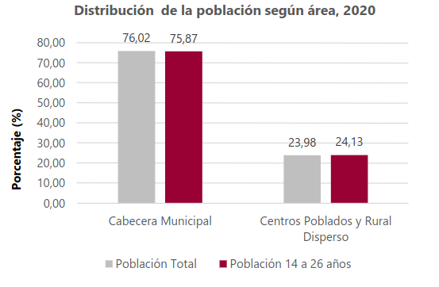
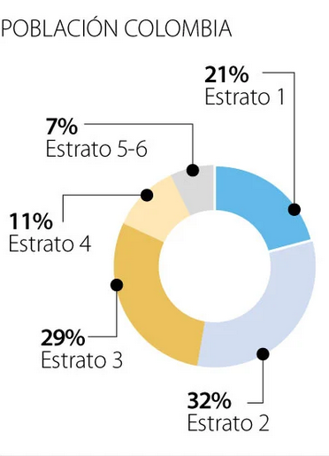
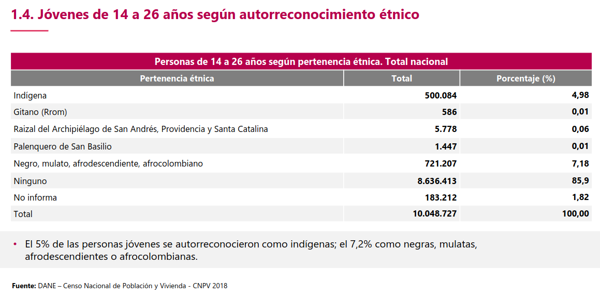

```{r setup, include=FALSE}
stopifnot(require(openxlsx), require(kableExtra), require(dm), require(dplyr), require (ggplot2), require(rms), require(caret), require(lmtest), require(car), require(yardstick), require(papaja), require(pandoc), require(tinytex), require(RColorBrewer), require(ggplotify), require(tidyr))
knitr::opts_chunk$set(cache=F,fig.path="./figures",cache.rebuild = F, out.width = "80%")
options(knitr.table.format = "simple")
```

```{r data, include=FALSE}
wb<-loadWorkbook("C:\\Users\\sebas\\OneDrive\\Documents\\JSCA2\\Research\\Current_R_projects\\col_youth_climate_change\\Analyses\\020-22 Base de Datos Anonimizada V4 (1).xlsx")
names(wb)
data1 <- readWorkbook(wb,sheet=1)
codeBook1 <- readWorkbook(wb,sheet=2,skipEmptyRows = F)
```

# Emociones hacia el cambio climático
La pregunta número 36 fue: ¿Cuáles son las DOS emociones que reflejan su forma de sentir cuando piensa en el cambio climático? Cada participante podía elegir un máximo de 2 emociones de un conjunto de 16 emociones.
```{r variable emociones hacia cambio climático, fig.align='center', echo=F}
emo_clim <- grep("^C36_", names(data1), value=T)
sums_emo_clim <- colSums(data1[, emo_clim])
names(sums_emo_clim) <- c("Triste", "Motivado", "Temeroso", "Furioso", "Ansioso", "Frustrado", "Culpable", "Avergonzado", "Desesperado", "Herido", "Deprimido", "Optimista", "Indiferente", "Confiado", "Desesperanzado", "Tranquilo")
sums_emo_clim <- data.frame(Emoción = names(sums_emo_clim), Frecuencia = unname(sums_emo_clim))
sums_emo_clim <- sums_emo_clim %>%
  dplyr::mutate(Porcentaje = round((Frecuencia / nrow(data1) * 100), 1))
kable(sums_emo_clim, col.names = c("Emoción", "Frecuencia", "Porcentaje (%)"), booktabs = TRUE)

sums <- rowSums(data1[emo_clim])
table_sums <- as.data.frame(table(sums)) %>%
  mutate(per = round(Freq / sum(Freq) * 100, 1))
kable(table_sums, col.names = c("Nº emociones seleccionadas", "Frecuencia", "Porcentaje (%)"), booktabs = TRUE)

plot_emo <- sums_emo_clim %>%
  ggplot(aes(x = Emoción, y = Porcentaje)) +
  geom_col(fill = "#1F77B4") +
  ylim(0, 38) +
  coord_flip() +
  labs(x = "Emoción", y = "Porcentaje (%)") +
  ggtitle("Distribución \n Emociones hacia el Cambio Climático") +
  papaja::theme_apa() +
  theme(legend.position="none") +
 geom_text(aes(label = paste0(Porcentaje, "%")), hjust = -0.2, color = "black", size = 4)
plot_emo
```

## Variable "Emociones hacia el cambio climático" Recodificada
El conjunto de 16 emociones fue agrupado en tres niveles: Emociones negativas, Emociones ambivalentes y/o neutrales, y Emociones positivas.
```{r recodificación emociones cambio climático, include=FALSE}
neg_emo <- c("C36_1", "C36_3", "C36_4", "C36_5", "C36_6", "C36_7", "C36_8", "C36_9", "C36_10", "C36_11", "C36_15")
amb_emo <- c("C36_13")
pos_emo <- c("C36_2", "C36_12", "C36_14", "C36_16")
data1$eco_anx <- NA
for (i in 1:nrow(data1)) {
neg_emo_count <- sum(data1[i, neg_emo] == 1)
pos_emo_count <- sum(data1[i, pos_emo] == 1)
amb_emo_count <- sum(data1[i, amb_emo] == 1)
if (neg_emo_count %in% c(1, 2) & pos_emo_count == 0 & amb_emo_count == 0) {
data1$eco_anx[i] <- "Negativas"
} else if (neg_emo_count == 1 & pos_emo_count == 1 & amb_emo_count == 0) {
data1$eco_anx[i] <- "Ambivalentes/Neutrales"
} else if (neg_emo_count == 1 & pos_emo_count == 0 & amb_emo_count == 1) {
data1$eco_anx[i] <- "Ambivalentes/Neutrales"
} else if (neg_emo_count == 0 & pos_emo_count == 1 & amb_emo_count == 1) {
data1$eco_anx[i] <- "Ambivalentes/Neutrales"
} else if (neg_emo_count == 0 & pos_emo_count == 0 & amb_emo_count == 1) {
data1$eco_anx[i] <- "Ambivalentes/Neutrales"
} else if (neg_emo_count == 0 & pos_emo_count %in% c(1, 2) & amb_emo_count == 0) {
data1$eco_anx[i] <- "Positivas"
}
}
```


```{r variable emo recodificada, fig.align='center', echo=F}
data1$eco_anx <- factor(data1$eco_anx, levels = c("Negativas", "Ambivalentes/Neutrales", "Positivas"))
table_eco_anx <- as.data.frame(table(data1$eco_anx)) %>%
  mutate(per = round(Freq / sum(Freq) * 100, 1))
kable(table_eco_anx, col.names = c("Emociones", "Frecuencia", "Porcentaje (%)"), booktabs = TRUE)

plot_eco_anx <- data1 %>%
  count(eco_anx) %>%
  mutate(prop = (n / sum(n))*100) %>%
  ggplot(aes(x = eco_anx, y = prop, fill = eco_anx)) +
  geom_bar(stat = "identity") +
  ylim(0, 75) +
  labs(x = "Emociones", y = "Porcentaje (%)") +
  ggtitle("Distribución \n Emociones hacia el cambio climático") +
  papaja::theme_apa() +
  theme(legend.position="none") +
  geom_text(aes(label = paste0(round(prop, 1), "%")), vjust = -0.5, color = "black", size = 4)
plot_eco_anx
```


## Variable "Emociones hacia el cambio climático" Recodificada Opción 2
El conjunto de 16 emociones fueron agrupadas en 6 categorías creadas a partir del modelo conocido como "Circumplex model of affect", el cual clasifica a las emociones de acuerdo a las dimensiones de valencia y activación. Las emociones positivas solo fueron catalogadas de acuerdo a su valencia debido al reducido número de participantes que seleccionaron algunas de estas. De esta manera se evita tener categorias con frecuencias en extremo reducidas.
```{r recodificación emociones cambio climático 2, include=FALSE, eval=FALSE}
high_ar <- c("C36_2", "C36_3", "C36_4", "C36_5", "C36_6", "C36_7", "C36_9", "C36_12", "C36_14")
low_ar <- c("C36_1", "C36_8", "C36_10", "C36_11", "C36_13", "C36_15", "C36_16")
data1$eco_anx2 <- NA
for (i in 1:nrow(data1)) {
high_ar_count <- sum(data1[i, high_ar] == 1)
low_ar_count <- sum(data1[i, low_ar] == 1)
if (high_ar_count %in% c(1, 2) & low_ar_count == 0) {
data1$eco_anx2[i] <- "Alta activación"
} else if (high_ar_count == 1 & low_ar_count == 1) {
data1$eco_anx2[i] <- "Ambivalente/Neutra"
} else if (high_ar_count == 0 & low_ar_count %in% c(1, 2)) {
data1$eco_anx2[i] <- "Baja activación"
}
}
```


```{r variable emo recodificada 2, fig.align='center', include=FALSE, eval=FALSE}
data1$eco_anx2 <- factor(data1$eco_anx2, levels = c("Baja activación", "Ambivalente/Neutra", "Alta activación"))
table_eco_anx2<- as.data.frame(table(data1$eco_anx2)) %>%
  mutate(per = round(Freq / sum(Freq) * 100, 1))
kable(table_eco_anx2, col.names = c("Emociones", "Frecuencia", "Porcentaje (%)"), booktabs = TRUE)

plot_eco_anx2 <- data1 %>%
  count(eco_anx2) %>%
  mutate(prop = (n / sum(n))*100) %>%
  ggplot(aes(x = eco_anx2, y = prop, fill = eco_anx2)) +
  geom_bar(stat = "identity") +
  ylim(0, 75) +
  labs(x = "Emociones", y = "Porcentaje (%)") +
  ggtitle("Distribución \n Emociones frente al cambio climático") +
  papaja::theme_apa() +
  theme(legend.position="none") +
  geom_text(aes(label = paste0(round(prop, 1), "%")), vjust = -0.5, color = "black", size = 4)
plot_eco_anx2
```


```{r recodificación emociones cambio climático 3, include=FALSE, eval=FALSE}
unp_deac <- c("C36_1", "C36_10", "C36_11", "C36_15")
unp_act <- c("C36_3", "C36_4", "C36_5", "C36_6", "C36_7", "C36_8", "C36_9")
ple_deac <- c("C36_13", "C36_16")
ple_act <- c("C36_2", "C36_12", "C36_14")
data1$cir_mod <- NA
for (i in 1:nrow(data1)) {
unp_deac_count <- sum(data1[i, unp_deac] == 1)
unp_act_count <- sum(data1[i, unp_act] == 1)
ple_deac_count <- sum(data1[i, ple_deac] == 1)
ple_act_count <- sum(data1[i, ple_act] == 1)
if (unp_deac_count %in% c(1, 2) & unp_act_count == 0 & ple_deac_count == 0 & ple_act_count == 0) {
data1$cir_mod[i] <- "Neg no act"
} else if (unp_deac_count == 1 & unp_act_count == 1 & ple_deac_count == 0 & ple_act_count == 0) {
data1$cir_mod[i] <- "Neg act y no act"
} else if (unp_deac_count == 1 & unp_act_count == 0 & ple_deac_count == 1 & ple_act_count == 0) {
data1$cir_mod[i] <- "Neg no act y pos no act"
} else if (unp_deac_count == 1 & unp_act_count == 0 & ple_deac_count == 0 & ple_act_count == 1) {
data1$cir_mod[i] <- "Neg no act y pos act"
} else if (unp_deac_count == 0 & unp_act_count %in% c(1, 2) & ple_deac_count == 0 & ple_act_count == 0) {
data1$cir_mod[i] <- "Neg act"
} else if (unp_deac_count == 0 & unp_act_count == 1 & ple_deac_count == 1 & ple_act_count == 0) {
data1$cir_mod[i] <- "Neg act y pos no act"
} else if (unp_deac_count == 0 & unp_act_count == 1 & ple_deac_count == 0 & ple_act_count == 1) {
data1$cir_mod[i] <- "Neg act y pos act"
} else if (unp_deac_count == 0 & unp_act_count == 0 & ple_deac_count %in% c(1, 2) & ple_act_count == 0) {
data1$cir_mod[i] <- "Pos no act"
} else if (unp_deac_count == 0 & unp_act_count == 0 & ple_deac_count == 1 & ple_act_count == 1) {
data1$cir_mod[i] <- "Pos act y no act"
} else if (unp_deac_count == 0 & unp_act_count == 0 & ple_deac_count == 0 & ple_act_count %in% c(1, 2)) {
data1$cir_mod[i] <- "Pos act"
}
}
data1$cir_mod <- as.factor(data1$cir_mod)
```


```{r recodificación emociones cambio climático 4, include=FALSE}
unp_deac <- c("C36_1", "C36_10", "C36_11", "C36_15")
unp_act <- c("C36_3", "C36_4", "C36_5", "C36_6", "C36_7", "C36_8", "C36_9")
pos <- c("C36_13", "C36_16", "C36_2", "C36_12", "C36_14")
data1$cir_mod <- NA
for (i in 1:nrow(data1)) {
unp_deac_count <- sum(data1[i, unp_deac] == 1)
unp_act_count <- sum(data1[i, unp_act] == 1)
pos_count <- sum(data1[i, pos] == 1)
if (unp_deac_count %in% c(1, 2) & unp_act_count == 0 & pos_count == 0) {
data1$cir_mod[i] <- "Neg no act"
} else if (unp_deac_count == 1 & unp_act_count == 1 & pos_count == 0) {
data1$cir_mod[i] <- "Neg no act y act"
} else if (unp_deac_count == 1 & unp_act_count == 0 & pos_count == 1) {
data1$cir_mod[i] <- "Pos y neg no act"
} else if (unp_deac_count == 0 & unp_act_count %in% c(1, 2) & pos_count == 0) {
data1$cir_mod[i] <- "Neg act"
} else if (unp_deac_count == 0 & unp_act_count == 1 & pos_count == 1) {
data1$cir_mod[i] <- "Pos y neg act"
} else if (unp_deac_count == 0 & unp_act_count == 0 & pos_count %in% c(1, 2)) {
data1$cir_mod[i] <- "Pos"
}
}
```

```{r variable emo recodificada 4, fig.align='center', echo=F}
data1$cir_mod <- factor(data1$cir_mod, levels = c("Pos", "Pos y neg act", "Pos y neg no act", "Neg act", "Neg no act y act", "Neg no act"))
table_cir_mod <- as.data.frame(table(data1$cir_mod)) %>%
  mutate(per = round(Freq / sum(Freq) * 100, 1))
kable(table_cir_mod, col.names = c("Emociones", "Frecuencia", "Porcentaje (%)"), booktabs = TRUE)

plot_cir_mod <- data1 %>%
  count(cir_mod) %>%
  mutate(prop = (n / sum(n))*100) %>%
  ggplot(aes(x = cir_mod, y = prop, fill = cir_mod)) +
  geom_bar(stat = "identity") +
  ylim(0, 75) +
  labs(x = "Emociones", y = "Porcentaje (%)") +
  ggtitle("Distribución \n Emociones hacia el cambio climático") +
  papaja::theme_apa() +
  coord_flip() +
  theme(legend.position="none") +
  geom_text(aes(label = paste0(round(prop, 1), "%")), hjust = -0.2, color = "black", size = 4)
plot_cir_mod
```


# Zona de residencia
Al inicio de la encuesta se clasificó a los participantes en dos distintas categorías según su lugar de residencia. Estas fueron categorías son: "Urbana ciudades" y "Municipios rurales dispersos".
```{r variable zone, fig.align='center', echo=F}
data1$Zona <- as.factor(data1$Zona)
table_zona <- as.data.frame(table(data1$Zona)) %>%
  mutate(per = round(Freq / sum(Freq) * 100, 1))
kable(table_zona, col.names = c("Zona de Residencia", "Frecuencia", "Porcentaje (%)"), booktabs = TRUE)

plot_zona <- data1 %>%
  count(Zona) %>%
  mutate(prop = (n / sum(n))*100) %>%
  ggplot(aes(x = Zona, y = prop, fill = Zona)) +
  geom_bar(stat = "identity") +
  ylim(0, 95) +
  labs(x = "Zona de Residencia", y = "Porcentaje (%)") +
  ggtitle("Distribución \n Zona de Residencia") +
  papaja::theme_apa() +
  theme(legend.position="none") +
  geom_text(aes(label = paste0(round(prop, 1), "%")), vjust = -0.5, color = "black", size = 4)
plot_zona
```

## Distribución de zona de residencia según datos del DANE
Los datos del DANE muestran porcentajes cercanos a los obtenidos en la encuesta.


# Sexo
La pregunta número 1 pedía a cada participante indicar su sexo.
```{r variable sexo, fig.align='center', echo=F}
data1$A1 <- as.factor(data1$A1)
levels(data1$A1) <- c("Hombre", "Mujer")
table_sexo <- as.data.frame(table(data1$A1)) %>%
  mutate(per = round(Freq / sum(Freq) * 100, 1))
kable(table_sexo, col.names = c("Sexo", "Frecuencia", "Porcentaje (%)"), booktabs = TRUE)

plot_sexo <- data1 %>%
  count(A1) %>%
  mutate(prop = (n / sum(n))*100) %>%
  ggplot(aes(x = A1, y = prop, fill = A1)) +
  geom_bar(stat = "identity") +
  ylim(0, 55) +
  labs(x = "Sexo", y = "Porcentaje (%)") +
  ggtitle("Distribución \n Sexo") +
  papaja::theme_apa() +
  theme(legend.position="none") +
  geom_text(aes(label = paste0(round(prop, 1), "%")), vjust = -0.5, color = "black", size = 4)
plot_sexo
```

# Edad
La pregunta número 2 fue: ¿Cuántos años tiene? Todos los participantes debían tener 18 años o más y no más de 32 años.
```{r variable edad, fig.align='center', echo=F}
kable(round(table(data1$A2) / length(data1$A2) * 100, digits = 1), col.names = c("Edad", "Porcentaje (%)"), booktabs = TRUE)

plot_edad <- data1 %>%
  ggplot(aes(x = A2, y = after_stat(count) / sum(after_stat(count)) * 100)) +
  geom_histogram(fill = "#FF7F0E", binwidth = 0.5) +
  labs(x = "Edad", y = "Porcentaje (%)") +
  ggtitle("Distribución \n Edad") +
  papaja::theme_apa() +
  scale_x_continuous(breaks = seq(18, 32, 2))
plot_edad
```

```{r recodificación edad, include=FALSE}
data1$RANGO_EDAD <- as.factor(data1$RANGO_EDAD)
data1$age_r <- data1$RANGO_EDAD
data1 <- data1 %>%
  mutate(age_r = case_when(
    age_r == 1 ~ "De 18 a 20 años",
    age_r == 2 ~ "De 21 a 24 años",
    age_r == 3 ~ "De 25 a 29 años",
    age_r == 4 ~ "De 30 a 32 años"
))
```

## Variable "Edad" Recodificada
El rango de edad permitido para los participantes fue separado en 4 distintos grupos: "De 18 a 20 años", "De 21 a 24 años", "De 25 a 29 años", y "De 30 a 32 años".
```{r variable edad recodificada, fig.align='center', echo=F}
data1$age_r <- as.factor(data1$age_r)
table_age_r <- as.data.frame(table(data1$age_r)) %>%
  mutate(per = round(Freq / sum(Freq) * 100, 1))
kable(table_age_r, col.names = c("Rango de edad", "Frecuencia", "Porcentaje (%)"), booktabs = TRUE)

plot_age_r <- data1 %>%
  count(age_r) %>%
  mutate(prop = (n / sum(n))*100) %>%
  ggplot(aes(x = age_r, y = prop, fill = age_r)) +
  geom_bar(stat = "identity") +
  ylim(0, 32) +
  coord_flip() +
  labs(x = "Rango de edad", y = "Porcentaje (%)") +
  ggtitle("Distribución \n Rango de Edad") +
  papaja::theme_apa() +
  theme(legend.position="none") +
  geom_text(aes(label = paste0(round(prop, 1), "%")), hjust = -0.2, color = "black", size = 4)
plot_age_r
```

# Estrato
La pregunta número 3 fue: En el recibo de la luz de su domicilio, ¿qué estrato sale reportado? Todos los participantes debían indicar su estrato de acuerdo a la clasificación del Departamento de Planeación Nacional que va desde 1 hasta 6.
```{r variable estrato, fig.align='center', echo=F}
data1$A3 <- as.factor(data1$A3)
table_stra <- as.data.frame(table(data1$A3)) %>%
  mutate(per = round(Freq / sum(Freq) * 100, 1))
kable(table_stra, col.names = c("Estrato", "Frecuencia", "Porcentaje (%)"), booktabs = TRUE)

plot_estrato <- data1 %>%
  count(A3) %>%
  mutate(prop = (n / sum(n))*100) %>%
  ggplot(aes(x = A3, y = prop, fill = A3)) +
  geom_bar(stat = "identity") +
  ylim(0, 35) +
  labs(x = "Estrato", y = "Porcentaje (%)") +
  ggtitle("Distribución \n Estrato") +
  papaja::theme_apa() +
  theme(legend.position="none") +
  geom_text(aes(label = paste0(round(prop, 1), "%")), vjust = -0.5, color = "black", size = 4)
plot_estrato
```

## Distribución de estrato socioeconómico según datos de Kantar
Los datos de Kantar muestran porcentajes cercanos a los obtenidos en la encuesta.


```{r recodificación estrato, include=FALSE}
data1$A3 <- as.factor(data1$A3)
data1$strat <- data1$A3
data1 <- data1 %>%
  mutate(strat = case_when(
    strat %in% c(1,2) ~ "Bajo",
    strat %in% c(3,4) ~ "Medio",
    strat %in% c(5,6) ~ "Alto"
))
```

## Variable "Estrato" Recodificada
La variable "Estrato" fue recodificada en tres distintos grupos: Estrato "Bajo", que incluye los estratos 1 y 2; Estrato "Medio", que incluye los estratos 3 y 4, y Estrato "Alto", que incluye los estratos 5 y 6.
```{r variable estrato recodificada, fig.align='center', echo=F}
data1$strat <- factor(data1$strat, levels = c("Bajo", "Medio", "Alto"))
table_strat <- as.data.frame(table(data1$strat)) %>%
  mutate(per = round(Freq / sum(Freq) * 100, 1))
kable(table_strat, col.names = c("Estrato", "Frecuencia", "Porcentaje (%)"), booktabs = TRUE)

plot_strat <- data1 %>%
  count(strat) %>%
  mutate(prop = (n / sum(n))*100) %>%
  ggplot(aes(x = strat, y = prop, fill = strat)) +
  geom_bar(stat = "identity") +
  ylim(0, 55) +
  labs(x = "Estrato", y = "Porcentaje (%)") +
  ggtitle("Distribución \n Estrato") +
  papaja::theme_apa() +
  theme(legend.position="none") +
  geom_text(aes(label = paste0(round(prop, 1), "%")), vjust = -0.5, color = "black", size = 4)
plot_strat
```

# Etnia
La pregunta número 5 fue:De acuerdo con su cultura, etnia o rasgos físicos, ¿usted se reconoce como:...? El participante debía elegir una opción de las 6 incluidas.
```{r variable etnia, fig.align='center', echo=F}
data1$A5 <- as.factor(data1$A5)
levels(data1$A5) <- c("Indígena", "Gitana(o) Rrom", "Raizal", "Palenquera(o)", "Afro", "Ninguna")
table_et <- as.data.frame(table(data1$A5)) %>%
  mutate(per = round(Freq / sum(Freq) * 100, 1))
kable(table_et, col.names = c("Etnia", "Frecuencia", "Porcentaje (%)"), booktabs = TRUE)

plot_et <- data1 %>%
  count(A5) %>%
  mutate(prop = (n / sum(n))*100) %>%
  ggplot(aes(x = A5, y = prop, fill = A5)) +
  geom_bar(stat = "identity") +
  ylim(0, 100) +
  coord_flip() +
  labs(x = "Etnia", y = "Porcentaje (%)") +
  ggtitle("Distribución \n Etnia") +
  papaja::theme_apa() +
  theme(legend.position="none") +
  geom_text(aes(label = paste0(round(prop, 1), "%")), hjust = -0.2, color = "black", size = 4)
plot_et
```

## Distribución de etnias según datos del DANE
Los datos del DANE muestran porcentajes cercanos a los obtenidos en la encuesta.


```{r recodificación etnia, include=FALSE}
data1$ethni <- data1$A5
data1 <- data1 %>%
  mutate(ethni = case_when(
    ethni != "Ninguna" ~ "Sí",
    ethni == "Ninguna" ~ "No"
))
```

## Variable "Etnia" Recodificada
La variable "Etnia" fue recodificada en dos distintos niveles que distinguen si la persona se reconoce como perteneciente a alguna de las etnias incluidas o no.
```{r variable etnia recodificada, fig.align='center', echo=FALSE}
data1$ethni <- as.factor(data1$ethni)
table_ethni<- as.data.frame(table(data1$ethni)) %>%
  mutate(per = round(Freq / sum(Freq) * 100, 1))
kable(table_ethni, col.names = c("¿Pertenece a alguna etnia?", "Frecuencia", "Porcentaje (%)"), booktabs = TRUE)

plot_ethni <- data1 %>%
  count(ethni) %>%
  mutate(prop = (n / sum(n))*100) %>%
  ggplot(aes(x = ethni, y = prop, fill = ethni)) +
  geom_bar(stat = "identity") +
  ylim(0, 95) +
  labs(x = "¿Pertenece a alguna etnia?", y = "Porcentaje (%)") +
  ggtitle("Distribución \n Pertenecia a una etnia") +
  papaja::theme_apa() +
  theme(legend.position="none") +
  geom_text(aes(label = paste0(round(prop, 1), "%")), vjust = -0.5, color = "black", size = 4)
plot_ethni
```

# Nivel educativo
La pregunta número 6 fue: ¿Cuál es el nivel educativo más alto alcanzado por usted?
```{r variable nivel educativo, fig.align='center', echo=F}
data1$A6 <- as.factor(data1$A6)
levels(data1$A6) <- c("Básica Primaria", "Básica Secundaria", "Secundaria Completa", "Técnico o Tecnólogo", "Pregrado", "Posgrado")
table_edu <- as.data.frame(table(data1$A6)) %>%
  mutate(per = round(Freq / sum(Freq) * 100, 1))
kable(table_edu, col.names = c("Educación", "Frecuencia", "Porcentaje (%)"), booktabs = TRUE)

custom_palette <- brewer.pal(6, "Blues")
plot_edu <- data1 %>%
  count(A6) %>%
  mutate(prop = (n / sum(n))*100) %>%
  ggplot(aes(x = A6, y = prop, fill = A6)) +
  geom_bar(stat = "identity") +
  ylim(0, 50) +
  coord_flip() +
  labs(x = "Educación", y = "Porcentaje (%)") +
  ggtitle("Distribución \n Educación") +
  papaja::theme_apa() +
  theme(legend.position="none") +
  geom_text(aes(label = paste0(round(prop, 1), "%")), hjust = -0.2, color = "black", size = 4) +
  scale_fill_manual(values = custom_palette)
plot_edu
```

## Distribución de nivel educativo más alto alcanzado según datos del DANE
Los datos del DANE muestran porcentajes cercanos a los obtenidos en la encuesta.


```{r recodificación nivel educativo, include=FALSE, eval=FALSE}
data1$edu <- data1$A6
levels(data1$edu) <- c("Básica Primaria", "Básica Secundaria", "Secundaria Completa", "Técnico o Tecnólogo", "Pregrado", "Posgrado")
data1 <- data1 %>%
  mutate(edu = case_when(
    edu %in% c("Básica Primaria", "Básica Secundaria", "Secundaria Completa", "Técnico o Tecnólogo") ~ "No",
    edu %in% c("Pregrado", "Posgrado") ~ "Sí"
))
```

## Variable "Nivel educativo" Recodificada
La variable "Nivel educativo" fue recodificada en dos distintos niveles que distinguen si la persona completó o no estudios de educación superior.
```{r variable nivel educativo recodificada, fig.align='center', include=FALSE, eval=FALSE}
data1$edu <- as.factor(data1$edu)
table_edu <- as.data.frame(table(data1$edu)) %>%
  mutate(per = round(Freq / sum(Freq) * 100, 1))
kable(table_edu, col.names = c("¿Educación superior?", "Frecuencia", "Porcentaje (%)"), booktabs = TRUE)

plot_edu <- data1 %>%
  count(edu) %>%
  mutate(prop = (n / sum(n))*100) %>%
  ggplot(aes(x = edu, y = prop, fill = edu)) +
  geom_bar(stat = "identity") +
  ylim(0, 85) +
  labs(x = "¿Educación superior?", y = "Porcentaje (%)") +
  ggtitle("Distribución \n Educación Superior") +
  papaja::theme_apa() +
  theme(legend.position="none") +
  geom_text(aes(label = paste0(round(prop, 1), "%")), vjust = -0.5, color = "black", size = 4)
plot_edu
```

# Hijos
La pregunta número 9 fue: ¿Usted tiene hijos?
```{r variable hijos, fig.align='center', echo=F}
data1$A9 <- as.factor(data1$A9)
levels(data1$A9) <- c("Sí", "No")
table_hijos <- as.data.frame(table(data1$A9)) %>%
  mutate(per = round(Freq / sum(Freq) * 100, 1))
kable(table_hijos, col.names = c("¿Tiene Hijos?", "Frecuencia", "Porcentaje (%)"), booktabs = TRUE)

plot_hijos <- data1 %>%
  count(A9) %>%
  mutate(prop = (n / sum(n))*100) %>%
  ggplot(aes(x = A9, y = prop, fill = A9)) +
  geom_bar(stat = "identity") +
  ylim(0, 65) +
  labs(x = "¿Tiene hijos?", y = "Porcentaje (%)") +
  ggtitle("Distribución \n Hijos") +
  papaja::theme_apa() +
  theme(legend.position="none") +
  geom_text(aes(label = paste0(round(prop, 1), "%")), vjust = -0.5, color = "black", size = 4)
plot_hijos
```

# Ideología política
La pregunta número 11 fue: Ubique su posición ideológica, en una escala de 1 a 6 donde 1 es una posición de izquierda y 6 es una posición de derecha.
```{r variable ideología política, fig.align='center', echo=F}
data1$A11 <- as.factor(data1$A11)
data1$pol_ide <- data1$A11
levels(data1$pol_ide) <- c("Izquierda Fuerte", "Izquierda", "Centro Izquierda", "Centro Derecha", "Derecha", "Derecha Fuerte")
table_pol_ide <- as.data.frame(table(data1$pol_ide)) %>%
  mutate(per = round(Freq / sum(Freq) * 100, 1))
kable(table_pol_ide, col.names = c("Ideología política", "Frecuencia", "Porcentaje (%)"), booktabs = TRUE)

plot_pol_ide <- data1 %>%
  count(pol_ide) %>%
  mutate(prop = (n / sum(n))*100) %>%
  ggplot(aes(x = pol_ide, y = prop, fill = pol_ide)) +
  geom_bar(stat = "identity") +
  ylim(0, 40) +
  coord_flip() +
  labs(x = "Ideología Política", y = "Porcentaje (%)") +
  ggtitle("Distribución \n Ideología Política") +
  papaja::theme_apa() +
  theme(legend.position="none") +
  geom_text(aes(label = paste0(round(prop, 1), "%")), hjust = -0.2, color = "black", size = 4)
plot_pol_ide
```

## Distribución de ideología política según datos del DANE
Los datos del DANE muestran porcentajes cercanos a los obtenidos en la encuesta.


```{r recodificación ideología política, include=FALSE}
data1 <- data1 %>%
  mutate(ideology = case_when(
    A11 %in% c(1, 2) ~ "Izquierda",
    A11 %in% c(3, 4) ~ "Centro",
    A11 %in% c(5, 6) ~ "Derecha"
  ))
```

## Variable "Ideología política" Recodificada
La variable "Ideología política" fue recodificada en tres distintos niveles que distinguen si la persona se considera de izquierda, de centro, o de derecha.
```{r variable ideología política recodificada, fig.align='center', echo=F}
data1$ideology <- factor(data1$ideology, levels = c("Derecha", "Centro", "Izquierda"))
table_pol_ide <- as.data.frame(table(data1$ideology)) %>%
  mutate(per = round(Freq / sum(Freq) * 100, 1))
kable(table_pol_ide, col.names = c("Ideología política", "Frecuencia", "Porcentaje (%)"), booktabs = TRUE)

plot_pol_ide <- data1 %>%
  count(ideology) %>%
  mutate(prop = (n / sum(n))*100) %>%
  ggplot(aes(x = ideology, y = prop, fill = ideology)) +
  geom_bar(stat = "identity") +
  ylim(0, 60) +
  labs(x = "Ideología política", y = "Porcentaje (%)") +
  ggtitle("Distribución \n Ideología política") +
  papaja::theme_apa() +
  theme(legend.position="none") +
  geom_text(aes(label = paste0(round(prop, 1), "%")), vjust = -0.5, color = "black", size = 4)
plot_pol_ide
```

# Medios de información
La pregunta número 12 fue: ¿Cómo se informa usted de los temas del país? El participante podía elegir tantas opciones como quisiera.
```{r variable medios, fig.align='center', echo=F}
media <- grep("^B12_", names(data1), value=T)
media <- media[-which(media == "B12_Otro")]
sums_media <- colSums(data1[, media])
names(sums_media) <- c("Televisión", "Radio", "Prensa impresa", "Digital", "Redes Sociales", "Otro")
sums_media <- data.frame(Medio = names(sums_media), Frecuencia = unname(sums_media))
sums_media <- sums_media %>%
  dplyr::mutate(Porcentaje = round((Frecuencia / nrow(data1) * 100), 1))
kable(sums_media, col.names = c("Medio", "Frecuencia", "Proporción (%)"), booktabs = TRUE)

sums <- rowSums(data1[media])
table_sums <- as.data.frame(table(sums)) %>%
  mutate(per = round(Freq / sum(Freq) * 100, 1))
kable(table_sums, col.names = c("Nº medios seleccionados", "Frecuencia", "Porcentaje (%)"), booktabs = TRUE)

custom_palette <- brewer.pal(6, "BrBG")
plot_media <- sums_media %>%
  ggplot(aes(x = Medio, y = Porcentaje, fill = Medio)) +
  geom_col() +
  ylim(0, 80) +
  coord_flip() +
  labs(x = "Medio", y = "Porcentaje (%)") +
  ggtitle("Distribución \n Medios de información") +
  papaja::theme_apa() +
  theme(legend.position="none") +
 geom_text(aes(label = paste0(Porcentaje, "%")), hjust = -0.2, color = "black", size = 4) +
  scale_fill_manual(values = custom_palette)
plot_media
```

## Medios de información por separado
Se exploró cada uno de los medios de información de forma individual.
```{r loop medios de información, fig.align='center', echo=FALSE}
selected_columns <- data1 %>%
  select(starts_with("B12_"), -B12_Otro)

# Create a new data frame with the selected columns
new_data <- data.frame(selected_columns)
new_data <- new_data %>%
  rename(Televisión = B12_1,
         Radio = B12_2,
         Prensa_Impresa = B12_3,
         Medios_Digitales = B12_4,
         Redes_Sociales = B12_5,
         Otro_medio = B12_89)
# List of variables to iterate over
variables <- names(new_data)

# Create an empty list to store the results
results <- list()

# Iterate over each variable
for (variable in variables) {
  # Convert variable to factor
  new_data[[variable]] <- as.factor(new_data[[variable]])
  levels(new_data[[variable]]) <- c("No", "Sí")
  
  # Calculate table
  table_data <- new_data %>%
  count(!!sym(variable)) %>%
  mutate(prop = round((n / sum(n)) * 100, digits = 1))
  
  # Create kable table
  table_kable <- kable(table_data, col.names = c(paste0("¿Se informa con ", variable, "?"), "Frecuencia", "Porcentaje (%)"), booktabs = TRUE)
  
  # Create plot
  plot <- table_data %>%
    ggplot(aes(x = !!sym(variable), y = prop, fill = !!sym(variable))) +
    geom_bar(stat = "identity") +
    ylim(0, 100) +
    labs(x = paste0("¿Se informa con ", variable, "?"), y = "Porcentaje (%)") +
    ggtitle(paste0("Distribución uso de \n ", variable, " para informarse")) +
    papaja::theme_apa() +
    theme(legend.position = "none") +
    geom_text(aes(label = paste0(round(prop, 1), "%")), vjust = -0.5, color = "black", size = 4)
  
  # Store the results
  results[[variable]] <- list(table_kable = table_kable, plot = plot)
}

# Access the results for each variable
for (variable in variables) {
  print(results[[variable]]$plot)
}
```


```{r recodificación medios, include=FALSE, eval=FALSE}
val_med <- c("B12_1", "B12_2", "B12_3", "B12_4")
no_val_med <- c("B12_5", "B12_89")
data1$med <- NA
for (i in 1:nrow(data1)) {
val_med_count <- sum(data1[i, val_med] == 1)
no_val_med_count <- sum(data1[i, no_val_med] == 1)
if (val_med_count %in% c(1:4) & no_val_med_count == 0) {
data1$med[i] <- "Fuentes validadas"
} else if (val_med_count %in% c(1:4) & no_val_med_count %in% c(1:2)) {
data1$med[i] <- "Fuentes mixtas"
} else if (val_med_count == 0 & no_val_med_count %in% c(1:2)) {
data1$med[i] <- "Fuentes no validadas"
}
}
```


```{r variable recodificacion medios, fig.align='center', include=FALSE, eval=FALSE}
data1$med <- factor(data1$med, levels = c("Fuentes validadas", "Fuentes mixtas", "Fuentes no validadas"))
table_med <- as.data.frame(table(data1$med)) %>%
  mutate(per = round(Freq / sum(Freq) * 100, 1))
kable(table_med, col.names = c("Tipo de fuentes", "Frecuencia", "Porcentaje (%)"), booktabs = TRUE)

plot_med <- data1 %>%
  count(med) %>%
  mutate(prop = (n / sum(n))*100) %>%
  ggplot(aes(x = med, y = prop, fill = med)) +
  geom_bar(stat = "identity") +
  ylim(0, 60) +
  labs(x = "Tipo de fuentes", y = "Porcentaje (%)") +
  ggtitle("Distribución \n tipo de fuentes de información") +
  papaja::theme_apa() +
  theme(legend.position="none") +
  geom_text(aes(label = paste0(round(prop, 1), "%")), vjust = -0.5, color = "black", size = 4)
plot_med
```


```{r recodificación medios 2, include=FALSE}
# Information sources
data1 <- data1 %>%
  rename(Televisión = B12_1,
         Radio = B12_2,
         Prensa_Impresa = B12_3,
         Medios_Digitales = B12_4,
         Redes_Sociales = B12_5,
         Otro_medio = B12_89)

vars_to_convert <- c("Televisión",
         "Radio",
         "Prensa_Impresa",
         "Medios_Digitales",
         "Redes_Sociales",
         "Otro_medio")

for (var in vars_to_convert) {
  data1[[var]] <- factor(data1[[var]])
}
new_levels <- c("No", "Sí")
for (var in vars_to_convert) {
  levels(data1[[var]]) <- new_levels
}

data1 <- data1 %>%
  mutate(Internet = case_when(
    Medios_Digitales == "Sí" & Redes_Sociales == "Sí" ~ "Sí",
    Medios_Digitales == "Sí" & Redes_Sociales == "No" ~ "Sí",
    Medios_Digitales == "No" & Redes_Sociales == "Sí" ~ "Sí",
    Medios_Digitales == "No" & Redes_Sociales == "No" ~ "No"
  ))
```


## Variable "Medios de información" Recodificada
Los distintos medios de información fueron agrupados para crear una variable que distingue si la persona se informa a través de internet o no.
```{r variable recodificacion medios 2, fig.align='center', echo=F}
data1$Internet <- as.factor(data1$Internet)
table_int <- as.data.frame(table(data1$Internet)) %>%
  mutate(per = round(Freq / sum(Freq) * 100, 1))
kable(table_int, col.names = c("Internet como fuente", "Frecuencia", "Porcentaje (%)"), booktabs = TRUE)

plot_int <- data1 %>%
  count(Internet) %>%
  mutate(prop = (n / sum(n))*100) %>%
  ggplot(aes(x = Internet, y = prop, fill = Internet)) +
  geom_bar(stat = "identity") +
  ylim(0, 100) +
  labs(x = "Internet como fuente", y = "Porcentaje (%)") +
  ggtitle("Distribución uso de Internet \ncomo fuente de información") +
  papaja::theme_apa() +
  theme(legend.position="none") +
  geom_text(aes(label = paste0(round(prop, 1), "%")), vjust = -0.5, color = "black", size = 4)
plot_int
```


# Confianza hacia figuras e instituciones
La pregunta número 17 fue: De las siguientes instituciones y figuras, ¿en cuáles confía? Los participantes debían responder para cada una de las 22 figuras e instituciones incluidas si confiaban en esta o no, o si no tenían conocimiento sobre esta.
```{r confianza en figuras e instituciones, fig.align='center', echo=F}
trust_in <- data1 %>%
  dplyr::select(starts_with("C17_"), -c(C17_20, C17_21, C17_22)) %>%
  rename(Registraduría = C17_1, Consejo_Nacional_Electoral = C17_2, Jurados_de_Votación = C17_3, Partidos_políticos = C17_4, Presidencia_de_Colombia = C17_5, Gobernación_departamental = C17_6, Alcaldía_municipal = C17_7, Congreso_de_la_República = C17_8, Defensoría_del_Pueblo = C17_9, La_Iglesia_católica = C17_10, Líderes_religiosos_cristianos_No_católicos = C17_11, Las_Fuerzas_Militares = C17_12, Policía_Nacional_de_Colombia = C17_13, Universidades_Privadas = C17_14, Universidades_Públicas = C17_15, Fiscalía_General_de_la_Nación = C17_16, Sindicatos = C17_17, Procuraduría_General_de_la_Nación = C17_18, Contraloría_General_de_la_República = C17_19) %>%
  tidyr::gather(key = "Variable", value = "Value") %>%
  dplyr::mutate(Value = replace(Value, is.na(Value), "na")) %>%
  count(Variable, Value) %>%
  spread(key = "Value", value = "n") %>%
  dplyr::mutate(na = replace(na, is.na(na), 0)) %>%
  rename(Institución_o_figura = "Variable",
         Sí = "1",
         No = "2",
         No_la_conoce = "3",
         No_aplica = na)
trust_in_props <- trust_in
cols_to_sum <- 2:5
row_sums <- rowSums(trust_in_props[cols_to_sum])
trust_in_props[cols_to_sum] <- round(trust_in_props[cols_to_sum] / row_sums * 100, 1)
trust_in_props$Institución_o_figura <- gsub("_", " ", trust_in_props$Institución_o_figura)
trust_in_props <- trust_in_props %>%
  arrange(desc(Sí))
kable(trust_in_props, col.names = c("Institución o figura", "Sí", "No", "No la conoce", "No aplica"), booktabs = TRUE)

custom_palette <- brewer.pal(4, "BrBG")
trust_plot <- trust_in_props %>%
  gather(key = "confianza", value = "porcentaje", -Institución_o_figura) %>%
  ggplot(aes(x = Institución_o_figura, y = porcentaje, fill = confianza)) +
  geom_bar(stat = "identity") +
  coord_flip() +
  labs(x = "Institución o Figura", y = "Porcentaje (%)", fill = "¿Confía \n en la \n Institución?") +
  papaja::theme_apa() +
  scale_fill_manual(values = custom_palette, labels = c("No", "No aplica", "No la conoce", "Sí")) +
  theme(legend.key.size = unit(0.5, 'cm'), #change legend key size
        legend.key.height = unit(0.5, 'cm'), #change legend key height
        legend.key.width = unit(0.5, 'cm'), #change legend key width
        legend.title = element_text(size=10), #change legend title font size
        legend.text = element_text(size=8)) #change legend text font size
trust_plot

totals_trust_in <- colSums(trust_in[, c(2,3,4,5)])
totals_trust_in <- data.frame(Categoria = names(totals_trust_in), Frecuencia = unname(totals_trust_in))
totals_trust_in <- totals_trust_in %>%
  dplyr::mutate(Porcentaje = round((Frecuencia / sum(Frecuencia) * 100), 1))
totals_trust_in$Categoria <- gsub("_", " ", totals_trust_in$Categoria)
kable(totals_trust_in, col.names = c("Categoría", "Frecuencia", "Porcentaje (%)"), booktabs = TRUE)
```

```{r medida confianza en figuras e instituciones, include=FALSE}
trust_vote_inst <- data1 %>%
  select(C17_5, C17_7, C17_8)
trust_vote_inst[] <- lapply(trust_vote_inst, function(x) replace(x, x == 2, -1))
trust_vote_inst[] <- lapply(trust_vote_inst, function(x) replace(x, x == 3, 0))
data1$trust_vote_inst <- rowSums(trust_vote_inst)
data1$trust_vote_inst <- as.factor(data1$trust_vote_inst)

data1 <- data1 %>%
  mutate(trust_vote_inst = case_when(
    trust_vote_inst %in% c("-3", "-2", "-1") ~ "No",
    trust_vote_inst == "0"  ~ "Neutral",
    trust_vote_inst %in% c("1", "2", "3") ~ "Sí"
  ))
```

## Confianza en figuras e instituciones agrupadas
Las instituciones donde los cargos ocupados son de elección popular se agruparon para conformar una nueva variable.
```{r variable medida de confianza, warning=FALSE, fig.align='center', echo=F}
#plot_trust_vote_inst <- data1 %>%
  #ggplot(aes(x = trust_vote_inst, y = after_stat(count) / sum(after_stat(count)) * 100)) +
  #geom_histogram(fill = "#FF9896", binwidth = 1) +
  #ylim(0, 60) +
  #labs(x = "Confianza", y = "Porcentaje (%)") +
  #ggtitle("Distribución Puntaje Confianza en \n Instituciones con cargos de elección popular") +
  #papaja::theme_apa() +
  #scale_x_continuous(breaks = seq(-3, 3, 1)) +
  #geom_text(stat = "count", aes(label = paste0(round((..count.. / sum(..count..)) * 100, 1), "%")),
            #vjust = -0.5, color = "black", size = 4)
#plot_trust_vote_inst

#plot_trust_unis <- data1 %>%
 # ggplot(aes(x = trust_unis, y = after_stat(count) / sum(after_stat(count)) * 100)) +
  #geom_histogram(fill = "#FF9896", binwidth = 1) +
  #ylim(0, 60) +
  #labs(x = "Confianza", y = "Porcentaje (%)") +
  #ggtitle("Distribución \n Puntaje Confianza en Universidades") +
  #papaja::theme_apa() +
  #scale_x_continuous(breaks = seq(-2, 2, 1)) +
  #geom_text(stat = "count", aes(label = paste0(round((..count.. / sum(..count..)) * 100, 1), "%")),
            #vjust = -0.5, color = "black", size = 4)
#plot_trust_unis

data1$trust_vote_inst <- as.factor(data1$trust_vote_inst)
plot_trust_vote_inst <- data1 %>%
  count(trust_vote_inst) %>%
  mutate(prop = (n / sum(n))*100) %>%
  ggplot(aes(x = trust_vote_inst, y = prop, fill = trust_vote_inst)) +
  geom_bar(stat = "identity") +
  ylim(0, 100) +
  labs(x = "¿Confía en las Instituciones?", y = "Porcentaje (%)") +
  ggtitle("Distribución Confianza en \n Instituciones con cargos de elección popular") +
  papaja::theme_apa() +
  theme(legend.position="none") +
  geom_text(aes(label = paste0(round(prop, 1), "%")), vjust = -0.5, color = "black", size = 4)
plot_trust_vote_inst
```


```{r variable medida de confianza universidades, warning=FALSE, fig.align='center', include=FALSE, eval=FALSE}
custom_palette <- brewer.pal(7, "BrBG")
plot_trust_unis <- data1 %>%
  count(trust_unis) %>%
  mutate(prop = (n / sum(n))*100) %>%
  ggplot(aes(x = trust_unis, y = prop, fill = trust_unis)) +
  geom_bar(stat = "identity") +
  ylim(0, 60) +
  labs(x = "Confianza", y = "Porcentaje (%)") +
  ggtitle("Distribución \n Puntaje Confianza en Universidades") +
  papaja::theme_apa() +
  theme(legend.position="none") +
  geom_text(aes(label = paste0(round(prop, 1), "%")), vjust = -0.5, color = "black", size = 4) +
  scale_fill_manual(values = custom_palette)
plot_trust_unis

```

# Asociarse a organizaciones ambientales
La pregunta número 18 fue: ¿Usted qué está dispuesto a hacer para aportar/solucionar los problemas del país? Dentro de las opciones incluidas, la número 7 correspondía a la opción "Asociarme en organizaciones ambientales" la cual fue elegida de forma independiente por su relevancia para el proyecto.
```{r variable asociarse a organizaciones ambientales, fig.align='center', echo=F}
data1$C18_7 <- as.factor(data1$C18_7)
levels(data1$C18_7) <- c("Sí", "No")
table_aso <- as.data.frame(table(data1$C18_7)) %>%
  mutate(per = round(Freq / sum(Freq) * 100, 1))
kable(table_aso, col.names = c("¿Se asociaría?", "Frecuencia", "Porcentaje (%)"), booktabs = TRUE)

plot_aso <- data1 %>%
  count(C18_7) %>%
  mutate(prop = (n / sum(n))*100) %>%
  ggplot(aes(x = C18_7, y = prop, fill = C18_7)) +
  geom_bar(stat = "identity") +
  ylim(0, 65) +
  labs(x = "¿Se asociaría?", y = "Porcentaje (%)") +
  ggtitle("Distribución Asociarse a \n Organizaciones Ambientales") +
  papaja::theme_apa() +
  theme(legend.position="none") +
  geom_text(aes(label = paste0(round(prop, 1), "%")), vjust = -0.5, color = "black", size = 4)
plot_aso
```


```{r variable asociarse a organizaciones ambientales 2, fig.align='center', echo=F}
data1$aso <- data1$C18_7
for (i in 1:nrow(data1)) {
  if (data1$aso[i] == 1) {
    data1$aso[i] <- 1
  } else if (data1$aso[i] == 2) {
    data1$aso[i] <- -1
  }
}
```


```{r variable emociones respuesta gobierno al cambio climático, include=FALSE, eval=FALSE}
# Emociones hacia respuesta del gobierno frente al cambio climático
# La pregunta número 34 fue: "En una escala de 1 a 6, donde 1 es MUY POCO y 6 es MUY FUERTE, Cuando usted piensa en cómo el gobierno está respondiendo al cambio climático se siente:". El participante debía dar una respuesta para cada una de las 10 emociones incluidas.
emo_gov <- data1 %>%
  dplyr::select(starts_with("D34_")) %>%
  rename(Tranquilo = D34_1, Angustiado = D34_2, Abandonado = D34_3, Temeroso = D34_4, Esperanzado = D34_5, Enojado = D34_6, Valorado = D34_7, Avergonzado = D34_8, Menospreciado = D34_9, Protegido = D34_10) %>%
  tidyr::gather(key = "Variable", value = "Value") %>%
  count(Variable, Value) %>%
  spread(key = "Value", value = "n") %>%
  rename(Emoción = "Variable",
         Muy_poco = "1",
         Muy_fuerte = "6")
emo_gov_props <- emo_gov
cols_to_sum <- 2:7
row_sums <- rowSums(emo_gov_props[cols_to_sum])
emo_gov_props[cols_to_sum] <- round(emo_gov_props[cols_to_sum] / row_sums * 100, 1)
kable(emo_gov_props, col.names = c("Emoción", "Muy poco", "2", "3", "4", "5", "Muy fuerte"), booktabs = TRUE)

totals_emo_gov <- colSums(emo_gov[, c(2,3,4,5,6,7)])
totals_emo_gov <- data.frame(Categoria = names(totals_emo_gov), Frecuencia = unname(totals_emo_gov))
totals_emo_gov <- totals_emo_gov %>%
  dplyr::mutate(Porcentaje = round((Frecuencia / sum(Frecuencia) * 100), 1))
totals_emo_gov$Categoria <- gsub("_", " ", totals_emo_gov$Categoria)
kable(totals_emo_gov, col.names = c("Categoría", "Frecuencia", "Porcentaje (%)"), booktabs = TRUE)
```

```{r medida negatividad emocional gobierno cambio climático, include=FALSE, eval=FALSE}
neg_d34 <- c("D34_2", "D34_3", "D34_4", "D34_6", "D34_8", "D34_9")
pos_d34 <- c("D34_1", "D34_5", "D34_7", "D34_10")
data1$neg_emo_gov <- NA
for (i in 1:nrow(data1)) {
  data1$neg_emo_gov[i] <- sum(data1[i, neg_d34]) - sum(data1[i, pos_d34]) + 19
}
```


```{r variable medida negatividad emocional gobierno, include=FALSE, eval=FALSE}
# Creación de una medida de negatividad emocional hacia las acciones del gobierno frente al cambio climático
# La creación de la medida de negatividad emocional hacia las acciones del gobierno frente al cambio climático corresponde a la suma de las emociones negativas menos la suma de las emociones positivas. Al valor total, tras realizar la resta, se le suma un valor de 19 para que el rango de la medida de negatividad vaya desde 1 hasta 51.
plot_neg_emo_gov <- data1 %>%
  ggplot(aes(x = neg_emo_gov, y = after_stat(count) / sum(after_stat(count)) * 100)) +
  geom_histogram(fill = "#BCBD22", binwidth = 1) +
  labs(x = "Negatividad emocional", y = "Porcentaje (%)") +
  ggtitle("Distribución puntaje negatividad emocional \n hacia las acciones del gobierno frente al cambio climático") +
  papaja::theme_apa() +
  scale_x_continuous(breaks = seq(1, 51, 5))
plot_neg_emo_gov
```

# Impacto de actores frente al cambio climático
La pregunta número 35 fue: En una escala de 1 a 6, donde 1 es MUY NEGATIVO y 6 es MUY POSITIVO, ¿cómo cree usted que impactan los siguientes actores en el cambio climático? EL participante debía responder a cada uno de los 14 actores incluidos.
```{r variable impacto actores frente al cambio climático, echo=F}
imp_act_clim <- data1 %>%
  dplyr::select(starts_with("D35_")) %>%
  rename(Científicos = D35_1, Profesores = D35_2, Grupos_religiosos = D35_3, Gobierno_nacional = D35_4, Gobierno_local = D35_5, Políticos = D35_6, Activistas = D35_7, Defensores_de_Derechos_humanos = D35_8, Líderes_ambientales = D35_9, Líderes_comunitarios = D35_10, Feministas = D35_11, Campesinos = D35_12, Grupos_al_margen_de_la_ley = D35_13, Fuerza_pública = D35_14) %>%
  tidyr::gather(key = "Variable", value = "Value") %>%
  count(Variable, Value) %>%
  spread(key = "Value", value = "n") %>%
  rename(Actor = "Variable",
         Muy_negativo = "1",
         Muy_positivo = "6",
         No_sabe = "99")
imp_act_clim_props <- imp_act_clim
cols_to_sum <- 2:8
row_sums <- rowSums(imp_act_clim_props[cols_to_sum])
imp_act_clim_props[cols_to_sum] <- round(imp_act_clim_props[cols_to_sum] / row_sums * 100, 1)
imp_act_clim_props$Actor <- gsub("_", " ", imp_act_clim_props$Actor)
kable(imp_act_clim_props, col.names = c("Actor", "Muy negativo", "2", "3", "4", "5", "Muy positivo", "No sabe"), booktabs = TRUE)

totals_imp_act_clim <- colSums(imp_act_clim[, c(2,3,4,5,6,7,8)])
totals_imp_act_clim <- data.frame(Categoria = names(totals_imp_act_clim), Frecuencia = unname(totals_imp_act_clim))
totals_imp_act_clim <- totals_imp_act_clim %>%
  dplyr::mutate(Porcentaje = round((Frecuencia / sum(Frecuencia) * 100), 1))
totals_imp_act_clim$Categoria <- gsub("_", " ", totals_imp_act_clim$Categoria)
kable(totals_imp_act_clim, col.names = c("Categoría", "Frecuencia", "Porcentaje (%)"), booktabs = TRUE)
```

## Impacto de actores relevantes en el cambio climático Recodificada
Fueron elegidos los actores considerados como más relevantes frente al fenómeno del cambio climático. Para cada uno se exploró su distribución en relación a su impacto sobre el cambio climático. Los valores negativos representan un impacto negativo, y los valores positivos un impacto positivo. La escala va desde -3 hasta 3.

```{r plot cientificos, fig.align='center', echo=FALSE}
# Impact of scientists on climate change
data1$imp_scien <- data1$D35_1
data1$imp_scien[data1$imp_scien == 99] <- 3.5
value_mapping <- c(1, 2, 3, 3.5, 4, 5, 6)
new_values <- c(-3, -2, -1, 0, 1, 2, 3)
data1$imp_scien <- new_values[match(data1$imp_scien, value_mapping)]
data1$imp_scien <- as.factor(data1$imp_scien)

#data1 <- data1 %>%
  #mutate(imp_scien = case_when(
    #imp_scien %in% c("-3", "-2", "-1") ~ "Negativo",
    #imp_scien == "0"  ~ "No sabe",
    #imp_scien %in% c("1", "2", "3") ~ "Positivo"
  #))
#data1$imp_scien <- as.factor(data1$imp_scien)

custom_palette <- brewer.pal(7, "Greens")
plot_imp_scien <- data1 %>%
  count(imp_scien) %>%
  mutate(prop = (n / sum(n))*100) %>%
  ggplot(aes(x = imp_scien, y = prop, fill = imp_scien)) +
  geom_bar(stat = "identity") +
  ylim(0, 80) +
  labs(x = "Impacto en cambio climático", y = "Porcentaje (%)") +
  ggtitle("Distribución Impacto de los científicos \n en el cambio climático") +
  papaja::theme_apa() +
  theme(legend.position="none") +
  geom_text(aes(label = paste0(round(prop, 1), "%")), vjust = -0.5, color = "black", size = 4) +
  scale_fill_manual(values = custom_palette)
plot_imp_scien
```


```{r plot activistas, fig.align='center', echo=FALSE}
# Impact of activists on climate change
data1$imp_act <- data1$D35_7
data1$imp_act[data1$imp_act == 99] <- 3.5
value_mapping <- c(1, 2, 3, 3.5, 4, 5, 6)
new_values <- c(-3, -2, -1, 0, 1, 2, 3)
data1$imp_act <- new_values[match(data1$imp_act, value_mapping)]
data1$imp_act <- as.factor(data1$imp_act)

#data1 <- data1 %>%
  #mutate(imp_act = case_when(
    #imp_act %in% c("-3", "-2", "-1") ~ "Negativo",
    #imp_act == "0"  ~ "No sabe",
    #imp_act %in% c("1", "2", "3") ~ "Positivo"
  #))
#data1$imp_act <- as.factor(data1$imp_act)

custom_palette <- brewer.pal(7, "Greens")
plot_imp_act <- data1 %>%
  count(imp_act) %>%
  mutate(prop = (n / sum(n))*100) %>%
  ggplot(aes(x = imp_act, y = prop, fill = imp_act)) +
  geom_bar(stat = "identity") +
  ylim(0, 80) +
  labs(x = "Impacto en cambio climático", y = "Porcentaje (%)") +
  ggtitle("Distribución Impacto de los activistas \n en el cambio climático") +
  papaja::theme_apa() +
  theme(legend.position="none") +
  geom_text(aes(label = paste0(round(prop, 1), "%")), vjust = -0.5, color = "black", size = 4) +
  scale_fill_manual(values = custom_palette)
plot_imp_act
```


```{r plot religious groups, fig.align='center', echo=FALSE}
# Impact of religious groups on climate change
data1$imp_rel <- data1$D35_3
data1$imp_rel[data1$imp_rel == 99] <- 3.5
value_mapping <- c(1, 2, 3, 3.5, 4, 5, 6)
new_values <- c(-3, -2, -1, 0, 1, 2, 3)
data1$imp_rel <- new_values[match(data1$imp_rel, value_mapping)]
data1$imp_rel <- as.factor(data1$imp_rel)

#data1 <- data1 %>%
  #mutate(imp_rel = case_when(
    #imp_rel %in% c("-3", "-2", "-1") ~ "Negativo",
    #imp_rel == "0"  ~ "No sabe",
    #imp_rel %in% c("1", "2", "3") ~ "Positivo"
  #))
#data1$imp_rel <- as.factor(data1$imp_rel)

custom_palette <- brewer.pal(7, "Greens")
plot_imp_rel <- data1 %>%
  count(imp_rel) %>%
  mutate(prop = (n / sum(n))*100) %>%
  ggplot(aes(x = imp_rel, y = prop, fill = imp_rel)) +
  geom_bar(stat = "identity") +
  ylim(0, 80) +
  labs(x = "Impacto en cambio climático", y = "Porcentaje (%)") +
  ggtitle("Distribución Impacto de grupos religiosos \n en el cambio climático") +
  papaja::theme_apa() +
  theme(legend.position="none") +
  geom_text(aes(label = paste0(round(prop, 1), "%")), vjust = -0.5, color = "black", size = 4) +
  scale_fill_manual(values = custom_palette)
plot_imp_rel
```


```{r plot politicians, fig.align='center', echo=FALSE}
# Impact of politicians on climate change
data1$imp_pol <- data1$D35_6
data1$imp_pol[data1$imp_pol == 99] <- 3.5
value_mapping <- c(1, 2, 3, 3.5, 4, 5, 6)
new_values <- c(-3, -2, -1, 0, 1, 2, 3)
data1$imp_pol <- new_values[match(data1$imp_pol, value_mapping)]
data1$imp_pol <- as.factor(data1$imp_pol)

#data1 <- data1 %>%
  #mutate(imp_pol = case_when(
    #imp_pol %in% c("-3", "-2", "-1") ~ "Negativo",
    #imp_pol == "0"  ~ "No sabe",
    #imp_pol %in% c("1", "2", "3") ~ "Positivo"
  #))
#data1$imp_pol <- as.factor(data1$imp_pol)


custom_palette <- brewer.pal(7, "Greens")
plot_imp_pol <- data1 %>%
  count(imp_pol) %>%
  mutate(prop = (n / sum(n))*100) %>%
  ggplot(aes(x = imp_pol, y = prop, fill = imp_pol)) +
  geom_bar(stat = "identity") +
  ylim(0, 80) +
  labs(x = "Impacto en cambio climático", y = "Porcentaje (%)") +
  ggtitle("Distribución Impacto de los políticos \n en el cambio climático") +
  papaja::theme_apa() +
  theme(legend.position="none") +
  geom_text(aes(label = paste0(round(prop, 1), "%")), vjust = -0.5, color = "black", size = 4) +
  scale_fill_manual(values = custom_palette)
plot_imp_pol
```

# Pensamientos sobre el cambio climático
La pregunta número 37 fue: "De las siguientes opciones, el cambio climático me hace pensar que:". Los participantes podían elegir un máximo de 3 opciones dentro de los 15 pensamientos incluidos.
```{r variable pensamientos hacia cambio climático, fig.align='center', echo=F}
pen_clim <- grep("^C37_", names(data1), value=T)
sums_pen_clim <- colSums(data1[, pen_clim])
names(sums_pen_clim) <- c("Fracaso humanidad", "Futuro aterrador", "No me afecta", "Humanidad condenada", "Generación sin oportunidades", "Destruye lo que valoro", "Seguridad amenazada", "No tener hijos", "La Humanidad lo superará", "Proceso natural", "Avances nos salvarán", "Oportunidad para valorar", "Coordinación mundial salvación", "Castigo Dios", "Dios nos salvará")
sums_pen_clim <- data.frame(Pensamiento = names(sums_pen_clim), Frecuencia = unname(sums_pen_clim))
sums_pen_clim <- sums_pen_clim %>%
  dplyr::mutate(Porcentaje = round((Frecuencia / 2220 * 100), 1))
kable(sums_pen_clim, col.names = c("Pensamiento", "Frecuencia", "Porcentaje (%)"), booktabs = TRUE)

sums <- rowSums(data1[pen_clim])
sums <- as.factor(sums)
table_sums_pen <- table(sums)
kable(table_sums_pen, col.names = c("Nº pensamientos seleccionados", "Frecuencia"), booktabs = TRUE)

plot_pen <- sums_pen_clim %>%
  ggplot(aes(x = Pensamiento, y = Porcentaje)) +
  geom_col(fill = "#9467bd") +
  ylim(0, 45) +
  coord_flip() +
  labs(x = "Pensamiento", y = "Porcentaje (%)") +
  ggtitle("Distribución \n Pensamientos hacia el Cambio Climático") +
  papaja::theme_apa() +
  theme(legend.position="none") +
 geom_text(aes(label = paste0(Porcentaje, "%")), hjust = -0.2, color = "black", size = 4)
plot_pen
```

```{r recodificación pensamientos hacia cambio climático, include=FALSE}
pos_thought <- c("C37_9", "C37_11", "C37_12", "C37_13", "C37_15")
neg_thought<- c("C37_1", "C37_2", "C37_4", "C37_5", "C37_6", "C37_7", "C37_8", "C37_14")
neut_thought <- c("C37_3", "C37_10")
data1$thoughts <- NA
for (i in 1:nrow(data1)) {
neg_th_count <- sum(data1[i, neg_thought] == 1)
pos_th_count <- sum(data1[i, pos_thought] == 1)
amb_th_count <- sum(data1[i, neut_thought] == 1)
if (neg_th_count %in% c(1, 2, 3) & pos_th_count == 0 & amb_th_count == 0) {
data1$thoughts[i] <- "Negativos"
} else if (neg_th_count == 2 & pos_th_count == 1 & amb_th_count == 0) {
data1$thoughts[i] <- "Ambivalentes/Neutrales"
} else if (neg_th_count == 2 & pos_th_count == 0 & amb_th_count == 1) {
data1$thoughts[i] <- "Ambivalentes/Neutrales"
} else if (neg_th_count == 1 & pos_th_count == 1 & amb_th_count == 1) {
data1$thoughts[i] <- "Ambivalentes/Neutrales"
} else if (neg_th_count == 1 & pos_th_count == 1 & amb_th_count == 0) {
data1$thoughts[i] <- "Ambivalentes/Neutrales"
} else if (neg_th_count == 1 & pos_th_count == 0 & amb_th_count == 1) {
data1$thoughts[i] <- "Ambivalentes/Neutrales"
} else if (neg_th_count == 0 & pos_th_count %in% c(1, 2, 3) & amb_th_count == 0) {
data1$thoughts[i] <- "Positivos"
} else if (neg_th_count == 1 & pos_th_count == 2 & amb_th_count == 0) {
data1$thoughts[i] <- "Ambivalentes/Neutrales"
} else if (neg_th_count == 0 & pos_th_count == 2 & amb_th_count == 1) {
data1$thoughts[i] <- "Ambivalentes/Neutrales"
} else if (neg_th_count == 0 & pos_th_count == 1 & amb_th_count == 1) {
data1$thoughts[i] <- "Ambivalentes/Neutrales"
} else if (neg_th_count == 0 & pos_th_count == 0 & amb_th_count %in% c(1, 2)) {
data1$thoughts[i] <- "Ambivalentes/Neutrales"
} else if (neg_th_count == 1 & pos_th_count == 0 & amb_th_count == 2) {
data1$thoughts[i] <- "Ambivalentes/Neutrales"
} else if (neg_th_count == 0 & pos_th_count == 1 & amb_th_count == 2) {
data1$thoughts[i] <- "Ambivalentes/Neutrales"
}
}
```

## Variable "Pensamientos sobre cambio climático" Recodificada
La variable "Pensamientos sobre cambio climático" fue recodificada en tres distintos niveles que distinguen si frente al cambio climático la persona tiene exclusivamente pensamientos negativos, si tiene pensamientos ambivalentes o neutrales, y si tiene pensamientos exclusivamente positivos.
```{r variable pensamientos negativos cambio climático, fig.align='center', echo=F}
data1$thoughts <- factor(data1$thoughts, levels = c("Negativos", "Ambivalentes/Neutrales", "Positivos"))
table_thoughts <- as.data.frame(table(data1$thoughts)) %>%
  mutate(per = round(Freq / sum(Freq) * 100, 1))
kable(table_thoughts, col.names = c("Pensamiento", "Frecuencia", "Porcentaje (%)"), booktabs = TRUE)

plot_thoughts <- data1 %>%
  count(thoughts) %>%
  mutate(prop = (n / sum(n))*100) %>%
  ggplot(aes(x = thoughts, y = prop, fill = thoughts)) +
  geom_bar(stat = "identity") +
  ylim(0, 60) +
  labs(x = "Pensamiento", y = "Porcentaje (%)") +
  ggtitle("Distribución Pensamientos \n sobre el cambio climático") +
  papaja::theme_apa() +
  theme(legend.position="none") +
  geom_text(aes(label = paste0(round(prop, 1), "%")), vjust = -0.5, color = "black", size = 4)
plot_thoughts
```

# Impacto acciones en su comodidad
La pregunta número 38 fue: En una escala de 1 a 6, donde 1 es MUY NEGATIVAMENTE y 6 es MUY POSITIVAMENTE, ¿Cómo cree que las siguientes acciones afectarían A SU COMODIDAD? El participante debía dar una respuesta para cada una de las 10 acciones incluidas.
```{r variable impacto acciones en comodidad, echo=F}
imp_com <- data1 %>%
  dplyr::select(starts_with("C38_")) %>%
  rename(No_carro = C38_1, Prohibir_bolsas = C38_2, Compra_local = C38_3, Un_hijo_menos = C38_4, Bombillos_ahorradores = C38_5, Vegetariano_vegano = C38_6, Bici_caminar = C38_7, Plantar_árbol = C38_8, Reducir_aire_calefacción = C38_9, Reducir_electrónicos = C38_10) %>%
  tidyr::gather(key = "Variable", value = "Value") %>%
  count(Variable, Value) %>%
  spread(key = "Value", value = "n") %>%
  rename(Acción = "Variable",
         Muy_negativo = "1",
         Muy_positivo = "6")
imp_com_props <- imp_com
cols_to_sum <- 2:7
row_sums <- rowSums(imp_com_props[cols_to_sum])
imp_com_props[cols_to_sum] <- round(imp_com_props[cols_to_sum] / row_sums * 100, 1)
imp_com_props$Acción <- gsub("_", " ", imp_com_props$Acción)
kable(imp_com_props, col.names = c("Acción", "Muy negativo", "2", "3", "4", "5", "Muy positivo"), booktabs = TRUE)

totals_imp_com <- colSums(imp_com[, c(2,3,4,5,6,7)])
totals_imp_com <- data.frame(Categoria = names(totals_imp_com), Frecuencia = unname(totals_imp_com))
totals_imp_com <- totals_imp_com %>%
  dplyr::mutate(Porcentaje = round((Frecuencia / sum(Frecuencia) * 100), 1))
totals_imp_com$Categoria <- gsub("_", " ", totals_imp_com$Categoria)
kable(totals_imp_com, col.names = c("Categoría", "Frecuencia", "Porcentaje (%)"), booktabs = TRUE)
```

```{r medida del impacto de ciertas acciones en comodidad, include=FALSE}
#c38 <- grep("^C38_", names(data1), value=T)
#data1$imp_como <- NA
#for (i in 1:nrow(data1)) {
  #data1$imp_como[i] <- sum(data1[i, c38]) / 10 - 3.5
#}

c38 <- grep("^C38_", names(data1), value=T)
data1$imp_como <- NA
for (i in 1:nrow(data1)) {
  data1$imp_como[i] <- round(sum(data1[i, c38]) / 10) 
}
for (i in 1:nrow(data1)) {
  if (data1$imp_como[i] == 1) {
    data1$imp_como[i] <- -3
  } else if (data1$imp_como[i] == 2) {
    data1$imp_como[i] <- -2
  } else if (data1$imp_como[i] == 3) {
    data1$imp_como[i] <- -1
  } else if (data1$imp_como[i] == 4) {
    data1$imp_como[i] <- 1
  } else if (data1$imp_como[i] == 5) {
    data1$imp_como[i] <- 2
  } else if (data1$imp_como[i] == 6) {
    data1$imp_como[i] <- 3
  }
}
#data1$imp_como <- as.factor(data1$imp_como)
#levels(data1$imp_como) <- c("-3", "-2", "-1", "1", "2", "3")
```

## Creación de una medida del impacto positivo de ciertas acciones en la comodidad
Se creó una medida que promedia los valores asignados a cada una de las acciones individuales y se recodificaron en una escala que va desde -3 hasta 3.
```{r variable medida impacto acciones comodidad cont, fig.align='center', echo=F}
plot_imp_como <- data1 %>%
  ggplot(aes(x = imp_como, y = after_stat(count) / sum(after_stat(count)) * 100)) +
  geom_histogram(fill = "#FF9896", binwidth = 1) +
  ylim(0, 60) +
  labs(x = "Impacto", y = "Porcentaje (%)") +
  ggtitle("Distribución puntaje impacto de acciones individuales \n contra el cambio climático en la comodidad") +
  papaja::theme_apa() +
  scale_x_continuous(breaks = seq(-3, 3, 1)) +
  geom_text(stat = "count", aes(label = paste0(round((after_stat(count) / sum(after_stat(count))) * 100, 1), "%")), vjust = -0.5, color = "black", size = 4)
plot_imp_como
```

# Impacto acciones en cambio climático
La pregunta número 39 fue: En una escala de 1 a 6, donde 1 es MUY NEGATIVAMENTE y 6 es MUY POSITIVAMENTE, ¿Cómo cree que las siguientes acciones afectarían AL CAMBIO CLIMÁTICO? El participante debía dar una respuesta para cada una de las 10 acciones incluidas.
```{r variable impacto acciones en cambio climático, echo=F}
imp_ind_act <- data1 %>%
  dplyr::select(starts_with("C39_")) %>%
  rename(No_carro = C39_1, Prohibir_bolsas = C39_2, Compra_local = C39_3, Un_hijo_menos = C39_4, Bombillos_ahorradores = C39_5, Vegetariano_vegano = C39_6, Bici_caminar = C39_7, Plantar_árbol = C39_8, Reducir_aire_calefacción = C39_9, Reducir_electrónicos = C39_10) %>%
  tidyr::gather(key = "Variable", value = "Value") %>%
  count(Variable, Value) %>%
  spread(key = "Value", value = "n") %>%
  rename(Acción = "Variable",
         Muy_negativo = "1",
         Muy_positivo = "6")
imp_ind_act_props <- imp_ind_act
cols_to_sum <- 2:7
row_sums <- rowSums(imp_ind_act_props[cols_to_sum])
imp_ind_act_props[cols_to_sum] <- round(imp_ind_act_props[cols_to_sum] / row_sums * 100, 1)
imp_ind_act_props$Acción <- gsub("_", " ", imp_ind_act_props$Acción)
kable(imp_ind_act_props, col.names = c("Acción", "Muy negativo", "2", "3", "4", "5", "Muy positivo"), booktabs = TRUE)

totals_imp_ind_act <- colSums(imp_ind_act[, c(2,3,4,5,6,7)])
totals_imp_ind_act <- data.frame(Categoria = names(totals_imp_ind_act), Frecuencia = unname(totals_imp_ind_act))
totals_imp_ind_act <- totals_imp_ind_act %>%
  dplyr::mutate(Porcentaje = round((Frecuencia / sum(Frecuencia) * 100), 1))
totals_imp_ind_act$Categoria <- gsub("_", " ", totals_imp_ind_act$Categoria)
kable(totals_imp_ind_act, col.names = c("Categoría", "Frecuencia", "Porcentaje (%)"), booktabs = TRUE)
```

```{r medida del impacto de ciertas acciones en cambio climático, include=FALSE}
#c39 <- grep("^C39_", names(data1), value=T)
#data1$imp_cli <- NA
#for (i in 1:nrow(data1)) {
  #data1$imp_cli[i] <- sum(data1[i, c39]) / 10 - 3.5
#}

c39 <- grep("^C39_", names(data1), value=T)
data1$imp_cli <- NA
for (i in 1:nrow(data1)) {
  data1$imp_cli[i] <- round(sum(data1[i, c39]) / 10)
}
for (i in 1:nrow(data1)) {
  if (data1$imp_cli[i] == 1) {
    data1$imp_cli[i] <- -3
  } else if (data1$imp_cli[i] == 2) {
    data1$imp_cli[i] <- -2
  } else if (data1$imp_cli[i] == 3) {
    data1$imp_cli[i] <- -1
  } else if (data1$imp_cli[i] == 4) {
    data1$imp_cli[i] <- 1
  } else if (data1$imp_cli[i] == 5) {
    data1$imp_cli[i] <- 2
  } else if (data1$imp_cli[i] == 6) {
    data1$imp_cli[i] <- 3
  }
}
#data1$imp_cli <- as.factor(data1$imp_cli)
#levels(data1$imp_cli) <- c("-3", "-2", "-1", "1", "2", "3")
```

## Creación de una medida del impacto de ciertas acciones en el cambio climático
Se creó una medida que promedia los valores asignados a cada una de las acciones individuales y se recodificaron en una escala que va desde -3 hasta 3.
```{r variable medida impacto cambio climático cont, fig.align='center', echo=F}
plot_imp_cli <- data1 %>%
  ggplot(aes(x = imp_cli, y = after_stat(count) / sum(after_stat(count)) * 100)) +
  geom_histogram(fill = "#FF9896", binwidth = 1) +
  ylim(0, 60) +
  labs(x = "Impacto", y = "Porcentaje (%)") +
  ggtitle("Distribución puntaje impacto de acciones individuales \n en el cambio climático") +
  papaja::theme_apa() +
  scale_x_continuous(breaks = seq(-3, 3, 1)) +
  geom_text(stat = "count", aes(label = paste0(round((after_stat(count) / sum(after_stat(count))) * 100, 1), "%")), vjust = -0.5, color = "black", size = 4)
plot_imp_cli
```


```{r medida disposicion acciones en cambio climático, include=FALSE}
data1$dis_act <- data1$imp_cli + data1$imp_como
data1 <- data1 %>%
  mutate(dis_act = case_when(
    dis_act %in% c(-6, -5, -4) ~ "Poco dispuesta",
    dis_act %in% c(-3, -2, -1) ~ "Poco dispuesta",
    dis_act == 0 ~ "Poco dispuesta",
    dis_act %in% c(1, 2, 3) ~ "Dispuesta",
    dis_act %in% c(4, 5, 6) ~ "Muy dispuesta",
))
```


## Creación de una medida de la disposición a llevar acabo acciones individuales
Se sumaron los valores obtenidos frente al impacto de acciones individuales en el cambio climático y en la comodidad y se clasificaron de modo que los puntajes negativos o iguales a cero se convirtieron en la categoría "Poco dispuesta"; los puntajes de 1 hasta 3 se convirtieron en la categoría "Dispuesta", y los puntajes de 4 hasta 6 se convirtieron en la categoría "Muy dispuesta".
```{r variable medida disposicion acciones en cambio climático, fig.align='center', echo=FALSE}
data1$dis_act <- factor(data1$dis_act, levels = c("Poco dispuesta", "Dispuesta", "Muy dispuesta"))
custom_palette <- brewer.pal(7, "Greens")
plot_dis_act <- data1 %>%
  count(dis_act) %>%
  mutate(prop = (n / sum(n))*100) %>%
  ggplot(aes(x = dis_act, y = prop, fill = dis_act)) +
  geom_bar(stat = "identity") +
  ylim(0, 80) +
  labs(x = "Disposición a tomar acciones \nindividuales contra el cambio climático", y = "Porcentaje (%)") +
  ggtitle("Distribución disposición a tomar acciones \nindividuales contra el cambio climático") +
  papaja::theme_apa() +
  theme(legend.position="none") +
  geom_text(aes(label = paste0(round(prop, 1), "%")), vjust = -0.5, color = "black", size = 4) +
  scale_fill_manual(values = custom_palette)
plot_dis_act
```


```{r medida disposicion acciones en cambio climático otro, include=FALSE, eval=FALSE}
# Impact of individual actions on comfort
c38 <- grep("^C38_", names(data1), value=T)
data1$imp_como <- NA
for (i in 1:nrow(data1)) {
  data1$imp_como[i] <- round(sum(data1[i, c38]) / 10) 
}
data1$imp_como <- as.factor(data1$imp_como)
levels(data1$imp_como) <- c("-3", "-2", "-1", "1", "2", "3")

data1 <- data1 %>%
  mutate(imp_com = case_when(
    imp_como %in% c("-3", "-2", "-1") ~ "Negativo",
    imp_como %in% c("1", "2", "3") ~ "Positivo"
  ))
data1$imp_com <- as.factor(data1$imp_com)

# Impact of individual actions on climate change
c39 <- grep("^C39_", names(data1), value=T)
data1$imp_cli <- NA
for (i in 1:nrow(data1)) {
  data1$imp_cli[i] <- round(sum(data1[i, c39]) / 10)
}
data1$imp_cli <- as.factor(data1$imp_cli)
levels(data1$imp_cli) <- c("-3", "-2", "-1", "1", "2", "3")

data1 <- data1 %>%
  mutate(imp_cl = case_when(
    imp_cli %in% c("-3", "-2", "-1") ~ "Negativo",
    imp_cli %in% c("1", "2", "3") ~ "Positivo"
  ))
data1$imp_cl <- as.factor(data1$imp_cl)
```

# Origen del cambio climático
La pregunta número 40 fue: Indíqueme su apreciación en cuanto al origen del cambio climático actual, en una escala de 1 a 10, donde 1 es 100% debido a causas naturales y 10 es 100% debido a actividades humanas.
```{r variable origen cambio climático, fig.align='center', echo=F}
data1$clim_ori <- data1$C40
data1$clim_ori <- as.factor(data1$clim_ori)
table_clim_ori <- as.data.frame(table(data1$clim_ori)) %>%
  mutate(per = round(Freq / sum(Freq) * 100, 1))
kable(table_clim_ori, col.names = c("Origen cambio climático", "Frecuencia", "Porcentaje (%)"), booktabs = TRUE)

plot_clim_ori <- data1 %>%
  count(clim_ori) %>%
  mutate(prop = (n / sum(n))*100) %>%
  ggplot(aes(x = clim_ori, y = prop)) +
  geom_col(fill = "#EE0A64") +
  ylim(0, 40) +
  labs(x = "Responsabilidad humana en el cambio climático", y = "Porcentaje (%)") +
  ggtitle("Distribución de la opinión sobre \n Origen del cambio climático") +
  papaja::theme_apa() +
  theme(legend.position="none") +
  geom_text(aes(label = paste0(round(prop, 1), "%")), vjust = -0.5, color = "black", size = 4)
plot_clim_ori
```

```{r recodificación origen cambio climático, include=FALSE, eval=FALSE}
data1$C40 <- as.factor(data1$C40)
data1 <- data1 %>%
  mutate(clim_ori = case_when(
    C40 %in% c(1,2) ~ "0 a 20%",
    C40 %in% c(3,4) ~ "20 a 40%",
    C40 %in% c(5,6) ~ "40 a 60%",
    C40 %in% c(7,8) ~ "60 a 80%",
    C40 %in% c(9,10) ~ "80 a 100%"
    ))
data1$clim_ori <- as.factor(data1$clim_ori)
```

```{r variable origen del cambio climático recodificada, fig.align='center', eval=FALSE, include=FALSE}
# Variable "Origen del cambio climático" Recodificada
#La variable "Origen del cambio climático" fue recodificada en cinco niveles que representan rangos porcentuales frente al grado en que el cambio climático es causado por la actividad humana.

data1$clim_ori <- as.factor(data1$clim_ori)
table_clim_ori <- as.data.frame(table(data1$clim_ori)) %>%
  mutate(per = round(Freq / sum(Freq) * 100, 1))
kable(table_clim_ori, col.names = c("Origen cambio climático", "Frecuencia", "Porcentaje (%)"), booktabs = TRUE)

custom_palette <- brewer.pal(6, "Reds")
plot_clim_ori <- data1 %>%
  count(clim_ori) %>%
  mutate(prop = (n / sum(n))*100) %>%
  ggplot(aes(x = clim_ori, y = prop, fill = clim_ori)) +
  geom_bar(stat = "identity") +
  ylim(0, 60) +
  labs(x = "Porcentaje de origen debido a actividades humanas", y = "Porcentaje (%)") +
  ggtitle("Distribución \n Origen cambio climático") +
  papaja::theme_apa() +
  theme(legend.position="none") +
  geom_text(aes(label = paste0(round(prop, 1), "%")), vjust = -0.5, color = "black", size = 4) +
  scale_fill_manual(values = custom_palette)
plot_clim_ori
```


```{r recodificación origen cambio climático 2, include=FALSE}
data1$C40 <- as.factor(data1$C40)
data1 <- data1 %>%
  mutate(clim_origin = case_when(
    C40 %in% c(1,2,3,4,5,6,7,8) ~ "Incorrecta",
    C40 %in% c(9,10) ~ "Correcta"
    ))
```

## Variable "Origen del cambio climático" Recodificada
La variable "Origen del cambio climático" fue recodificada en dos niveles que distinguen si la persona se aproxima a una respuesta correcta o no respecto al porcentaje de contribución al cambio climático de las actividades humanas. Solo quienes eligieron las opciones que constituyen un rango del 80 al 100% de origen del cambio climátivo por actividades humanas se clasificaron como una respuesta correcta.
```{r variable origen del cambio climático recodificada 2, fig.align='center', echo=F}
data1$clim_origin <- as.factor(data1$clim_origin)
table_clim_origin <- as.data.frame(table(data1$clim_origin)) %>%
  mutate(per = round(Freq / sum(Freq) * 100, 1))
kable(table_clim_origin, col.names = c("Respuesta Origen Cambio Climático", "Frecuencia", "Porcentaje (%)"), booktabs = TRUE)

plot_clim_origin <- data1 %>%
  count(clim_origin) %>%
  mutate(prop = (n / sum(n))*100) %>%
  ggplot(aes(x = clim_origin, y = prop, fill = clim_origin)) +
  geom_bar(stat = "identity") +
  ylim(0, 80) +
  labs(x = "Respuesta frente al Origen del cambio climático", y = "Porcentaje (%)") +
  ggtitle("Distribución \n Origen cambio climático") +
  papaja::theme_apa() +
  theme(legend.position="none") +
  geom_text(aes(label = paste0(round(prop, 1), "%")), vjust = -0.5, color = "black", size = 4)
plot_clim_origin
```

# Mayor contribución al cambio climático
La pregunta número 41 fue: En su opinión, ¿cuál de los siguientes factores a nivel global tiene la mayor contribución al cambio climático actualmente? El participante debía elegir una única opción dentro de los 4 factores incluidos.
```{r variable contribución factores al cambio climático, fig.align='center', echo=F}
data1$cont_clim <- data1$C41
data1$cont_clim <- as.factor(data1$cont_clim)
levels(data1$cont_clim) <- c("Agricultura y ganadería", "Quema de combustibles fósiles", "Deforestación", "Volcanes y/o actividad solar")
table_cont_clim <- as.data.frame(table(data1$cont_clim)) %>%
  mutate(per = round(Freq / sum(Freq) * 100, 1))
kable(table_cont_clim, col.names = c("Factor", "Frecuencia", "Porcentaje (%)"), booktabs = TRUE)

plot_cont_clim <- data1 %>%
  count(cont_clim) %>%
  mutate(prop = (n / sum(n))*100) %>%
  ggplot(aes(x = cont_clim, y = prop, fill = cont_clim)) +
  geom_bar(stat = "identity") +
  ylim(0, 60) +
  coord_flip() +
  labs(x = "Factor", y = "Porcentaje (%)") +
  ggtitle("Distribución de opinión sobre \n contribución al cambio climático") +
  papaja::theme_apa() +
  theme(legend.position="none") +
  geom_text(aes(label = paste0(round(prop, 1), "%")), hjust = -0.2, color = "black", size = 4)
plot_cont_clim
```

```{r recodificación contribución factores al cambio climático, include=FALSE}
data1$C41 <- as.factor(data1$C41)
data1 <- data1 %>%
  mutate(cont_clim = case_when(
    C41 %in% c(1, 3, 4) ~ "Incorrecta",
    C41 == 2 ~ "Correcta"
))
```

## Variable "Mayor contribución al cambio climático" Recodificada
La variable "Mayor contribución al cambio climático" fue recodificada en dos distintos niveles que distinguen si la persona respondió correctamente que la quema de combustibles fósiles es el factor que más contribuye al cambio climático.
```{r variable contribución factores recodificada, fig.align='center', echo=F}
data1$cont_clim <- as.factor(data1$cont_clim)
table_cont_clim <- as.data.frame(table(data1$cont_clim)) %>%
  mutate(per = round(Freq / sum(Freq) * 100, 1))
kable(table_cont_clim, col.names = c("Respuesta", "Frecuencia", "Porcentaje (%)"), booktabs = TRUE)

plot_cont_clim <- data1 %>%
  count(cont_clim) %>%
  mutate(prop = (n / sum(n))*100) %>%
  ggplot(aes(x = cont_clim, y = prop, fill = cont_clim)) +
  geom_bar(stat = "identity") +
  ylim(0, 70) +
  labs(x = "Respuesta", y = "Porcentaje (%)") +
  ggtitle("Distribución respuesta a factor \n que más contribuye al cambio climático") +
  papaja::theme_apa() +
  theme(legend.position="none") +
  geom_text(aes(label = paste0(round(prop, 1), "%")), vjust = -0.5, color = "black", size = 4)
plot_cont_clim
```

# Exploración visual de algunas relaciones esperables dentro de la muestra
Se esperaba encontrar que las personas que habitan en ciudades urbanas tiendan a alcanzar niveles más altos de educación comparadas con las personas que habitan en municipios rurales dispersos.
```{r relación nivel educativo zona, fig.align='center', echo=F}
# Education
data1$education <- as.factor(data1$A6)
levels(data1$education) <- c("Básica Primaria", "Básica Secundaria", "Secundaria Completa", "Técnico o Tecnólogo", "Pregrado", "Posgrado")
custom_palette <- brewer.pal(4, "BrBG")
plot_edu_zona <- data1 %>%
  ggplot(aes(x = education, fill = Zona)) +
  geom_bar(position = "fill") +
  labs(x = "Nivel educativo", y = "Proporción", fill = "Zona") +
  ggtitle("Relación \n Zona y Nivel Educativo") +
  papaja::theme_apa() +
  coord_flip() +
  scale_fill_manual(values = custom_palette)
plot_edu_zona
```


Se esperaba encontrar que las personas que habitan en ciudades urbanas tiendan a pertenecer a estratos más altos comparadas con las personas que habitan en municipios rurales dispersos.
```{r relación estrato zona, fig.align='center', echo=F}
custom_palette <- brewer.pal(4, "BrBG")
plot_est_zona <- data1 %>%
  ggplot(aes(x = A3, fill = Zona)) +
  geom_bar(position = "fill") +
  labs(x = "Estrato", y = "Proporción", fill = "Zona") +
  ggtitle("Relación \n Zona y Estrato") +
  papaja::theme_apa() +
  scale_fill_manual(values = custom_palette)
plot_est_zona
```


Se esperaba encontrar que las personas de estratos socioeconómicos altos tiendan a alcanzar niveles de educación más altos comparadas con las personas de estratos socioeconómicos más bajos.
```{r relación nivel educativo estrato, fig.align='center', echo=F}
custom_palette <- brewer.pal(6, "BrBG")
plot_est_edu <- data1 %>%
  ggplot(aes(x = education, fill = A3)) +
  geom_bar(position = "fill") +
  labs(x = "Nivel educativo", y = "Proporción", fill = "Estrato") +
  ggtitle("Relación \n Estrato y Nivel Educativo") +
  papaja::theme_apa() +
  coord_flip() +
  scale_fill_manual(values = custom_palette)
plot_est_edu
```
