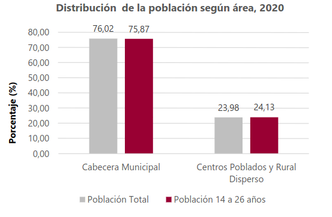
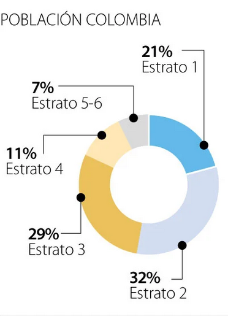
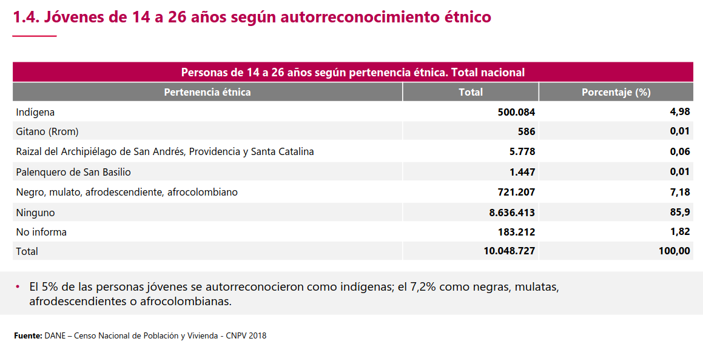
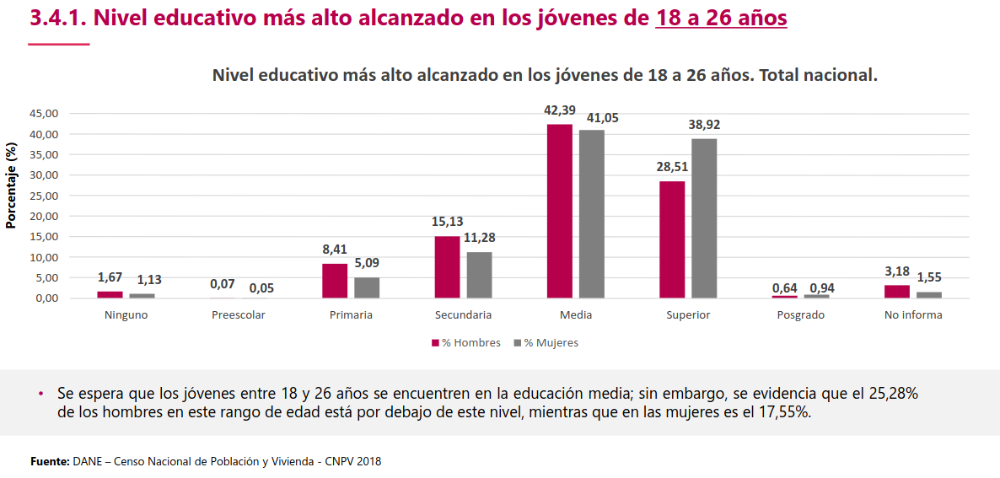
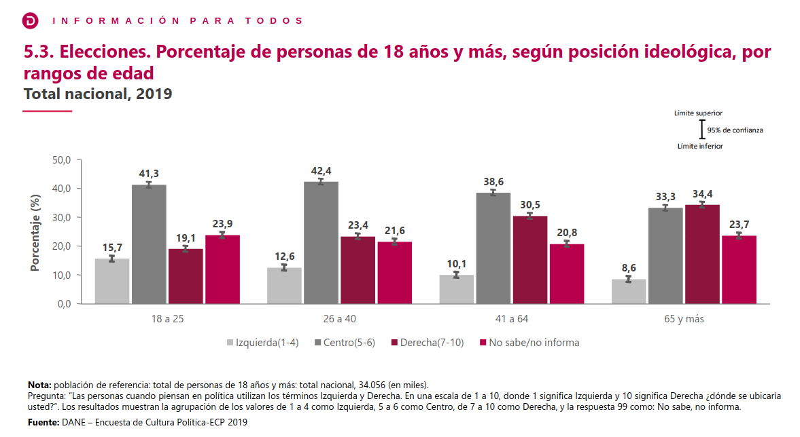

Encuesta: Distribución y recodificación de variables
================
Juan Sebastian Cely
2023-08-01

# Emociones hacia el cambio climático

La pregunta número 36 fue: ¿Cuáles son las DOS emociones que reflejan su
forma de sentir cuando piensa en el cambio climático? Cada participante
podía elegir un máximo de 2 emociones de un conjunto de 16 emociones.

| Emoción        | Frecuencia | Porcentaje (%) |
|:---------------|-----------:|---------------:|
| Triste         |        745 |           33.6 |
| Motivado       |        289 |           13.0 |
| Temeroso       |        721 |           32.5 |
| Furioso        |        202 |            9.1 |
| Ansioso        |        425 |           19.1 |
| Frustrado      |        460 |           20.7 |
| Culpable       |        237 |           10.7 |
| Avergonzado    |        125 |            5.6 |
| Desesperado    |        155 |            7.0 |
| Herido         |         43 |            1.9 |
| Deprimido      |        130 |            5.9 |
| Optimista      |        262 |           11.8 |
| Indiferente    |         76 |            3.4 |
| Confiado       |        118 |            5.3 |
| Desesperanzado |        204 |            9.2 |
| Tranquilo      |        117 |            5.3 |

| Nº emociones seleccionadas | Frecuencia | Porcentaje (%) |
|:---------------------------|-----------:|---------------:|
| 1                          |        131 |            5.9 |
| 2                          |       2089 |           94.1 |

## Variable “Emociones hacia el cambio climático” Recodificada

El conjunto de 16 emociones fue agrupado en tres niveles: Emociones
negativas, Emociones ambivalentes y/o neutrales, y Emociones positivas.

| Emociones              | Frecuencia | Porcentaje (%) |
|:-----------------------|-----------:|---------------:|
| Negativas              |       1581 |           71.2 |
| Ambivalentes/Neutrales |        385 |           17.3 |
| Positivas              |        254 |           11.4 |

## Variable “Emociones hacia el cambio climático” Recodificada Opción 2

El conjunto de 16 emociones fueron agrupadas en 6 categorías creadas a
partir del modelo conocido como “Circumplex model of affect”, el cual
clasifica a las emociones de acuerdo a las dimensiones de valencia y
activación. Las emociones positivas solo fueron catalogadas de acuerdo a
su valencia debido al reducido número de participantes que seleccionaron
algunas de estas. De esta manera se evita tener categorias con
frecuencias en extremo reducidas.

| Emociones        | Frecuencia | Porcentaje (%) |
|:-----------------|-----------:|---------------:|
| Pos              |        297 |           13.4 |
| Pos y neg act    |        264 |           11.9 |
| Pos y neg no act |         78 |            3.5 |
| Neg act          |        647 |           29.1 |
| Neg no act y act |        798 |           35.9 |
| Neg no act       |        136 |            6.1 |

# Zona de residencia

Al inicio de la encuesta se clasificó a los participantes en dos
distintas categorías según su lugar de residencia. Estas fueron
categorías son: “Urbana ciudades” y “Municipios rurales dispersos”.

| Zona de Residencia           | Frecuencia | Porcentaje (%) |
|:-----------------------------|-----------:|---------------:|
| Municipios rurales dispersos |        210 |            9.5 |
| Urbana ciudades              |       2010 |           90.5 |

## Distribución de zona de residencia según datos del DANE

Los datos del DANE muestran porcentajes cercanos a los obtenidos en la
encuesta. 

# Sexo

La pregunta número 1 pedía a cada participante indicar su sexo.

| Sexo   | Frecuencia | Porcentaje (%) |
|:-------|-----------:|---------------:|
| Hombre |       1115 |           50.2 |
| Mujer  |       1105 |           49.8 |

# Edad

La pregunta número 2 fue: ¿Cuántos años tiene? Todos los participantes
debían tener 18 años o más y no más de 32 años.

| Edad | Porcentaje (%) |
|:-----|---------------:|
| 18   |            7.1 |
| 19   |            5.9 |
| 20   |            5.5 |
| 21   |            5.6 |
| 22   |            6.1 |
| 23   |            5.8 |
| 24   |            6.1 |
| 25   |            6.9 |
| 26   |            5.9 |
| 27   |            5.3 |
| 28   |            5.9 |
| 29   |            5.3 |
| 30   |           10.1 |
| 31   |            5.9 |
| 32   |           12.5 |

## Variable “Edad” Recodificada

El rango de edad permitido para los participantes fue separado en 4
distintos grupos: “De 18 a 20 años”, “De 21 a 24 años”, “De 25 a 29
años”, y “De 30 a 32 años”.

| Rango de edad   | Frecuencia | Porcentaje (%) |
|:----------------|-----------:|---------------:|
| De 18 a 20 años |        412 |           18.6 |
| De 21 a 24 años |        524 |           23.6 |
| De 25 a 29 años |        651 |           29.3 |
| De 30 a 32 años |        633 |           28.5 |

# Estrato

La pregunta número 3 fue: En el recibo de la luz de su domicilio, ¿qué
estrato sale reportado? Todos los participantes debían indicar su
estrato de acuerdo a la clasificación del Departamento de Planeación
Nacional que va desde 1 hasta 6.

| Estrato | Frecuencia | Porcentaje (%) |
|:--------|-----------:|---------------:|
| 1       |        423 |           19.1 |
| 2       |        674 |           30.4 |
| 3       |        697 |           31.4 |
| 4       |        232 |           10.5 |
| 5       |        130 |            5.9 |
| 6       |         64 |            2.9 |

## Distribución de estrato socioeconómico según datos de Kantar

Los datos de Kantar muestran porcentajes cercanos a los obtenidos en la
encuesta. 

## Variable “Estrato” Recodificada

La variable “Estrato” fue recodificada en tres distintos grupos: Estrato
“Bajo”, que incluye los estratos 1 y 2; Estrato “Medio”, que incluye los
estratos 3 y 4, y Estrato “Alto”, que incluye los estratos 5 y 6.

| Estrato | Frecuencia | Porcentaje (%) |
|:--------|-----------:|---------------:|
| Bajo    |       1097 |           49.4 |
| Medio   |        929 |           41.8 |
| Alto    |        194 |            8.7 |

# Etnia

La pregunta número 5 fue:De acuerdo con su cultura, etnia o rasgos
físicos, ¿usted se reconoce como:…? El participante debía elegir una
opción de las 6 incluidas.

| Etnia          | Frecuencia | Porcentaje (%) |
|:---------------|-----------:|---------------:|
| Indígena       |         36 |            1.6 |
| Gitana(o) Rrom |          4 |            0.2 |
| Raizal         |          7 |            0.3 |
| Palenquera(o)  |          2 |            0.1 |
| Afro           |        136 |            6.1 |
| Ninguna        |       2035 |           91.7 |

## Distribución de etnias según datos del DANE

Los datos del DANE muestran porcentajes cercanos a los obtenidos en la
encuesta. 

## Variable “Etnia” Recodificada

La variable “Etnia” fue recodificada en dos distintos niveles que
distinguen si la persona se reconoce como perteneciente a alguna de las
etnias incluidas o no.

| ¿Pertenece a alguna etnia? | Frecuencia | Porcentaje (%) |
|:---------------------------|-----------:|---------------:|
| No                         |       2035 |           91.7 |
| Sí                         |        185 |            8.3 |

# Nivel educativo

La pregunta número 6 fue: ¿Cuál es el nivel educativo más alto alcanzado
por usted?

| Educación           | Frecuencia | Porcentaje (%) |
|:--------------------|-----------:|---------------:|
| Básica Primaria     |         56 |            2.5 |
| Básica Secundaria   |        164 |            7.4 |
| Secundaria Completa |       1014 |           45.7 |
| Técnico o Tecnólogo |        577 |           26.0 |
| Pregrado            |        346 |           15.6 |
| Posgrado            |         63 |            2.8 |

## Distribución de nivel educativo más alto alcanzado según datos del DANE

Los datos del DANE muestran porcentajes cercanos a los obtenidos en la
encuesta. 

## Variable “Nivel educativo” Recodificada

La variable “Nivel educativo” fue recodificada en dos distintos niveles
que distinguen si la persona completó o no estudios de educación
superior.

# Hijos

La pregunta número 9 fue: ¿Usted tiene hijos?

| ¿Tiene Hijos? | Frecuencia | Porcentaje (%) |
|:--------------|-----------:|---------------:|
| Sí            |        935 |           42.1 |
| No            |       1285 |           57.9 |

# Ideología política

La pregunta número 11 fue: Ubique su posición ideológica, en una escala
de 1 a 6 donde 1 es una posición de izquierda y 6 es una posición de
derecha.

| Ideología política | Frecuencia | Porcentaje (%) |
|:-------------------|-----------:|---------------:|
| Izquierda Fuerte   |        262 |           11.8 |
| Izquierda          |        286 |           12.9 |
| Centro Izquierda   |        801 |           36.1 |
| Centro Derecha     |        448 |           20.2 |
| Derecha            |        211 |            9.5 |
| Derecha Fuerte     |        212 |            9.5 |

## Distribución de ideología política según datos del DANE

Los datos del DANE muestran porcentajes cercanos a los obtenidos en la
encuesta. 

## Variable “Ideología política” Recodificada

La variable “Ideología política” fue recodificada en tres distintos
niveles que distinguen si la persona se considera de izquierda, de
centro, o de derecha.

| Ideología política | Frecuencia | Porcentaje (%) |
|:-------------------|-----------:|---------------:|
| Derecha            |        423 |           19.1 |
| Centro             |       1249 |           56.3 |
| Izquierda          |        548 |           24.7 |

# Medios de información

La pregunta número 12 fue: ¿Cómo se informa usted de los temas del país?
El participante podía elegir tantas opciones como quisiera.

| Medio          | Frecuencia | Proporción (%) |
|:---------------|-----------:|---------------:|
| Televisión     |       1396 |           62.9 |
| Radio          |        455 |           20.5 |
| Prensa impresa |        264 |           11.9 |
| Digital        |        468 |           21.1 |
| Redes Sociales |       1603 |           72.2 |
| Otro           |         21 |            0.9 |

| Nº medios seleccionados | Frecuencia | Porcentaje (%) |
|:------------------------|-----------:|---------------:|
| 1                       |        865 |           39.0 |
| 2                       |        925 |           41.7 |
| 3                       |        280 |           12.6 |
| 4                       |         98 |            4.4 |
| 5                       |         52 |            2.3 |

## Medios de información por separado

Se exploró cada uno de los medios de información de forma individual.

## Variable “Medios de información” Recodificada

Los distintos medios de información fueron agrupados para crear una
variable que distingue si la persona se informa a través de internet o
no.

| Internet como fuente | Frecuencia | Porcentaje (%) |
|:---------------------|-----------:|---------------:|
| No                   |        475 |           21.4 |
| Sí                   |       1745 |           78.6 |

# Confianza hacia figuras e instituciones

La pregunta número 17 fue: De las siguientes instituciones y figuras,
¿en cuáles confía? Los participantes debían responder para cada una de
las 22 figuras e instituciones incluidas si confiaban en esta o no, o si
no tenían conocimiento sobre esta.

| Institución o figura                       |   Sí |   No | No la conoce | No aplica |
|:-------------------------------------------|-----:|-----:|-------------:|----------:|
| Universidades Públicas                     | 62.3 | 34.6 |          3.2 |       0.0 |
| Universidades Privadas                     | 55.4 | 41.1 |          3.5 |       0.0 |
| La Iglesia católica                        | 47.6 | 49.6 |          2.8 |       0.0 |
| Las Fuerzas Militares                      | 43.5 | 53.4 |          3.2 |       0.0 |
| Registraduría                              | 38.2 | 58.1 |          3.8 |       0.0 |
| Defensoría del Pueblo                      | 37.9 | 55.6 |          6.5 |       0.0 |
| Alcaldía municipal                         | 33.1 | 64.0 |          2.9 |       0.0 |
| Jurados de Votación                        | 31.0 | 62.7 |          6.3 |       0.0 |
| Fiscalía General de la Nación              | 30.0 | 66.3 |          3.7 |       0.0 |
| Policía Nacional de Colombia               | 30.0 | 67.9 |          2.1 |       0.0 |
| Líderes religiosos cristianos No católicos | 28.0 | 64.6 |          7.4 |       0.0 |
| Procuraduría General de la Nación          | 26.1 | 65.4 |          8.6 |       0.0 |
| Sindicatos                                 | 25.3 | 63.8 |         10.9 |       0.0 |
| Contraloría General de la República        | 25.0 | 66.0 |          9.0 |       0.0 |
| Consejo Nacional Electoral                 | 23.8 | 68.6 |          7.6 |       0.0 |
| Gobernación departamental                  | 23.1 | 49.1 |          3.3 |      24.5 |
| Congreso de la República                   | 19.6 | 75.8 |          4.5 |       0.0 |
| Presidencia de Colombia                    | 19.3 | 78.1 |          2.6 |       0.0 |
| Partidos políticos                         | 16.0 | 79.2 |          4.8 |       0.0 |

| Categoría    | Frecuencia | Porcentaje (%) |
|:-------------|-----------:|---------------:|
| Sí           |      13654 |           32.4 |
| No           |      25835 |           61.2 |
| No la conoce |       2147 |            5.1 |
| No aplica    |        544 |            1.3 |

## Confianza en figuras e instituciones agrupadas

Las instituciones donde los cargos ocupados son de elección popular se
agruparon para conformar una nueva variable.

# Asociarse a organizaciones ambientales

La pregunta número 18 fue: ¿Usted qué está dispuesto a hacer para
aportar/solucionar los problemas del país? Dentro de las opciones
incluidas, la número 7 correspondía a la opción “Asociarme en
organizaciones ambientales” la cual fue elegida de forma independiente
por su relevancia para el proyecto.

| ¿Se asociaría? | Frecuencia | Porcentaje (%) |
|:---------------|-----------:|---------------:|
| Sí             |       1274 |           57.4 |
| No             |        946 |           42.6 |

# Impacto de actores frente al cambio climático

La pregunta número 35 fue: En una escala de 1 a 6, donde 1 es MUY
NEGATIVO y 6 es MUY POSITIVO, ¿cómo cree usted que impactan los
siguientes actores en el cambio climático? EL participante debía
responder a cada uno de los 14 actores incluidos.

| Actor                          | Muy negativo |    2 |    3 |    4 |    5 | Muy positivo | No sabe |
|:-------------------------------|-------------:|-----:|-----:|-----:|-----:|-------------:|--------:|
| Activistas                     |         14.1 | 12.5 | 20.5 | 21.1 | 14.7 |         11.1 |     5.9 |
| Campesinos                     |          5.4 |  6.1 | 15.0 | 20.8 | 20.5 |         23.4 |     8.8 |
| Científicos                    |          4.5 |  4.9 | 15.0 | 18.6 | 21.8 |         25.6 |     9.5 |
| Defensores de Derechos humanos |          9.0 | 10.1 | 20.8 | 23.3 | 16.9 |         13.5 |     6.4 |
| Feministas                     |         18.4 | 14.8 | 24.3 | 17.5 | 11.0 |          7.7 |     6.4 |
| Fuerza pública                 |         27.5 | 14.8 | 20.7 | 17.1 |  9.6 |          4.9 |     5.5 |
| Gobierno local                 |         20.2 | 17.2 | 23.0 | 18.5 | 11.1 |          6.7 |     3.4 |
| Gobierno nacional              |         22.3 | 18.0 | 22.3 | 17.4 | 10.0 |          6.4 |     3.5 |
| Grupos al margen de la ley     |         33.8 | 16.7 | 16.4 | 14.1 |  9.0 |          3.8 |     6.2 |
| Grupos religiosos              |         19.3 | 15.2 | 21.2 | 19.3 | 12.6 |          7.3 |     5.0 |
| Líderes ambientales            |          3.9 |  5.0 | 14.3 | 19.1 | 21.0 |         28.1 |     8.6 |
| Líderes comunitarios           |          8.2 | 11.9 | 21.0 | 22.0 | 15.4 |         14.9 |     6.6 |
| Políticos                      |         30.6 | 18.8 | 18.2 | 14.2 |  9.1 |          5.1 |     3.9 |
| Profesores                     |          5.2 |  7.7 | 18.8 | 21.9 | 21.3 |         19.8 |     5.2 |

| Categoría    | Frecuencia | Porcentaje (%) |
|:-------------|-----------:|---------------:|
| Muy negativo |       4937 |           15.9 |
| 2            |       3857 |           12.4 |
| 3            |       6030 |           19.4 |
| 4            |       5881 |           18.9 |
| 5            |       4531 |           14.6 |
| Muy positivo |       3959 |           12.7 |
| No sabe      |       1885 |            6.1 |

## Impacto de actores relevantes en el cambio climático Recodificada

Fueron elegidos los actores considerados como más relevantes frente al
fenómeno del cambio climático. Para cada uno se exploró su distribución
en relación a su impacto sobre el cambio climático. Los valores
negativos representan un impacto negativo, y los valores positivos un
impacto positivo. La escala va desde -3 hasta 3.

# Pensamientos sobre el cambio climático

La pregunta número 37 fue: “De las siguientes opciones, el cambio
climático me hace pensar que:”. Los participantes podían elegir un
máximo de 3 opciones dentro de los 15 pensamientos incluidos.

| Pensamiento                    | Frecuencia | Porcentaje (%) |
|:-------------------------------|-----------:|---------------:|
| Fracaso humanidad              |        559 |           25.2 |
| Futuro aterrador               |        839 |           37.8 |
| No me afecta                   |        178 |            8.0 |
| Humanidad condenada            |        392 |           17.7 |
| Generación sin oportunidades   |        676 |           30.5 |
| Destruye lo que valoro         |        558 |           25.1 |
| Seguridad amenazada            |        353 |           15.9 |
| No tener hijos                 |        346 |           15.6 |
| La Humanidad lo superará       |        179 |            8.1 |
| Proceso natural                |        137 |            6.2 |
| Avances nos salvarán           |        256 |           11.5 |
| Oportunidad para valorar       |        461 |           20.8 |
| Coordinación mundial salvación |        158 |            7.1 |
| Castigo Dios                   |         78 |            3.5 |
| Dios nos salvará               |         96 |            4.3 |

| Nº pensamientos seleccionados | Frecuencia |
|:------------------------------|-----------:|
| 1                             |        302 |
| 2                             |        790 |
| 3                             |       1128 |

## Variable “Pensamientos sobre cambio climático” Recodificada

La variable “Pensamientos sobre cambio climático” fue recodificada en
tres distintos niveles que distinguen si frente al cambio climático la
persona tiene exclusivamente pensamientos negativos, si tiene
pensamientos ambivalentes o neutrales, y si tiene pensamientos
exclusivamente positivos.

| Pensamiento            | Frecuencia | Porcentaje (%) |
|:-----------------------|-----------:|---------------:|
| Negativos              |       1125 |           50.7 |
| Ambivalentes/Neutrales |        951 |           42.8 |
| Positivos              |        144 |            6.5 |

# Impacto acciones en su comodidad

La pregunta número 38 fue: En una escala de 1 a 6, donde 1 es MUY
NEGATIVAMENTE y 6 es MUY POSITIVAMENTE, ¿Cómo cree que las siguientes
acciones afectarían A SU COMODIDAD? El participante debía dar una
respuesta para cada una de las 10 acciones incluidas.

| Acción                   | Muy negativo |    2 |    3 |    4 |    5 | Muy positivo |
|:-------------------------|-------------:|-----:|-----:|-----:|-----:|-------------:|
| Bici caminar             |          3.7 |  7.3 | 16.9 | 22.6 | 18.4 |         31.2 |
| Bombillos ahorradores    |          2.0 |  4.5 | 12.1 | 16.5 | 19.4 |         45.5 |
| Compra local             |          4.5 |  8.1 | 24.5 | 25.0 | 15.1 |         22.7 |
| No carro                 |         12.7 | 13.5 | 28.2 | 21.4 | 11.4 |         12.9 |
| Plantar árbol            |          1.4 |  2.7 | 10.0 | 16.6 | 18.6 |         50.8 |
| Prohibir bolsas          |          4.5 |  7.4 | 20.0 | 20.3 | 16.9 |         30.9 |
| Reducir aire calefacción |          4.5 |  6.4 | 21.6 | 23.3 | 17.0 |         27.3 |
| Reducir electrónicos     |          5.6 |  9.4 | 23.2 | 24.4 | 16.0 |         21.4 |
| Un hijo menos            |          7.2 |  8.6 | 22.0 | 23.0 | 15.0 |         24.3 |
| Vegetariano vegano       |         10.0 | 13.4 | 26.0 | 23.0 | 12.3 |         15.4 |

| Categoría    | Frecuencia | Porcentaje (%) |
|:-------------|-----------:|---------------:|
| Muy negativo |       1238 |            5.6 |
| 2            |       1804 |            8.1 |
| 3            |       4543 |           20.5 |
| 4            |       4795 |           21.6 |
| 5            |       3553 |           16.0 |
| Muy positivo |       6267 |           28.2 |

## Creación de una medida del impacto positivo de ciertas acciones en la comodidad

Se creó una medida que promedia los valores asignados a cada una de las
acciones individuales y se recodificaron en una escala que va desde -3
hasta 3.

# Impacto acciones en cambio climático

La pregunta número 39 fue: En una escala de 1 a 6, donde 1 es MUY
NEGATIVAMENTE y 6 es MUY POSITIVAMENTE, ¿Cómo cree que las siguientes
acciones afectarían AL CAMBIO CLIMÁTICO? El participante debía dar una
respuesta para cada una de las 10 acciones incluidas.

| Acción                   | Muy negativo |   2 |    3 |    4 |    5 | Muy positivo |
|:-------------------------|-------------:|----:|-----:|-----:|-----:|-------------:|
| Bici caminar             |          1.4 | 3.0 | 10.4 | 16.4 | 18.6 |         50.3 |
| Bombillos ahorradores    |          1.0 | 3.3 | 10.5 | 14.7 | 17.7 |         52.7 |
| Compra local             |          2.1 | 4.2 | 17.4 | 21.9 | 21.0 |         33.4 |
| No carro                 |          3.8 | 4.3 | 16.1 | 16.5 | 19.8 |         39.5 |
| Plantar árbol            |          0.6 | 2.9 |  8.1 | 13.2 | 16.5 |         58.7 |
| Prohibir bolsas          |          2.3 | 3.2 | 11.5 | 15.7 | 20.5 |         46.9 |
| Reducir aire calefacción |          1.5 | 3.0 | 12.2 | 19.1 | 20.3 |         43.9 |
| Reducir electrónicos     |          1.3 | 3.3 | 13.3 | 20.2 | 21.5 |         40.4 |
| Un hijo menos            |          4.0 | 5.5 | 15.5 | 20.2 | 19.0 |         35.9 |
| Vegetariano vegano       |          3.9 | 6.5 | 19.5 | 23.8 | 17.1 |         29.2 |

| Categoría    | Frecuencia | Porcentaje (%) |
|:-------------|-----------:|---------------:|
| Muy negativo |        484 |            2.2 |
| 2            |        871 |            3.9 |
| 3            |       2985 |           13.4 |
| 4            |       4034 |           18.2 |
| 5            |       4258 |           19.2 |
| Muy positivo |       9568 |           43.1 |

## Creación de una medida del impacto de ciertas acciones en el cambio climático

Se creó una medida que promedia los valores asignados a cada una de las
acciones individuales y se recodificaron en una escala que va desde -3
hasta 3.

## Creación de una medida de la disposición a llevar acabo acciones individuales

Se sumaron los valores obtenidos frente al impacto de acciones
individuales en el cambio climático y en la comodidad y se clasificaron
de modo que los puntajes negativos o iguales a cero se convirtieron en
la categoría “Poco dispuesta”; los puntajes de 1 hasta 3 se convirtieron
en la categoría “Dispuesta”, y los puntajes de 4 hasta 6 se convirtieron
en la categoría “Muy dispuesta”.

# Origen del cambio climático

La pregunta número 40 fue: Indíqueme su apreciación en cuanto al origen
del cambio climático actual, en una escala de 1 a 10, donde 1 es 100%
debido a causas naturales y 10 es 100% debido a actividades humanas.

| Origen cambio climático | Frecuencia | Porcentaje (%) |
|:------------------------|-----------:|---------------:|
| 1                       |         21 |            0.9 |
| 2                       |         23 |            1.0 |
| 3                       |         28 |            1.3 |
| 4                       |         50 |            2.3 |
| 5                       |        187 |            8.4 |
| 6                       |        209 |            9.4 |
| 7                       |        305 |           13.7 |
| 8                       |        344 |           15.5 |
| 9                       |        282 |           12.7 |
| 10                      |        771 |           34.7 |

## Variable “Origen del cambio climático” Recodificada

La variable “Origen del cambio climático” fue recodificada en dos
niveles que distinguen si la persona se aproxima a una respuesta
correcta o no respecto al porcentaje de contribución al cambio climático
de las actividades humanas. Solo quienes eligieron las opciones que
constituyen un rango del 80 al 100% de origen del cambio climátivo por
actividades humanas se clasificaron como una respuesta correcta.

| Respuesta Origen Cambio Climático | Frecuencia | Porcentaje (%) |
|:----------------------------------|-----------:|---------------:|
| Correcta                          |       1053 |           47.4 |
| Incorrecta                        |       1167 |           52.6 |

# Mayor contribución al cambio climático

La pregunta número 41 fue: En su opinión, ¿cuál de los siguientes
factores a nivel global tiene la mayor contribución al cambio climático
actualmente? El participante debía elegir una única opción dentro de los
4 factores incluidos.

| Factor                        | Frecuencia | Porcentaje (%) |
|:------------------------------|-----------:|---------------:|
| Agricultura y ganadería       |        239 |           10.8 |
| Quema de combustibles fósiles |        744 |           33.5 |
| Deforestación                 |       1155 |           52.0 |
| Volcanes y/o actividad solar  |         82 |            3.7 |

## Variable “Mayor contribución al cambio climático” Recodificada

La variable “Mayor contribución al cambio climático” fue recodificada en
dos distintos niveles que distinguen si la persona respondió
correctamente que la quema de combustibles fósiles es el factor que más
contribuye al cambio climático.

| Respuesta  | Frecuencia | Porcentaje (%) |
|:-----------|-----------:|---------------:|
| Correcta   |        744 |           33.5 |
| Incorrecta |       1476 |           66.5 |

# Exploración visual de algunas relaciones esperables dentro de la muestra

Se esperaba encontrar que las personas que habitan en ciudades urbanas
tiendan a alcanzar niveles más altos de educación comparadas con las
personas que habitan en municipios rurales dispersos.

Se esperaba encontrar que las personas que habitan en ciudades urbanas
tiendan a pertenecer a estratos más altos comparadas con las personas
que habitan en municipios rurales dispersos.

Se esperaba encontrar que las personas de estratos socioeconómicos altos
tiendan a alcanzar niveles de educación más altos comparadas con las
personas de estratos socioeconómicos más bajos.

