```{r setup, include=FALSE, warning=FALSE}
stopifnot(require(openxlsx), require(kableExtra), require(dm), require(dplyr), require (ggplot2), require(rms), require(caret), require(lmtest), require(car), require(yardstick), require(papaja), require(pandoc), require(tinytex), require(RColorBrewer), require(ggplotify), require(FactoMineR), require(factoextra), require(Factoshiny), require(effectsize), require(nnet), require(VGAM), require(gtsummary), require(DescTools), require(generalhoslem), require(ResourceSelection), require(mfx), require(lmtest))
knitr::opts_chunk$set(cache=F,fig.path="./figures",cache.rebuild = F)
options(knitr.table.format = "simple")
```

```{r data, include=FALSE, warning=FALSE}
wb<-loadWorkbook("C:\\Users\\sebas\\OneDrive\\Documents\\JSCA2\\Research\\Current_R_projects\\col_youth_climate_change\\Analyses\\020-22 Base de Datos Anonimizada V4 (1).xlsx")
names(wb)
data1 <- readWorkbook(wb,sheet=1)
codeBook1 <- readWorkbook(wb,sheet=2,skipEmptyRows = F)
```

```{r tranformación y recodificación variables, include=FALSE, warning=FALSE}
# Eco-anxiety
neg_emo <- c("C36_1", "C36_3", "C36_4", "C36_5", "C36_6", "C36_7", "C36_8", "C36_9", "C36_10", "C36_11", "C36_15")
amb_emo <- c("C36_13")
pos_emo <- c("C36_2", "C36_12", "C36_14", "C36_16")
data1$eco_anx <- NA
for (i in 1:nrow(data1)) {
neg_emo_count <- sum(data1[i, neg_emo] == 1)
pos_emo_count <- sum(data1[i, pos_emo] == 1)
amb_emo_count <- sum(data1[i, amb_emo] == 1)
if (neg_emo_count %in% c(1, 2) & pos_emo_count == 0 & amb_emo_count == 0) {
data1$eco_anx[i] <- "Negativas"
} else if (neg_emo_count == 1 & pos_emo_count == 1 & amb_emo_count == 0) {
data1$eco_anx[i] <- "Ambivalentes/Neutrales"
} else if (neg_emo_count == 1 & pos_emo_count == 0 & amb_emo_count == 1) {
data1$eco_anx[i] <- "Ambivalentes/Neutrales"
} else if (neg_emo_count == 0 & pos_emo_count == 1 & amb_emo_count == 1) {
data1$eco_anx[i] <- "Ambivalentes/Neutrales"
} else if (neg_emo_count == 0 & pos_emo_count == 0 & amb_emo_count == 1) {
data1$eco_anx[i] <- "Ambivalentes/Neutrales"
} else if (neg_emo_count == 0 & pos_emo_count %in% c(1, 2) & amb_emo_count == 0) {
data1$eco_anx[i] <- "Positivas"
}
}
data1$eco_anx <- factor(data1$eco_anx, levels = c("Negativas", "Ambivalentes/Neutrales", "Positivas"))

# Emotional arousal
high_ar <- c("C36_2", "C36_3", "C36_4", "C36_5", "C36_6", "C36_7", "C36_9", "C36_12", "C36_14")
low_ar <- c("C36_1", "C36_8", "C36_10", "C36_11", "C36_13", "C36_15", "C36_16")
data1$eco_anx2 <- NA
for (i in 1:nrow(data1)) {
high_ar_count <- sum(data1[i, high_ar] == 1)
low_ar_count <- sum(data1[i, low_ar] == 1)
if (high_ar_count %in% c(1, 2) & low_ar_count == 0) {
data1$eco_anx2[i] <- "Alta activación"
} else if (high_ar_count == 1 & low_ar_count == 1) {
data1$eco_anx2[i] <- "Ambivalente/Neutra"
} else if (high_ar_count == 0 & low_ar_count %in% c(1, 2)) {
data1$eco_anx2[i] <- "Baja activación"
}
}
data1$eco_anx2 <- factor(data1$eco_anx2, levels = c("Baja activación", "Ambivalente/Neutra", "Alta activación"))

unp_deac <- c("C36_1", "C36_10", "C36_11", "C36_15")
unp_act <- c("C36_3", "C36_4", "C36_5", "C36_6", "C36_7", "C36_8", "C36_9")
ple_deac <- c("C36_13", "C36_16")
ple_act <- c("C36_2", "C36_12", "C36_14")
data1$cir_mod2 <- NA
for (i in 1:nrow(data1)) {
unp_deac_count <- sum(data1[i, unp_deac] == 1)
unp_act_count <- sum(data1[i, unp_act] == 1)
ple_deac_count <- sum(data1[i, ple_deac] == 1)
ple_act_count <- sum(data1[i, ple_act] == 1)
if (unp_deac_count %in% c(1, 2) & unp_act_count == 0 & ple_deac_count == 0 & ple_act_count == 0) {
data1$cir_mod2[i] <- "Neg no act"
} else if (unp_deac_count == 1 & unp_act_count == 1 & ple_deac_count == 0 & ple_act_count == 0) {
data1$cir_mod2[i] <- "Neg act y no act"
} else if (unp_deac_count == 1 & unp_act_count == 0 & ple_deac_count == 1 & ple_act_count == 0) {
data1$cir_mod2[i] <- "Neg no act y pos no act"
} else if (unp_deac_count == 1 & unp_act_count == 0 & ple_deac_count == 0 & ple_act_count == 1) {
data1$cir_mod2[i] <- "Neg no act y pos act"
} else if (unp_deac_count == 0 & unp_act_count %in% c(1, 2) & ple_deac_count == 0 & ple_act_count == 0) {
data1$cir_mod2[i] <- "Neg act"
} else if (unp_deac_count == 0 & unp_act_count == 1 & ple_deac_count == 1 & ple_act_count == 0) {
data1$cir_mod2[i] <- "Neg act y pos no act"
} else if (unp_deac_count == 0 & unp_act_count == 1 & ple_deac_count == 0 & ple_act_count == 1) {
data1$cir_mod2[i] <- "Neg act y pos act"
} else if (unp_deac_count == 0 & unp_act_count == 0 & ple_deac_count %in% c(1, 2) & ple_act_count == 0) {
data1$cir_mod2[i] <- "Pos no act"
} else if (unp_deac_count == 0 & unp_act_count == 0 & ple_deac_count == 1 & ple_act_count == 1) {
data1$cir_mod2[i] <- "Pos act y no act"
} else if (unp_deac_count == 0 & unp_act_count == 0 & ple_deac_count == 0 & ple_act_count %in% c(1, 2)) {
data1$cir_mod2[i] <- "Pos act"
}
}
data1$cir_mod2 <- as.factor(data1$cir_mod2)

unp_deac <- c("C36_1", "C36_10", "C36_11", "C36_15")
unp_act <- c("C36_3", "C36_4", "C36_5", "C36_6", "C36_7", "C36_8", "C36_9")
pos <- c("C36_13", "C36_16", "C36_2", "C36_12", "C36_14")
data1$cir_mod <- NA
for (i in 1:nrow(data1)) {
unp_deac_count <- sum(data1[i, unp_deac] == 1)
unp_act_count <- sum(data1[i, unp_act] == 1)
pos_count <- sum(data1[i, pos] == 1)
if (unp_deac_count %in% c(1, 2) & unp_act_count == 0 & pos_count == 0) {
data1$cir_mod[i] <- "Neg no act"
} else if (unp_deac_count == 1 & unp_act_count == 1 & pos_count == 0) {
data1$cir_mod[i] <- "Neg no act y act"
} else if (unp_deac_count == 1 & unp_act_count == 0 & pos_count == 1) {
data1$cir_mod[i] <- "Pos y neg no act"
} else if (unp_deac_count == 0 & unp_act_count %in% c(1, 2) & pos_count == 0) {
data1$cir_mod[i] <- "Neg act"
} else if (unp_deac_count == 0 & unp_act_count == 1 & pos_count == 1) {
data1$cir_mod[i] <- "Pos y neg act"
} else if (unp_deac_count == 0 & unp_act_count == 0 & pos_count %in% c(1, 2)) {
data1$cir_mod[i] <- "Pos"
}
}
data1$cir_mod <- factor(data1$cir_mod, levels = c("Pos", "Pos y neg act", "Pos y neg no act", "Neg act", "Neg no act y act", "Neg no act"))

# Residential area
data1$Zona <- as.factor(data1$Zona)

# Sex
data1$A1 <- as.factor(data1$A1)
levels(data1$A1) <- c("Hombre", "Mujer")
data1$sex <- data1$A1

# Age range
data1$RANGO_EDAD <- as.factor(data1$RANGO_EDAD)
data1$age_r <- data1$RANGO_EDAD
data1 <- data1 %>%
  mutate(age_r = case_when(
    age_r == 1 ~ "De 18 a 20 años",
    age_r == 2 ~ "De 21 a 24 años",
    age_r == 3 ~ "De 25 a 29 años",
    age_r == 4 ~ "De 30 a 32 años"
))
data1$age_r <- as.factor(data1$age_r)
data1$edad <- data1$A2

# Stratum
data1$estrato <- as.factor(data1$A3)
data1$strat <- data1$A3
data1 <- data1 %>%
  mutate(strat = case_when(
    strat %in% c(1,2) ~ "Bajo",
    strat %in% c(3,4) ~ "Medio",
    strat %in% c(5,6) ~ "Alto"
))
data1$strat <- factor(data1$strat, levels = c("Bajo", "Medio", "Alto"))

# Ethnics
data1$A5 <- as.factor(data1$A5)
levels(data1$A5) <- c("Indígena", "Gitana(o) Rrom", "Raizal", "Palenquera(o)", "Afro", "Ninguna")
data1$etnia <- data1$A5
data1 <- data1 %>%
  mutate(ethni = case_when(
    etnia != "Ninguna" ~ "Sí",
    etnia == "Ninguna" ~ "No"
))
data1$ethni <- as.factor(data1$ethni)

# Education
data1$education <- as.factor(data1$A6)
levels(data1$education) <- c("Básica Primaria", "Básica Secundaria", "Secundaria Completa", "Técnico o Tecnólogo", "Pregrado", "Posgrado")

data1 <- data1 %>%
  mutate(edu = case_when(
    education %in% c("Básica Primaria", "Básica Secundaria", "Secundaria Completa", "Técnico o Tecnólogo") ~ "No",
    education %in% c("Pregrado", "Posgrado") ~ "Sí"
))
data1$edu <- as.factor(data1$edu)

# Kids
data1$A9 <- as.factor(data1$A9)
levels(data1$A9) <- c("Sí", "No")
data1$kids <- data1$A9

# Political ideology
data1$A11 <- as.factor(data1$A11)
data1 <- data1 %>%
  mutate(ideology = case_when(
    A11 %in% c(1, 2) ~ "Izquierda",
    A11 %in% c(3, 4) ~ "Centro",
    A11 %in% c(5, 6) ~ "Derecha"
  ))
data1$ideology <- factor(data1$ideology, levels = c("Derecha", "Centro", "Izquierda"))

# Medios según tipo
trad_med <- c("B12_1", "B12_2", "B12_3", "B12_89")
int_med <- c("B12_4", "B12_5")
data1$media <- NA
for (i in 1:nrow(data1)) {
trad_med_count <- sum(data1[i, trad_med] == 1)
int_med_count <- sum(data1[i, int_med] == 1)
if (trad_med_count %in% c(1:4) & int_med_count == 0) {
data1$media[i] <- "Solo tradicionales"
} else if (trad_med_count %in% c(1:4) & int_med_count %in% c(1:2)) {
data1$media[i] <- "Mixtos"
} else if (trad_med_count == 0 & int_med_count %in% c(1:2)) {
data1$media[i] <- "Solo internet"
}
}
data1$media <- factor(data1$media, levels = c("Solo tradicionales", "Mixtos", "Solo internet"))


# Medios según si es validada o no
val_med <- c("B12_1", "B12_2", "B12_3", "B12_4")
no_val_med <- c("B12_5", "B12_89")
data1$med <- NA
for (i in 1:nrow(data1)) {
val_med_count <- sum(data1[i, val_med] == 1)
no_val_med_count <- sum(data1[i, no_val_med] == 1)
if (val_med_count %in% c(1:4) & no_val_med_count == 0) {
data1$med[i] <- "Fuentes validadas"
} else if (val_med_count %in% c(1:4) & no_val_med_count %in% c(1:2)) {
data1$med[i] <- "Fuentes mixtas"
} else if (val_med_count == 0 & no_val_med_count %in% c(1:2)) {
data1$med[i] <- "Fuentes no validadas"
}
}
data1$med <- factor(data1$med, levels = c("Fuentes validadas", "Fuentes mixtas", "Fuentes no validadas"))

# Information sources
data1 <- data1 %>%
  dplyr::rename(Televisión = B12_1,
         Radio = B12_2,
         Prensa_Impresa = B12_3,
         Medios_Digitales = B12_4,
         Redes_Sociales = B12_5,
         Otro_medio = B12_89)

vars_to_convert <- c("Televisión",
         "Radio",
         "Prensa_Impresa",
         "Medios_Digitales",
         "Redes_Sociales",
         "Otro_medio")

for (var in vars_to_convert) {
  data1[[var]] <- factor(data1[[var]])
}
new_levels <- c("No", "Sí")
for (var in vars_to_convert) {
  levels(data1[[var]]) <- new_levels
}

data1 <- data1 %>%
  mutate(Internet = case_when(
    Medios_Digitales == "Sí" & Redes_Sociales == "Sí" ~ "Sí",
    Medios_Digitales == "Sí" & Redes_Sociales == "No" ~ "Sí",
    Medios_Digitales == "No" & Redes_Sociales == "Sí" ~ "Sí",
    Medios_Digitales == "No" & Redes_Sociales == "No" ~ "No"
  ))
data1$Internet <- as.factor(data1$Internet)


# Trust in particular Institutions and figures
trust_vote_inst <- data1 %>%
  dplyr::select(C17_5, C17_7, C17_8)
trust_vote_inst[] <- lapply(trust_vote_inst, function(x) replace(x, x == 2, -1))
trust_vote_inst[] <- lapply(trust_vote_inst, function(x) replace(x, x == 3, 0))
data1$trust_vote_inst <- rowSums(trust_vote_inst)
data1$trust_vote_inst <- as.factor(data1$trust_vote_inst)

data1 <- data1 %>%
  mutate(trust_vote_inst = case_when(
    trust_vote_inst %in% c("-3", "-2", "-1") ~ "No",
    trust_vote_inst %in% c("0", "1", "2", "3") ~ "Sí"
  ))
data1$trust_vote_inst <- factor(data1$trust_vote_inst, levels = c("No", "Sí"))

#trust_unis <- data1 %>%
  #select(C17_14, C17_15)
#trust_unis[] <- lapply(trust_unis, function(x) replace(x, x == 2, -1))
#trust_unis[] <- lapply(trust_unis, function(x) replace(x, x == 3, 0))
#data1$trust_unis <- rowSums(trust_unis)
#data1$trust_unis <- as.factor(data1$trust_unis)

data1$aso <- data1$C18_7
for (i in 1:nrow(data1)) {
  if (data1$aso[i] == 1) {
    data1$aso[i] <- 1
  } else if (data1$aso[i] == 2) {
    data1$aso[i] <- -1
  }
}

# Join an environmental organization
data1$C18_7 <- as.factor(data1$C18_7)
levels(data1$C18_7) <- c("Sí", "No")
data1$env_aso <- data1$C18_7

# Negative emotions towards actions taken by the government regarding climate change
neg_d34 <- c("D34_2", "D34_3", "D34_4", "D34_6", "D34_8", "D34_9")
pos_d34 <- c("D34_1", "D34_5", "D34_7", "D34_10")
data1$neg_emo_gov <- NA
for (i in 1:nrow(data1)) {
  data1$neg_emo_gov[i] <- sum(data1[i, neg_d34]) - sum(data1[i, pos_d34]) + 19
}

# Impact of scientists on climate change
data1$imp_scien <- data1$D35_1
data1$imp_scien[data1$imp_scien == 99] <- 3.5
value_mapping <- c(1, 2, 3, 3.5, 4, 5, 6)
new_values <- c(-3, -2, -1, 0, 1, 2, 3)
data1$imp_scien <- new_values[match(data1$imp_scien, value_mapping)]
data1$imp_scien <- as.factor(data1$imp_scien)

data1 <- data1 %>%
  mutate(imp_sci = case_when(
    imp_scien %in% c("-3", "-2") ~ "Negativo",
    imp_scien %in% c("-1", "0", "1") ~ "Neutro",
    imp_scien %in% c("2", "3") ~ "Positivo"
  ))
data1$imp_sci <- as.factor(data1$imp_sci)

# Impact of activists on climate change
data1$imp_act <- data1$D35_7
data1$imp_act[data1$imp_act == 99] <- 3.5
value_mapping <- c(1, 2, 3, 3.5, 4, 5, 6)
new_values <- c(-3, -2, -1, 0, 1, 2, 3)
data1$imp_act <- new_values[match(data1$imp_act, value_mapping)]
data1$imp_act <- as.factor(data1$imp_act)

data1 <- data1 %>%
  mutate(imp_ac = case_when(
    imp_act %in% c("-3", "-2") ~ "Negativo",
    imp_act %in% c("-1", "0", "1") ~ "Neutro",
    imp_act %in% c("2", "3") ~ "Positivo"
  ))
data1$imp_ac <- as.factor(data1$imp_ac)

# Impact of religious groups on climate change
data1$imp_rel <- data1$D35_3
data1$imp_rel[data1$imp_rel == 99] <- 3.5
value_mapping <- c(1, 2, 3, 3.5, 4, 5, 6)
new_values <- c(-3, -2, -1, 0, 1, 2, 3)
data1$imp_rel <- new_values[match(data1$imp_rel, value_mapping)]
data1$imp_rel <- as.factor(data1$imp_rel)

data1 <- data1 %>%
  mutate(imp_re = case_when(
    imp_rel %in% c("-3", "-2") ~ "Negativo",
    imp_rel %in% c("-1", "0", "1") ~ "Neutro",
    imp_rel %in% c("2", "3") ~ "Positivo"
  ))
data1$imp_re <- as.factor(data1$imp_re)

# Impact of politicians on climate change
data1$imp_pol <- data1$D35_6
data1$imp_pol[data1$imp_pol == 99] <- 3.5
value_mapping <- c(1, 2, 3, 3.5, 4, 5, 6)
new_values <- c(-3, -2, -1, 0, 1, 2, 3)
data1$imp_pol <- new_values[match(data1$imp_pol, value_mapping)]
data1$imp_pol <- as.factor(data1$imp_pol)

data1 <- data1 %>%
  mutate(imp_po = case_when(
    imp_pol %in% c("-3", "-2") ~ "Negativo",
    imp_pol %in% c("-1", "0", "1") ~ "Neutro",
    imp_pol %in% c("2", "3") ~ "Positivo"
  ))
data1$imp_po <- as.factor(data1$imp_po)

# Thoughts about climate change
pos_thought <- c("C37_9", "C37_11", "C37_12", "C37_13", "C37_15")
neg_thought<- c("C37_1", "C37_2", "C37_4", "C37_5", "C37_6", "C37_7", "C37_8", "C37_14")
neut_thought <- c("C37_3", "C37_10")
data1$thoughts <- NA
for (i in 1:nrow(data1)) {
neg_th_count <- sum(data1[i, neg_thought] == 1)
pos_th_count <- sum(data1[i, pos_thought] == 1)
amb_th_count <- sum(data1[i, neut_thought] == 1)
if (neg_th_count %in% c(1, 2, 3) & pos_th_count == 0 & amb_th_count == 0) {
data1$thoughts[i] <- "Negativos"
} else if (neg_th_count == 2 & pos_th_count == 1 & amb_th_count == 0) {
data1$thoughts[i] <- "Ambivalentes/Neutrales"
} else if (neg_th_count == 2 & pos_th_count == 0 & amb_th_count == 1) {
data1$thoughts[i] <- "Ambivalentes/Neutrales"
} else if (neg_th_count == 1 & pos_th_count == 1 & amb_th_count == 1) {
data1$thoughts[i] <- "Ambivalentes/Neutrales"
} else if (neg_th_count == 1 & pos_th_count == 1 & amb_th_count == 0) {
data1$thoughts[i] <- "Ambivalentes/Neutrales"
} else if (neg_th_count == 1 & pos_th_count == 0 & amb_th_count == 1) {
data1$thoughts[i] <- "Ambivalentes/Neutrales"
} else if (neg_th_count == 0 & pos_th_count %in% c(1, 2, 3) & amb_th_count == 0) {
data1$thoughts[i] <- "Positivos"
} else if (neg_th_count == 1 & pos_th_count == 2 & amb_th_count == 0) {
data1$thoughts[i] <- "Ambivalentes/Neutrales"
} else if (neg_th_count == 0 & pos_th_count == 2 & amb_th_count == 1) {
data1$thoughts[i] <- "Ambivalentes/Neutrales"
} else if (neg_th_count == 0 & pos_th_count == 1 & amb_th_count == 1) {
data1$thoughts[i] <- "Ambivalentes/Neutrales"
} else if (neg_th_count == 0 & pos_th_count == 0 & amb_th_count %in% c(1, 2)) {
data1$thoughts[i] <- "Ambivalentes/Neutrales"
} else if (neg_th_count == 1 & pos_th_count == 0 & amb_th_count == 2) {
data1$thoughts[i] <- "Ambivalentes/Neutrales"
} else if (neg_th_count == 0 & pos_th_count == 1 & amb_th_count == 2) {
data1$thoughts[i] <- "Ambivalentes/Neutrales"
}
}
data1$thoughts <- factor(data1$thoughts, levels = c("Negativos", "Ambivalentes/Neutrales", "Positivos"))

c38 <- grep("^C38_", names(data1), value=T)
data1$imp_como <- NA
for (i in 1:nrow(data1)) {
  data1$imp_como[i] <- round(sum(data1[i, c38]) / 10) 
}
for (i in 1:nrow(data1)) {
  if (data1$imp_como[i] == 1) {
    data1$imp_como[i] <- -3
  } else if (data1$imp_como[i] == 2) {
    data1$imp_como[i] <- -2
  } else if (data1$imp_como[i] == 3) {
    data1$imp_como[i] <- -1
  } else if (data1$imp_como[i] == 4) {
    data1$imp_como[i] <- 1
  } else if (data1$imp_como[i] == 5) {
    data1$imp_como[i] <- 2
  } else if (data1$imp_como[i] == 6) {
    data1$imp_como[i] <- 3
  }
}

c39 <- grep("^C39_", names(data1), value=T)
data1$imp_cli <- NA
for (i in 1:nrow(data1)) {
  data1$imp_cli[i] <- round(sum(data1[i, c39]) / 10)
}
for (i in 1:nrow(data1)) {
  if (data1$imp_cli[i] == 1) {
    data1$imp_cli[i] <- -3
  } else if (data1$imp_cli[i] == 2) {
    data1$imp_cli[i] <- -2
  } else if (data1$imp_cli[i] == 3) {
    data1$imp_cli[i] <- -1
  } else if (data1$imp_cli[i] == 4) {
    data1$imp_cli[i] <- 1
  } else if (data1$imp_cli[i] == 5) {
    data1$imp_cli[i] <- 2
  } else if (data1$imp_cli[i] == 6) {
    data1$imp_cli[i] <- 3
  }
}

data1$dis_act <- data1$imp_cli + data1$imp_como
data1 <- data1 %>%
  mutate(dis_act = case_when(
    dis_act %in% c(-6, -5, -4) ~ "Poco dispuesta",
    dis_act %in% c(-3, -2, -1) ~ "Poco dispuesta",
    dis_act == 0 ~ "Poco dispuesta",
    dis_act %in% c(1, 2, 3) ~ "Dispuesta",
    dis_act %in% c(4, 5, 6) ~ "Muy dispuesta",
))
data1$dis_act <- factor(data1$dis_act, levels = c("Poco dispuesta", "Dispuesta", "Muy dispuesta"))

# No car comfort
for (i in 1:nrow(data1)) {
  if (data1$C38_1[i] == 1) {
    data1$C38_1[i] <- -3
  } else if (data1$C38_1[i] == 2) {
    data1$C38_1[i] <- -2
  } else if (data1$C38_1[i] == 3) {
    data1$C38_1[i] <- -1
  } else if (data1$C38_1[i] == 4) {
    data1$C38_1[i] <- 1
  } else if (data1$C38_1[i] == 5) {
    data1$C38_1[i] <- 2
  } else if (data1$C38_1[i] == 6) {
    data1$C38_1[i] <- 3
  }
}

# Plastic bags comfort
for (i in 1:nrow(data1)) {
  if (data1$C38_2[i] == 1) {
    data1$C38_2[i] <- -3
  } else if (data1$C38_2[i] == 2) {
    data1$C38_2[i] <- -2
  } else if (data1$C38_2[i] == 3) {
    data1$C38_2[i] <- -1
  } else if (data1$C38_2[i] == 4) {
    data1$C38_2[i] <- 1
  } else if (data1$C38_2[i] == 5) {
    data1$C38_2[i] <- 2
  } else if (data1$C38_2[i] == 6) {
    data1$C38_2[i] <- 3
  }
}

# Local food comfort
for (i in 1:nrow(data1)) {
  if (data1$C38_3[i] == 1) {
    data1$C38_3[i] <- -3
  } else if (data1$C38_3[i] == 2) {
    data1$C38_3[i] <- -2
  } else if (data1$C38_3[i] == 3) {
    data1$C38_3[i] <- -1
  } else if (data1$C38_3[i] == 4) {
    data1$C38_3[i] <- 1
  } else if (data1$C38_3[i] == 5) {
    data1$C38_3[i] <- 2
  } else if (data1$C38_3[i] == 6) {
    data1$C38_3[i] <- 3
  }
}

# One fewer child comfort
for (i in 1:nrow(data1)) {
  if (data1$C38_4[i] == 1) {
    data1$C38_4[i] <- -3
  } else if (data1$C38_4[i] == 2) {
    data1$C38_4[i] <- -2
  } else if (data1$C38_4[i] == 3) {
    data1$C38_4[i] <- -1
  } else if (data1$C38_4[i] == 4) {
    data1$C38_4[i] <- 1
  } else if (data1$C38_4[i] == 5) {
    data1$C38_4[i] <- 2
  } else if (data1$C38_4[i] == 6) {
    data1$C38_4[i] <- 3
  }
}

# Energy-saving light bulbs
for (i in 1:nrow(data1)) {
  if (data1$C38_5[i] == 1) {
    data1$C38_5[i] <- -3
  } else if (data1$C38_5[i] == 2) {
    data1$C38_5[i] <- -2
  } else if (data1$C38_5[i] == 3) {
    data1$C38_5[i] <- -1
  } else if (data1$C38_5[i] == 4) {
    data1$C38_5[i] <- 1
  } else if (data1$C38_5[i] == 5) {
    data1$C38_5[i] <- 2
  } else if (data1$C38_5[i] == 6) {
    data1$C38_5[i] <- 3
  }
}

# veganism comfort
for (i in 1:nrow(data1)) {
  if (data1$C38_6[i] == 1) {
    data1$C38_6[i] <- -3
  } else if (data1$C38_6[i] == 2) {
    data1$C38_6[i] <- -2
  } else if (data1$C38_6[i] == 3) {
    data1$C38_6[i] <- -1
  } else if (data1$C38_6[i] == 4) {
    data1$C38_6[i] <- 1
  } else if (data1$C38_6[i] == 5) {
    data1$C38_6[i] <- 2
  } else if (data1$C38_6[i] == 6) {
    data1$C38_6[i] <- 3
  }
}

# biking or walking comfort
for (i in 1:nrow(data1)) {
  if (data1$C38_7[i] == 1) {
    data1$C38_7[i] <- -3
  } else if (data1$C38_7[i] == 2) {
    data1$C38_7[i] <- -2
  } else if (data1$C38_7[i] == 3) {
    data1$C38_7[i] <- -1
  } else if (data1$C38_7[i] == 4) {
    data1$C38_7[i] <- 1
  } else if (data1$C38_7[i] == 5) {
    data1$C38_7[i] <- 2
  } else if (data1$C38_7[i] == 6) {
    data1$C38_7[i] <- 3
  }
}

# Plant a tree comfort
for (i in 1:nrow(data1)) {
  if (data1$C38_8[i] == 1) {
    data1$C38_8[i] <- -3
  } else if (data1$C38_8[i] == 2) {
    data1$C38_8[i] <- -2
  } else if (data1$C38_8[i] == 3) {
    data1$C38_8[i] <- -1
  } else if (data1$C38_8[i] == 4) {
    data1$C38_8[i] <- 1
  } else if (data1$C38_8[i] == 5) {
    data1$C38_8[i] <- 2
  } else if (data1$C38_8[i] == 6) {
    data1$C38_8[i] <- 3
  }
}

# Reduce use of air conditioning comfort
for (i in 1:nrow(data1)) {
  if (data1$C38_9[i] == 1) {
    data1$C38_9[i] <- -3
  } else if (data1$C38_9[i] == 2) {
    data1$C38_9[i] <- -2
  } else if (data1$C38_9[i] == 3) {
    data1$C38_9[i] <- -1
  } else if (data1$C38_9[i] == 4) {
    data1$C38_9[i] <- 1
  } else if (data1$C38_9[i] == 5) {
    data1$C38_9[i] <- 2
  } else if (data1$C38_9[i] == 6) {
    data1$C38_9[i] <- 3
  }
}

# Reduce buying of electronic devices comfort
for (i in 1:nrow(data1)) {
  if (data1$C38_10[i] == 1) {
    data1$C38_10[i] <- -3
  } else if (data1$C38_10[i] == 2) {
    data1$C38_10[i] <- -2
  } else if (data1$C38_10[i] == 3) {
    data1$C38_10[i] <- -1
  } else if (data1$C38_10[i] == 4) {
    data1$C38_10[i] <- 1
  } else if (data1$C38_10[i] == 5) {
    data1$C38_10[i] <- 2
  } else if (data1$C38_10[i] == 6) {
    data1$C38_10[i] <- 3
  }
}


# No car climate
for (i in 1:nrow(data1)) {
  if (data1$C39_1[i] == 1) {
    data1$C39_1[i] <- -3
  } else if (data1$C39_1[i] == 2) {
    data1$C39_1[i] <- -2
  } else if (data1$C39_1[i] == 3) {
    data1$C39_1[i] <- -1
  } else if (data1$C39_1[i] == 4) {
    data1$C39_1[i] <- 1
  } else if (data1$C39_1[i] == 5) {
    data1$C39_1[i] <- 2
  } else if (data1$C39_1[i] == 6) {
    data1$C39_1[i] <- 3
  }
}

# One fewer climate
for (i in 1:nrow(data1)) {
  if (data1$C39_4[i] == 1) {
    data1$C39_4[i] <- -3
  } else if (data1$C39_4[i] == 2) {
    data1$C39_4[i] <- -2
  } else if (data1$C39_4[i] == 3) {
    data1$C39_4[i] <- -1
  } else if (data1$C39_4[i] == 4) {
    data1$C39_4[i] <- 1
  } else if (data1$C39_4[i] == 5) {
    data1$C39_4[i] <- 2
  } else if (data1$C39_4[i] == 6) {
    data1$C39_4[i] <- 3
  }
}

# veganism climate
for (i in 1:nrow(data1)) {
  if (data1$C39_6[i] == 1) {
    data1$C39_6[i] <- -3
  } else if (data1$C39_6[i] == 2) {
    data1$C39_6[i] <- -2
  } else if (data1$C39_6[i] == 3) {
    data1$C39_6[i] <- -1
  } else if (data1$C39_6[i] == 4) {
    data1$C39_6[i] <- 1
  } else if (data1$C39_6[i] == 5) {
    data1$C39_6[i] <- 2
  } else if (data1$C39_6[i] == 6) {
    data1$C39_6[i] <- 3
  }
}

# biking or walking climate
for (i in 1:nrow(data1)) {
  if (data1$C39_7[i] == 1) {
    data1$C39_7[i] <- -3
  } else if (data1$C39_7[i] == 2) {
    data1$C39_7[i] <- -2
  } else if (data1$C39_7[i] == 3) {
    data1$C39_7[i] <- -1
  } else if (data1$C39_7[i] == 4) {
    data1$C39_7[i] <- 1
  } else if (data1$C39_7[i] == 5) {
    data1$C39_7[i] <- 2
  } else if (data1$C39_7[i] == 6) {
    data1$C39_7[i] <- 3
  }
}

# No car willingness
data1$no_car <- data1$C38_1 + data1$C39_1
data1 <- data1 %>%
  mutate(no_car = case_when(
    no_car %in% c(-6, -5, -4, -3, -2, -1, 0) ~ "Poco dispuesta",
    no_car %in% c(1, 2, 3, 4, 5, 6) ~ "Dispuesta"
))
data1$no_car <- as.factor(data1$no_car)

# One fewer child willingness
data1$one_fw_ch <- data1$C38_4 + data1$C39_4
data1 <- data1 %>%
  mutate(one_fw_ch = case_when(
    one_fw_ch %in% c(-6, -5, -4, -3, -2, -1, 0) ~ "Poco dispuesta",
    one_fw_ch %in% c(1, 2, 3, 4, 5, 6) ~ "Dispuesta"
))
data1$one_fw_ch <- as.factor(data1$one_fw_ch)

# Vegan willingness
data1$veg <- data1$C38_6 + data1$C39_6
data1 <- data1 %>%
  mutate(veg = case_when(
    veg %in% c(-6, -5, -4, -3, -2, -1, 0) ~ "Poco dispuesta",
    veg %in% c(1, 2, 3, 4, 5, 6) ~ "Dispuesta"
))
data1$veg <- as.factor(data1$veg)

# Biking or walking willingness
data1$only_bk_wk <- data1$C38_7 + data1$C39_7
data1 <- data1 %>%
  mutate(only_bk_wk = case_when(
    only_bk_wk %in% c(-6, -5, -4, -3, -2, -1, 0) ~ "Poco dispuesta",
    only_bk_wk %in% c(1, 2, 3, 4, 5, 6) ~ "Dispuesta"
))
data1$only_bk_wk <- as.factor(data1$only_bk_wk)


# Impact of actions on comfort
data1 <- data1 %>%
  dplyr::rename(no_car_1 = C38_1,
         pl_bags_1 = C38_2,
         loc_food_1 = C38_3,
         one_fw_ch_1 = C38_4,
         light_bulbs_1 = C38_5,
         veg_1 = C38_6,
         only_bk_wk_1 = C38_7,
         tree_1 = C38_8,
         air_con_1 = C38_9,
         elec_dev_1 = C38_10,
         )

data1 <- data1 %>%
    mutate(no_car_1 = case_when(
        no_car_1 %in% c(-1, -2, -3) ~ "Poco dispuesta",
        no_car_1 %in% c(1, 2, 3) ~ "Dispuesta"
    ))
data1$no_car_1 <- as.factor(data1$no_car_1)

data1 <- data1 %>%
    mutate(pl_bags_1 = case_when(
        pl_bags_1 %in% c(-1, -2, -3) ~ "Poco dispuesta",
        pl_bags_1 %in% c(1, 2, 3) ~ "Dispuesta"
    ))
data1$pl_bags_1 <- as.factor(data1$pl_bags_1)

data1 <- data1 %>%
    mutate(loc_food_1 = case_when(
        loc_food_1 %in% c(-1, -2, -3) ~ "Poco dispuesta",
        loc_food_1 %in% c(1, 2, 3) ~ "Dispuesta"
    ))
data1$loc_food_1 <- as.factor(data1$loc_food_1)

data1 <- data1 %>%
    mutate(one_fw_ch_1 = case_when(
        one_fw_ch_1 %in% c(-1, -2, -3) ~ "Poco dispuesta",
        one_fw_ch_1 %in% c(1, 2, 3) ~ "Dispuesta"
    ))
data1$one_fw_ch_1 <- as.factor(data1$one_fw_ch_1)

data1 <- data1 %>%
    mutate(light_bulbs_1 = case_when(
        light_bulbs_1 %in% c(-1, -2, -3) ~ "Poco dispuesta",
        light_bulbs_1 %in% c(1, 2, 3) ~ "Dispuesta"
    ))
data1$light_bulbs_1 <- as.factor(data1$light_bulbs_1)

data1 <- data1 %>%
    mutate(veg_1 = case_when(
        veg_1 %in% c(-1, -2, -3) ~ "Poco dispuesta",
        veg_1 %in% c(1, 2, 3) ~ "Dispuesta"
    ))
data1$veg_1 <- as.factor(data1$veg_1)

data1 <- data1 %>%
    mutate(only_bk_wk_1 = case_when(
        only_bk_wk_1 %in% c(-1, -2, -3) ~ "Poco dispuesta",
        only_bk_wk_1 %in% c(1, 2, 3) ~ "Dispuesta"
    ))
data1$only_bk_wk_1 <- as.factor(data1$only_bk_wk_1)

data1 <- data1 %>%
    mutate(tree_1 = case_when(
        tree_1 %in% c(-1, -2, -3) ~ "Poco dispuesta",
        tree_1 %in% c(1, 2, 3) ~ "Dispuesta"
    ))
data1$tree_1 <- as.factor(data1$tree_1)

data1 <- data1 %>%
    mutate(air_con_1 = case_when(
        air_con_1 %in% c(-1, -2, -3) ~ "Poco dispuesta",
        air_con_1 %in% c(1, 2, 3) ~ "Dispuesta"
    ))
data1$air_con_1 <- as.factor(data1$air_con_1)

data1 <- data1 %>%
    mutate(elec_dev_1 = case_when(
        elec_dev_1 %in% c(-1, -2, -3) ~ "Poco dispuesta",
        elec_dev_1 %in% c(1, 2, 3) ~ "Dispuesta"
    ))
data1$elec_dev_1 <- as.factor(data1$elec_dev_1)

# A  more conservative possible measure for willingness to act
data1 <- data1 %>%
    mutate(imp_como = case_when(
        imp_como %in% c(-1, -2, -3) ~ "Negativo",
        imp_como %in% c(1, 2, 3) ~ "Positivo"
    ))
data1$imp_como <- as.factor(data1$imp_como)

# Impact of individual actions separated
data1 <- data1 %>%
  dplyr::rename(no_car_2 = C39_1, 
         one_fw_ch_2 = C39_4,
         veg_2 = C39_6,
         only_bk_wk_2 = C39_7)

data1 <- data1 %>%
    mutate(no_car_2 = case_when(
        no_car_2 %in% c(-1, -2, -3) ~ "Poco dispuesta",
        no_car_2 %in% c(1, 2, 3) ~ "Dispuesta"
    ))
data1$no_car_2 <- as.factor(data1$no_car_2)

data1 <- data1 %>%
    mutate(one_fw_ch_2 = case_when(
        one_fw_ch_2 %in% c(-1, -2, -3) ~ "Poco dispuesta",
        one_fw_ch_2 %in% c(1, 2, 3) ~ "Dispuesta"
    ))
data1$one_fw_ch_2 <- as.factor(data1$one_fw_ch_2)

data1 <- data1 %>%
    mutate(veg_2 = case_when(
        veg_2 %in% c(-1, -2, -3) ~ "Poco dispuesta",
        veg_2 %in% c(1, 2, 3) ~ "Dispuesta"
    ))
data1$veg_2 <- as.factor(data1$veg_2)

data1 <- data1 %>%
    mutate(only_bk_wk_2 = case_when(
        only_bk_wk_2 %in% c(-1, -2, -3) ~ "Poco dispuesta",
        only_bk_wk_2 %in% c(1, 2, 3) ~ "Dispuesta"
    ))
data1$only_bk_wk_2 <- as.factor(data1$only_bk_wk_2)

#Join environmental organization
data1$aso <- as.factor(data1$C18_7)
levels(data1$aso) <- c("Sí", "No")


# Climate change origin
data1$C40 <- as.factor(data1$C40)
data1 <- data1 %>%
  mutate(clim_ori = case_when(
    C40 %in% c(1,2) ~ "0 a 20%",
    C40 %in% c(3,4) ~ "20 a 40%",
    C40 %in% c(5,6) ~ "40 a 60%",
    C40 %in% c(7,8) ~ "60 a 80%",
    C40 %in% c(9,10) ~ "80 a 100%"
    ))
data1$clim_ori <- as.factor(data1$clim_ori)

# Climate change origin binary
data1$C40 <- as.factor(data1$C40)
data1 <- data1 %>%
  mutate(clim_origin = case_when(
    C40 %in% c(1,2,3,4,5,6,7,8) ~ "Incorrecta",
    C40 %in% c(9,10) ~ "Correcta"
    ))
data1$clim_origin <- as.factor(data1$clim_origin)

# Contribution to climate change
data1$C41 <- as.factor(data1$C41)
data1 <- data1 %>%
  mutate(cont_clim = case_when(
    C41 %in% c(1, 3, 4) ~ "Incorrecta",
    C41 == 2 ~ "Correcta"
))
data1$cont_clim <- as.factor(data1$cont_clim)

# Negative emotions government and climate change
neg_d34 <- c("D34_2", "D34_3", "D34_4", "D34_6", "D34_8", "D34_9")
pos_d34 <- c("D34_1", "D34_5", "D34_7", "D34_10")
data1$neg_emo_gov <- NA
for (i in 1:nrow(data1)) {
  data1$neg_emo_gov[i] <- sum(data1[i, neg_d34]) - sum(data1[i, pos_d34]) + 19
}
data1 <- data1 %>%
  mutate(neg_emo_gov = case_when(
    neg_emo_gov %in% c(1:17) ~ "Bajo o nulo",
    neg_emo_gov %in% c(18:34) ~ "Medio",
    neg_emo_gov %in% c(35:51) ~ "Alto"
))
data1$neg_emo_gov <- factor(data1$neg_emo_gov, levels = c("Bajo o nulo", "Medio", "Alto"))
```

```{r variables modelo emociones, include=FALSE, warning=FALSE}
data2 <- data1 %>%
  dplyr::select(Zona, sex, age_r, strat, ethni, edu, kids, ideology, trust_vote_inst, eco_anx, imp_sci, imp_ac, imp_re, imp_po, thoughts, clim_origin, cont_clim, neg_emo_gov, aso)
```

```{r regresion multinomial emociones cambio climático, include=FALSE, warning=FALSE}
# Analysis with VGAM package
m1 <- vglm(eco_anx~., data = data2, family = multinomial(refLevel = "Negativas"), model = TRUE)
summary(m1)
round(exp(coef(m1)), 4)

# Razón de verosimilitud H0 = Ningún predictor influye
m0 <- vglm(eco_anx~1, data = data2, family = multinomial(refLevel = "Negativas"))
lrtest(m1, m0)

# Prueba de Hosmer Lemeshow H0 = El modelo se ajusta bien a los datos
logitgof(data2$eco_anx, fitted(m1))

# Pseudo R2
pseudo_r2<- kable(data.frame(PseudoR2(m1, "all"))) 
pseudo_r2 # Valores optimos están entre 0.4 y 0.6
```

```{r table regresion emociones, fig.align='center', include=FALSE}
m1 <- multinom(eco_anx~., data = data2, model = TRUE)
tbl_logreg <- tbl_regression(m1, exponentiate = TRUE) %>%
                              modify_header(label ~ "**Característica**")
```

```{r variables modelo origen cambio climático, include=FALSE, warning=FALSE}
data2 <- data1 %>%
  dplyr::select(Zona, sex, age_r, strat, ethni, edu, kids, ideology, trust_vote_inst, eco_anx, imp_sci, imp_ac, imp_re, imp_po, thoughts, clim_origin, cont_clim, neg_emo_gov, aso)
```

```{r regresion binomial origen cambio climático, include=FALSE, warning=FALSE}
m1 <- glm(clim_origin~., family = "binomial"(link = logit), data = data2, model = TRUE)
summary(m1)
exp(coef(m1))
# Razon de verosimilitud
dev_mod <- m1$deviance
dev_nulo <- m1$null.deviance
gl_nulo <- m1$df.null
gl_mod <- m1$df.residual
1-pchisq(dev_nulo-dev_mod, gl_nulo-gl_mod)

m0 <- glm(clim_origin~1, family = "binomial"(link = logit), data = data2)
lmtest::lrtest(m1, m0)

# Prueba de Hosmer Lemeshow
logitgof(data2$clim_origin, fitted(m1))

# Pseudo R2
pseudo_r2<- kable(data.frame(PseudoR2(m1, "all")))
pseudo_r2 # Valores optimos están entre 0.4 y 0.6
```

```{r table regresion origen, fig.align='center', include=FALSE, warning=FALSE}
tbl_logreg <- tbl_regression(m1, exponentiate = TRUE) %>%
                              modify_header(label ~ "**Característica**")
```

```{r variables modelo impacto en comodidad, include=FALSE, warning=FALSE}
data2 <- data1 %>%
  dplyr::select(Zona, sex, age_r, strat, ethni, edu, kids, ideology, trust_vote_inst, eco_anx, imp_sci, imp_ac, imp_re, imp_po, thoughts, clim_origin, cont_clim, neg_emo_gov, imp_como)
```

```{r regresion binomial impacto comodidad, include=FALSE, warning=FALSE}
m1 <- glm(imp_como~., family = "binomial"(link = logit), data = data2)
summary(m1)
exp(coef(m1))
# Razon de verosimilitud
dev_mod <- m1$deviance
dev_nulo <- m1$null.deviance
gl_nulo <- m1$df.null
gl_mod <- m1$df.residual
1-pchisq(dev_nulo-dev_mod, gl_nulo-gl_mod)

m0 <- glm(imp_como~1, family = "binomial"(link = logit), data = data2)
lmtest::lrtest(m1, m0)

# Prueba de Hosmer Lemeshow
logitgof(data2$imp_como, fitted(m1))


# Pseudo R2
pseudo_r2<- kable(data.frame(PseudoR2(m1, "all")))
pseudo_r2 # Valores optimos están entre 0.4 y 0.6
```

```{r table regresion impacto comodidad, fig.align='center', include=FALSE, warning=FALSE}
tbl_logreg <- tbl_regression(m1, exponentiate = TRUE) %>%
                              modify_header(label ~ "**Característica**")
```


# Tablas de Odd Ratios para los tres modelos propuestos

## Tabla modelo de regresión multinomial para emociones frente al cambio climático
El nivel de referencia frente al cual se calcularon los odd ratios fue el de emociones "Negativas" frente al cambio climático.
Noten que los primeros odd ratios corresponden a la comparación emociones "Ambivalentes/Neutras" frente a emociones "Negativas", y los segundos odd ratios corresponden a la comparación emociones "Positivas" frente a emociones "Negativas".


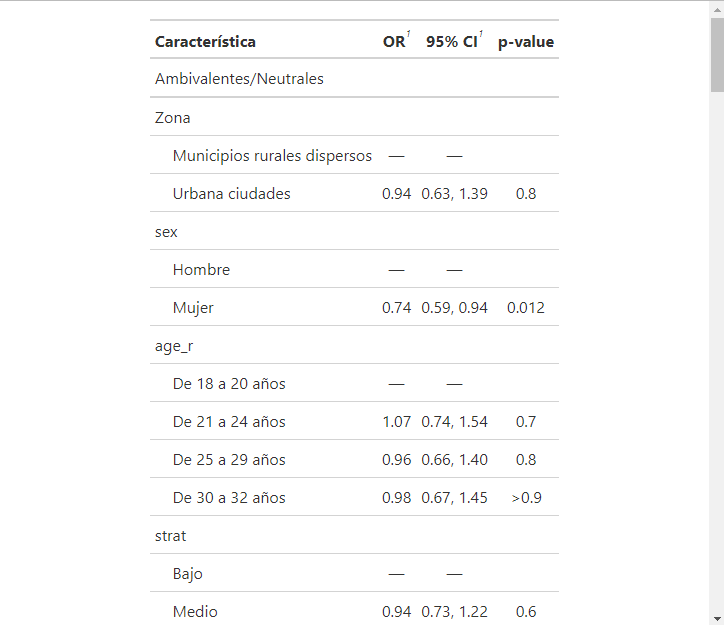
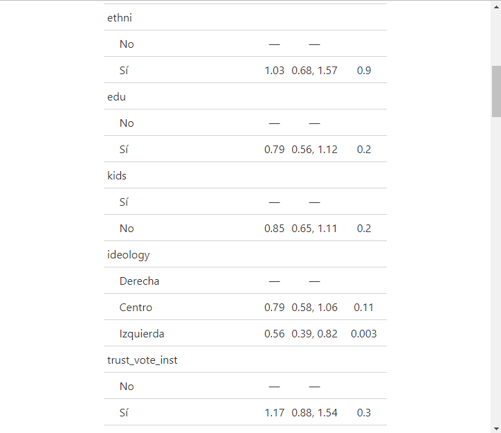

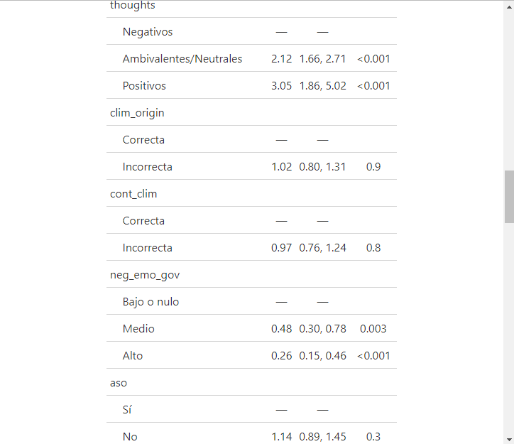
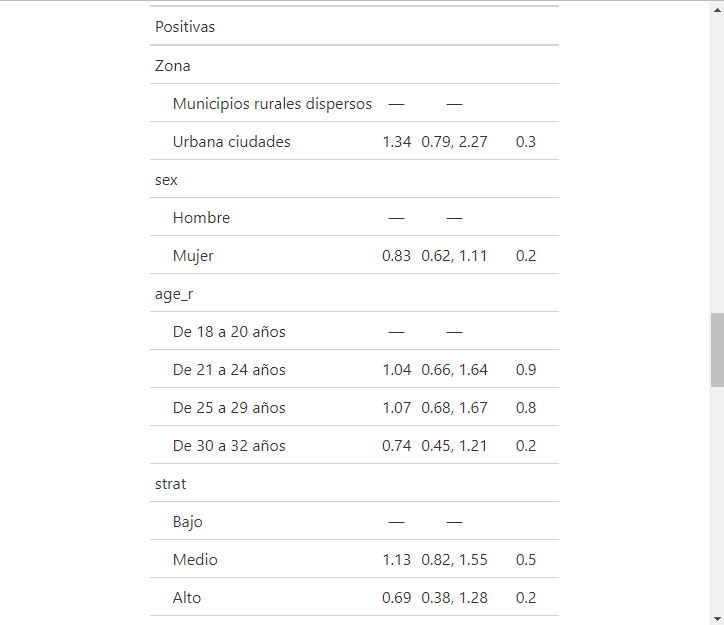
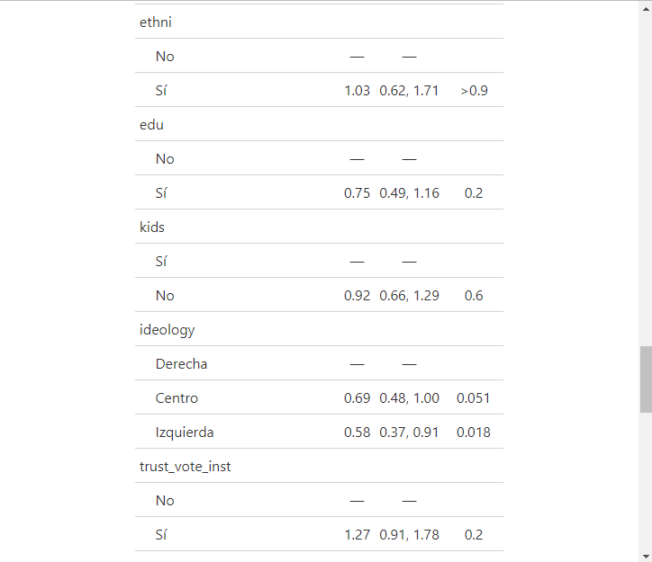
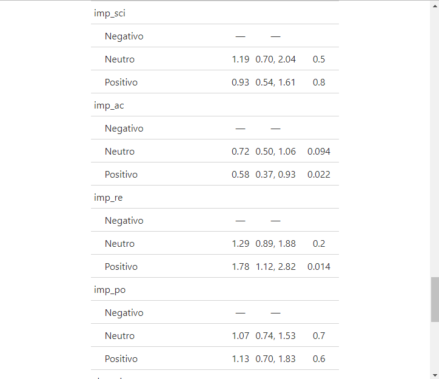
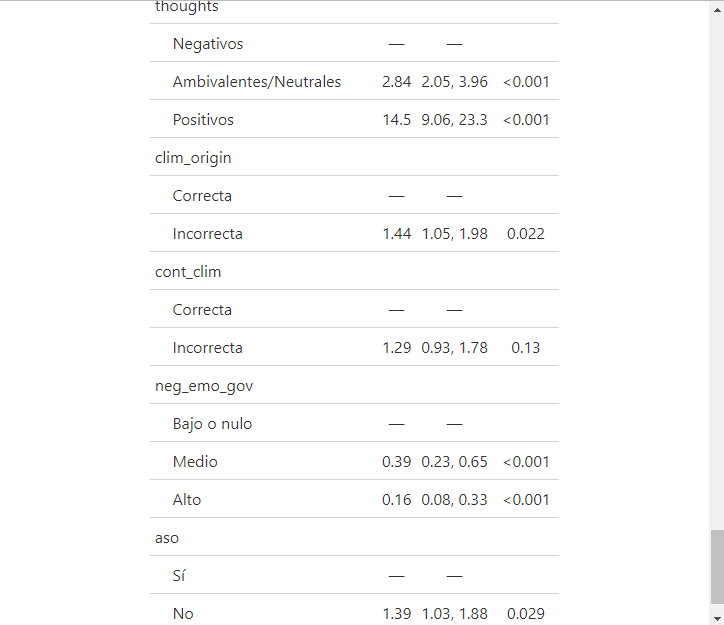


## Tabla modelo de regresión binomial para origen del cambio climático
El nivel de referencia frente al cual se calcularon los odd ratios fue el de respuesta "Correcta" frente al origen o causa del cambio climático.

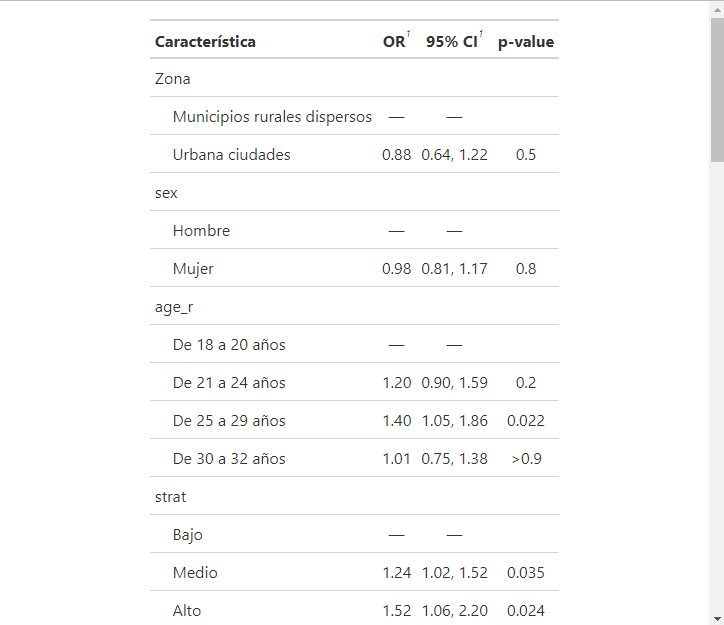
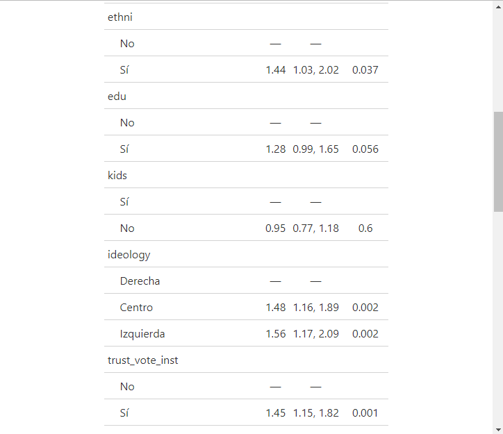
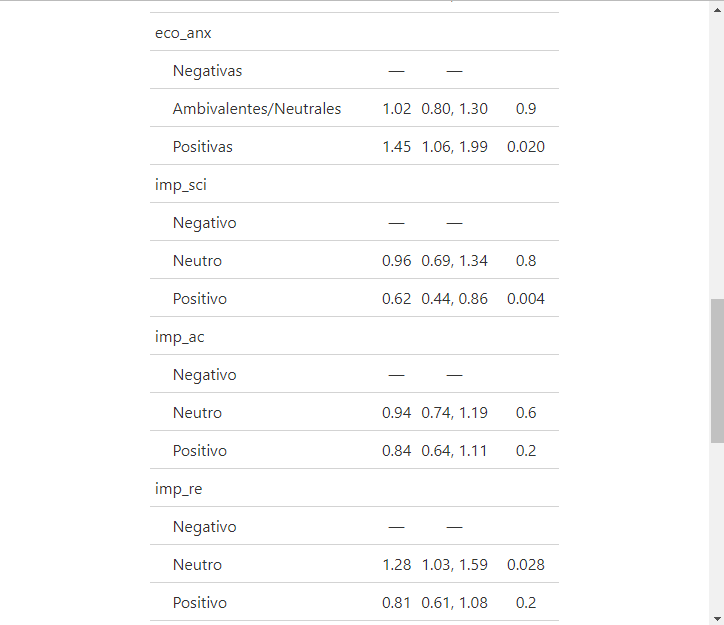
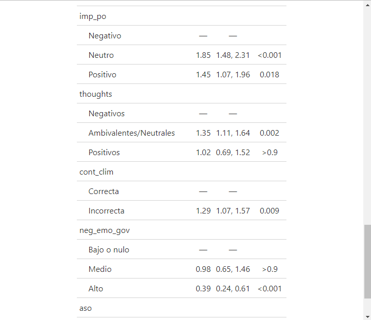
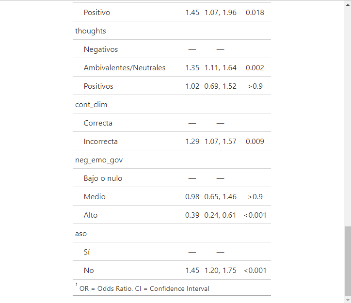

## Tabla modelo de regresión binomial para impacto en comodidad de acciones individuales
El nivel de referencia frente al cual se calcularon los odd ratios fue el de impacto "Negativo" en la comodidad de tomar acciones individuales contra el cambio climático. La variable de impacto general en la comodidad de las distintas acciones contra el cambio climático aun es tentativa, por lo cual no se incluyó en los dos modelos anteriores.

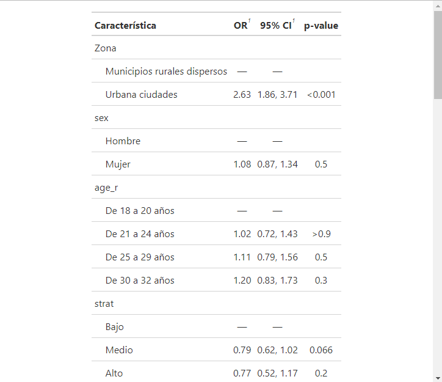
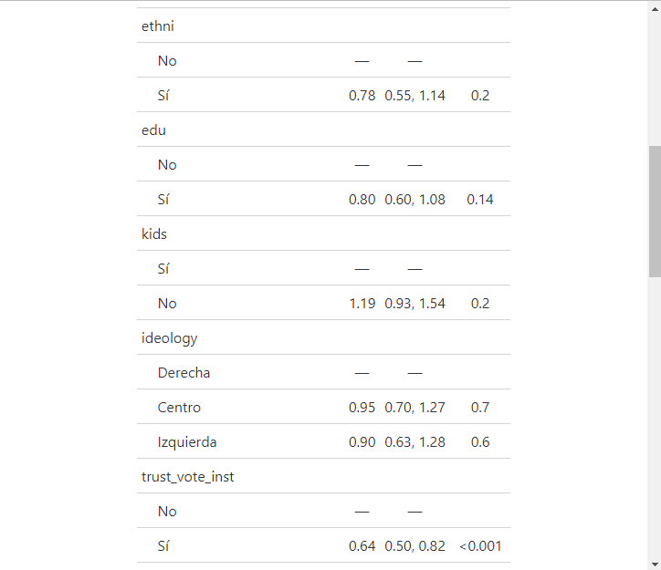
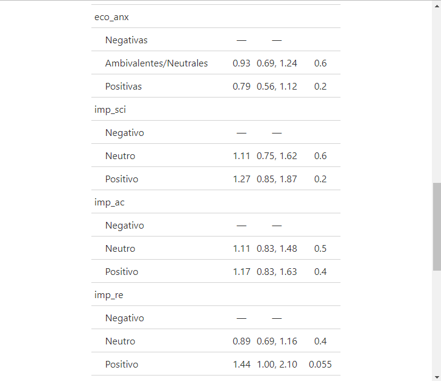
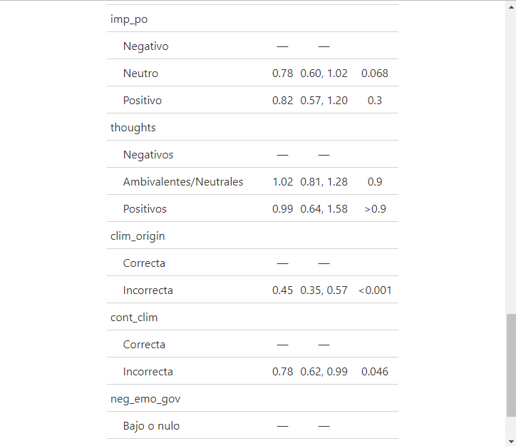
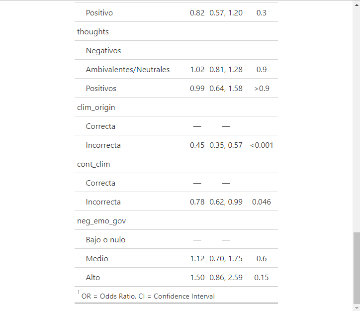

