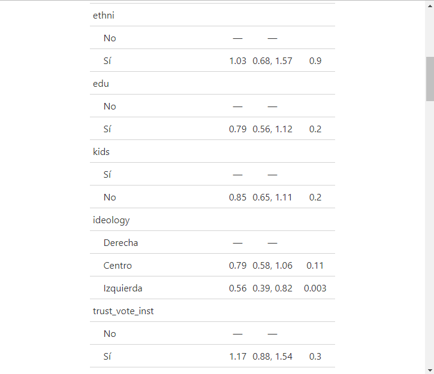
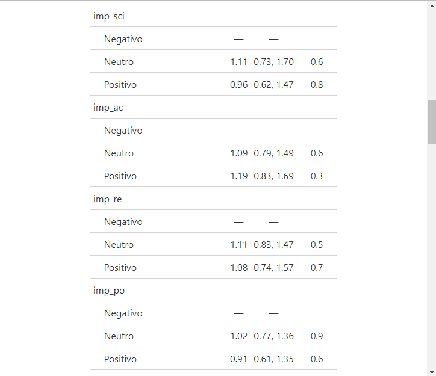
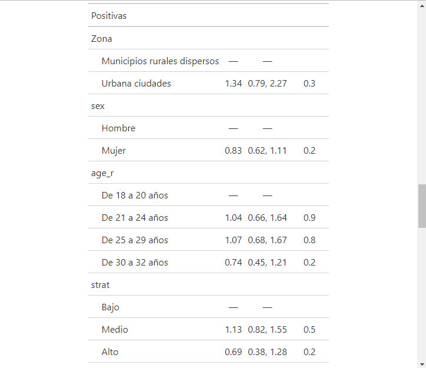
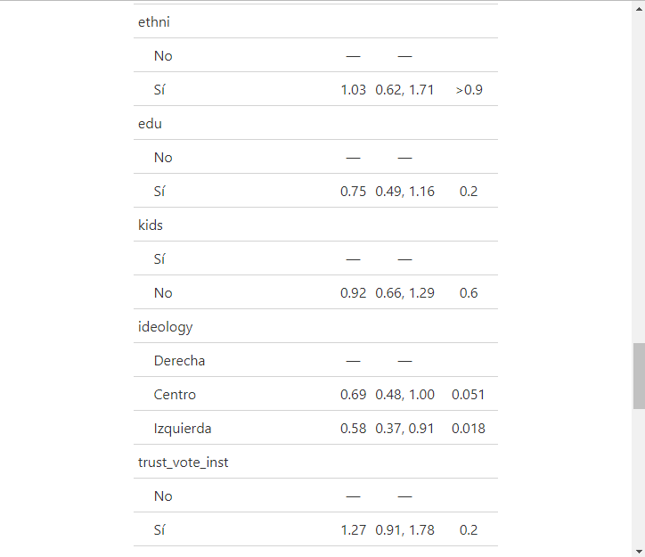
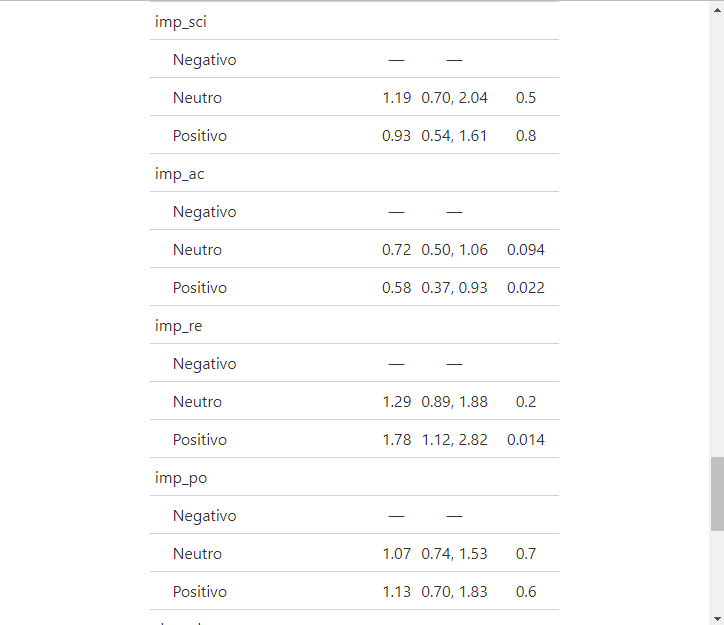
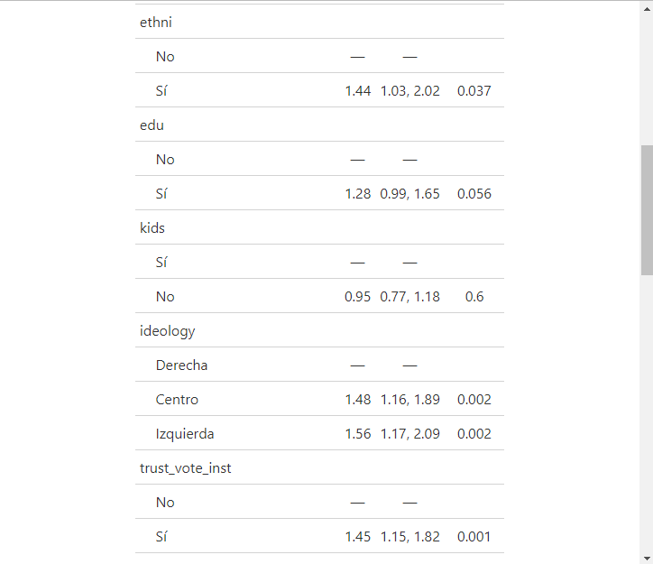
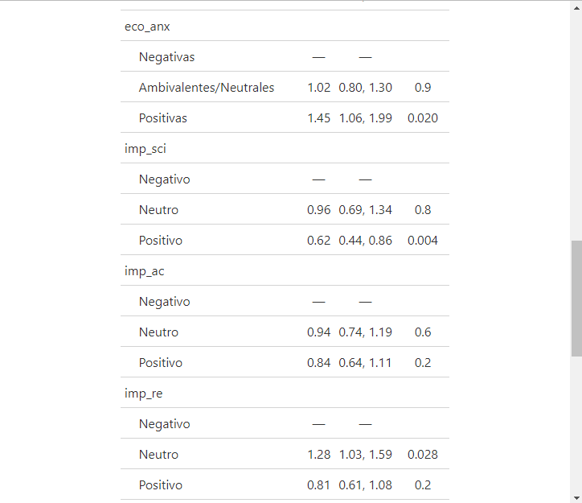
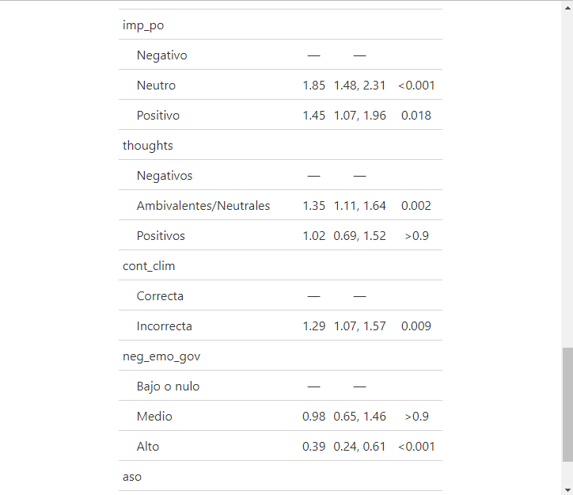

Encuesta: Modelos
================
Juan Sebastian Cely
2023-08-24

# Tablas de Odd Ratios para los tres modelos propuestos

## Tabla modelo de regresión multinomial para emociones frente al cambio climático

El nivel de referencia frente al cual se calcularon los odd ratios fue
el de emociones “Negativas” frente al cambio climático. Noten que los
primeros odd ratios corresponden a la comparación emociones
“Ambivalentes/Neutras” frente a emociones “Negativas”, y los segundos
odd ratios corresponden a la comparación emociones “Positivas” frente a
emociones “Negativas”.

    
  

## Tabla modelo de regresión binomial para origen del cambio climático

El nivel de referencia frente al cual se calcularon los odd ratios fue
el de respuesta “Correcta” frente al origen o causa del cambio
climático.

    

## Tabla modelo de regresión binomial para impacto en comodidad de acciones individuales

El nivel de referencia frente al cual se calcularon los odd ratios fue
el de impacto “Negativo” en la comodidad de tomar acciones individuales
contra el cambio climático. La variable de impacto general en la
comodidad de las distintas acciones contra el cambio climático aun es
tentativa, por lo cual no se incluyó en los dos modelos anteriores.

   

