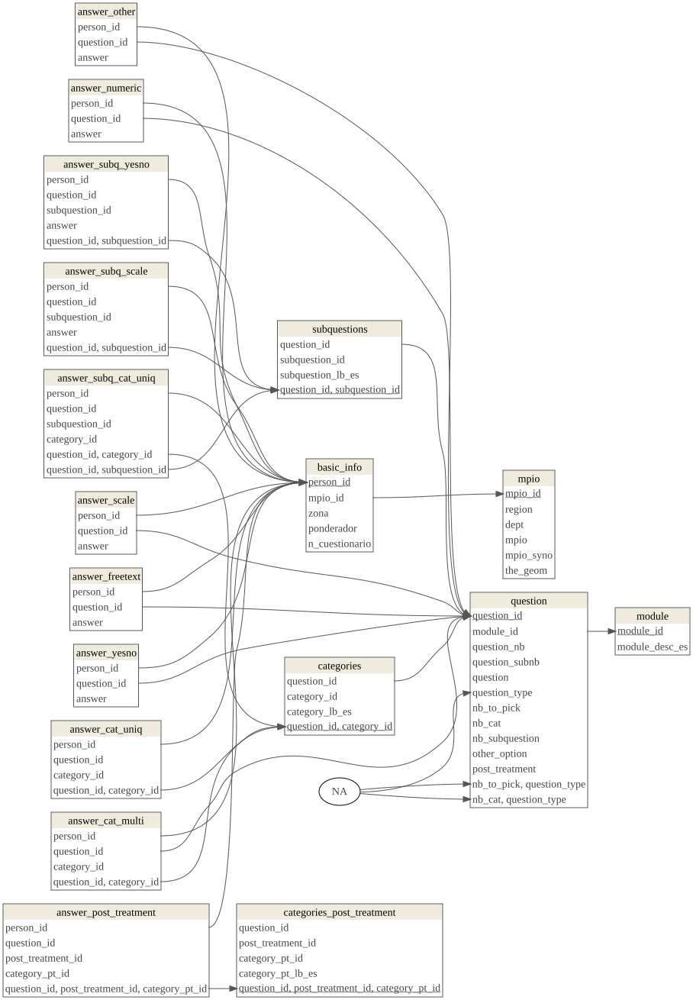

```{r setup}
stopifnot(require(openxlsx), require(kableExtra), require(RPostgreSQL), require(rpostgis), require(geodata), require(sp), require(knitr), require(dm), require(rsvg), require(DiagrammeRsvg))
opts_chunk$set(cache=F,fig.path="./Fig/",tidy=T,tidy.opts=list(width.cutoff=70),cache.rebuild = F, formatSQL = TRUE)
options(knitr.kable.NA = '--', knitr.table.format = "simple")
```


# Reading and first formating of the excel data

We first read the data and codebook (dictionary) from the file "020-22 Base de Datos Anonimizada V4 (1).xlsx", which is located outside of the git repository (I strongly advocates against sharing Excel files in GitHub, but if we want to give open access of the data, there are other solution), in a folder called "Data_Document".

```{r}
wb<-loadWorkbook("../../Data_Document/020-22 Base de Datos Anonimizada V4 (1).xlsx")
names(wb)
data1 <- readWorkbook(wb,sheet=1)
codeBook1 <- readWorkbook(wb,sheet=2,skipEmptyRows = F)
emptyRows<-which(apply(codeBook1,1,function(x)all(is.na(x))))
```

Reading the codebook (dictionary of data):

```{r}
beg <- c(0, emptyRows) + 1
end <- c(emptyRows - 1, nrow(codeBook1))
titles<-codeBook1[beg,1]
position <- codeBook1[beg + 2, 3]
etiqueta <- codeBook1[beg + 3, 3]
tipo <- codeBook1[beg +4,3]
medicion<-codeBook1[beg+5,3]
noVal <- (beg+5==end)
#tipo[noVal]
#tipo[!noVal]
```

In the codebook, the potential values for all the columns of the data sheet are encoded in various small tables, here goes the code to extract this value encoding:
```{r}
listVal <- vector(mode="list", length = length(beg))
for(i in 1:length(beg))
{
  if(noVal[i])
  {listVal[[i]] <- NULL}else
  {listVal[[i]] <- codeBook1[(beg[i]+6):(end[i]),2:3]}
  
}
descr<-data.frame(title=titles,
           position=position,
           question=etiqueta,
           type=tipo,
           measurement=medicion)
descr[1,"title"]="@_id"
```

The description of the variables goes in a table structured as follows:

```{r, eval=!interactive()}
descr[1:15,]
```


Unfortunately, the information from the dictionary in terms of types of questions and variables is not very useful...

## Getting to understand the data from the dictionary and the table

Here we check whether the variables from the codebook are in the data table and inversely.

```{r}
colNotInDic <- (!colnames(data1) %in% descr$title)
dicNotInCol <- (!descr$title %in% colnames(data1))
```

Dictionary fields which are not in the data:

```{r}
descr[dicNotInCol,]
```

*The "número de cuestionario", I imagine, represent the version number of the survey (which I imagine can change by the order of the questions or the options that are given?).
This might be an important variable to calculate some biases in the study (what is the effect of the survey form on the results of the survey?), we may want to get that information in the future.


Data fields which are not in the dictionary:

```{r}
colnames(data1)[colNotInDic]
```

Now, concerning the fields, they seem to be organized through some letter and number codes that we need to "hack" in order to go further.


# Description of the variables

Here are the questions (I just went from question 1 to question 40, to get a better idea on how organize the database):

* id
* ponderador
* Region, very general: 
"ORIENTE"   "BOGOTA"    "ANTIOQUIA" "COSTA"     "CENTRAL"   "OCCIDENTE"
* Departamento: Parece que está limpio, en español normal
* Municipios
* Zona: urbano o municipios rurales dispersos
* Numero de cuestionario
* Rango de edad entre 18 y 32? (P1) Si/No: Note: no tiene sentido si tenemos la edad en A2
* Sexo (A1), seems to be male or female
* Edad (A2), numerico, note that they are divided in categories in other variables
*  Estrato (A3): 1 a 6
*  NSE: seems to be the socio-economic level as well, but on a scale from 1 to 3 and to have a clear relationship with estrato (1:2->1,3->2,>3->3)
* Actividad principal (A4): categories, very few answers, with a text for "Others", only one answer
* Anotacion etnica (A5): Defined categories, only one answer
* nivel educativo más alto (A6), defined categories, only one answer
* Hogar unipersonal o multipersonal (A7): one of these 2 categories
* Parentesco con el jefe del hogar (A8): defined categories
* Hijos (A9) : Yes/No
* Mascotas (A10): Yes/No
* Position ideologica (A11): from left (1) to right (6), rescaled in "PosIdeologica" on a 3 level scale.
* Media de información (B12): defined categories, more than one response possible, apparently no minimal number of response. A lot of columns used (for each category). There is an "other" option
* Problemas que lo afectan a usted (B13): 5 answers to choose, apparently some have chosen less, no order... and with an "other" option, which might explain the less than 4 possibility!
* Emociones dominantes Hoy (B14): 2 categories to choose, apparently no order, but there are a emocion1 and a emocion2
* B15_n All these emotions are then described one by one on a 6 level scale, but apparently only for the emotionchosen precedently (does that make sense?)
* Emociones cuanto a los candidatos presidenciales (B16): 2 categories to choose
* the following questions (C17), i guess, is about confidence to institutions, the possible anwers are Yes/No/I do not know it
  + Registraduría (C17_1)
  + Consejo Nacional Electoral (C17_2)
  + Jurados de votación (C17_3)
  + partidos politicos (C17_4)
  + presidencia de Colombia (C17_5)
  + gobernación departamental (C17_6)
  + Alcadía municipal (C17_7)
  + Congreso de la republica (C17_8)
  + Defensoría del pueblo (C17_9)
  + Iglesia catolica (C17_10)
  + Lideres religiosos cristianos no catolicos (C17_11)
  + fuerzas militares (C17_12)
  + policía nacional de Colombia (C17_13)
  + Universidades privadas (C17_14)
  + Universidades publicas (C17_15)
  + Fiscalía general de la nación (C17_16)
  + Sindicatos (C17_17)
  + Procuraduría general de la nación (C17_18)
  + Controlaría general de la republica (C17_19)
  + Medios de comunicación (C17_20)
  + Redes sociales (C17_21)
  + Influenciadores digitales (C17_22)
* The following questions (C18) seem to concern means (actions), the answer are Yes/No, but I have no idea what the question is...
  + Voluntariado (C18_1)
  + Pagar más impuesto  (C18_2)
  + Seguir protestando (C18_3)
  + Aportar más a pensiones (C18_4)
  + Participar en politica (C18_5)
  + Asociarme en organisaciones políticas (C18_6)
  + Asociarme en organizaciones ambientales (C18_7)
  + Asociarme en organizaciones de defensa de los animales (C18_8)
  + Asociarme a organizaciones sindicales (C18_9)
  + Denunciar (C18_10)
  + Exigir rendición de cuentas a los gobernantes (C18_11)
  + Hacer donaciones a personas u organizaciones (C18_12)
* Votar ayuda a solucionar? (C19) Question Yes/No
* Ha votado? (C20) Yes/No
* Votó 13 de marzo interpartidista? (C21) Yes/No/No salió a votar (what is the difference?)
* Su candidato ganó (C22) Yes/No
* Va a votar por su candidato (primera vuelta pres) (C23) Yes/No
* comprar su voto (C24) Yes/No
* irregularidad constatada (C25) Yes/No
* irregularidad reportada (C26) Yes/No, Goes with a question on where they reported it, in free text
* Representado por candidatos de primera vuelta (C27) Yes/No
* Piensa votar primera vuelta (C28) Yes/No
* Decidido primera vuelta (C29) Yes/No
* Tiene clara propuestas (C30) Yes/No
* temas que llaman su attencion (C31): 3 free words, this is then analysed and categorized in categories, for each one of the question, which may be in the same order as the three words
* Que tiene en cuenta para escoger/votar (C32), various proposition, where the answers are Yes/No, it seems that the maximum is 3, there is an "other" option:
  + Lo que ve/lee en redes sociales (C32_1)
  + Voz a voz (C32_2)
  + Lo que ve lee escucha en medios de comunicación (C32_3)
  + Las conversaciones con sus amigos (C32_4)
  + Las conversaciones con su familia (C32_5)
  + Las propuestas del candidato (C32_6)
  + la popularidad del candidato (C32_7)
  + El perfil del candidato (C32_8)
  + El partido político/movimiento del candidato (C32_9)
  + Ideología del candidato (C32_10)
  + Las discusiones en los debates presidenciales (C32_11)
* Ve debates presidenciales? (C33) answer Yes/No
* Cuales ve (C33_1): free text
* The D34 questions has to do with emotions but we do not know the question, all the categories are to be defined with a 6level scale
  + Tranquilo (D34_1)
  + Angustiado (D34_2)
  + Abandonado (D34_3)
  + Temeroso (D34_4)
  + Esperanzado (D34_5)
  + Enojado (D34_6)
  + Valorado (D34_7)
  + Avergonzado (D34_8)
  + Menospreciado (D34_9)
  + Protegido (D34_10)
* The D35 question is a group of question concerning some social groups and the answers are a scale from 1 to 6 (negative to positive), with a possibility to answer NS/NR
  + cientificos (D35_1)
  + profesores (D35_2)
  + grupos religiosos (D35_3)
  + gobierno nacional (D35_4)
  + gobierno local (D35_5)
  + políticos (D35_6)
  + activistas (D35_7)
  + defensores de derechos humanos (D35_8)
  + Líderes ambientales (D35_9)
  + Líderes comunitarios (D35_10)
  + Feministas (D35_11)
  + Campesinos (D35_12)
  + Grupos a la margen de la ley (D35_13)
  + Fuerza pública (D35_14)
* 2 emociones cambio climatico (C36). choose 2 from categories, order does not seem important, some choose only one
  + Triste 
  + Motivado
  + Temeroso
  + Furioso
  + Ansioso
  + Frustrado
  + Culpable
  + Avergonzado
  + Desesperado
  + Herido
  + Deprimido
  + Optimista
  + Indiferente
  + Confiado
  + Desesperanzado
  + Tranquilo
* Pensamientos CC (C37) Choose 3 options from a list of sentences, some take less, no "other" option, no order
  + La humanidad ha fracasado
  + El futuro es aterrador
  + Nada en especial, es algo que no me afecta
  + La humanidad está condenada
  + Las nuevas generaciones tienen menos oportunidades que sus padres
  + Las cosas que valoro se están destruyendo
  + Mi seguridad está amenazada
  + Quizas no debería tener hijos
  + La humanidad superará cualquier obstáculo que se pueda presentar
  + Es un proceso natural que ocurre en el planeta y no debe preocuparnos
  + ... (15 sentences in total)
* C38 and C39 are two groups of questions which use the same subcategories, actions described by sentences, but we don't know the questions, no "other" option, answers on a 6 levels scale
  + No tener carro
  + Prohibir el uso de bolsas plasticas
  + Comprar únicamente alimentos locales
  + ... (10 sentences in total)
* Apreciación origen CC (C40), 10 level scale from natural to anthropic


# Create csv main table

Here we create a csv file which we will fill up in order to describe the main characteristics of the survey questions.

```r
A<- descr[grep("^[0-9]",descr$question),c("title","question")]
write.csv(A,file="descr_question.csv")
```

After filling the table we read it back in R:

```{r}
require(kableExtra)
infoTabPrint<-infoTab<-read.csv("descr_question.csv")
infoTabPrint$question<- paste0("\"",infoTabPrint$question,"\"")
kable(infoTab,caption="Description of the survey questions")
```


# Extracting the info to send to the database

Here we use a regular expression to extract columns which describe subquestions or categories for choices questions:

```{r}  
descr$title[grep("^[A-Z][0-9]{1,2}_[0-9]{1,2}",descr$title)]
```


Here we look for the questions which correspond to categories or scales.
```{r}
choice_scale<-grepl("Choice", infoTab$type)|grepl("Scale", infoTab$type)
```


Then we extract the labels for the subquestions:

```{r}
# Searching subquestion
title_subQues<-infoTab$title[!is.na(infoTab$subquestion_nb_rep)]
regex_title_subQues <- paste0("^",title_subQues,"_[0-9]+$")
det_which_tsQ <- sapply(descr$title,function(t,rts,ts){
  w<-which(sapply(rts,function(a,b)grepl(a,b),b=t))
  ts[w]
}, rts = regex_title_subQues, ts = title_subQues)
subquestions <- data.frame(
  questionTitle = unlist(det_which_tsQ),
  number = gsub("^[A-Z][0-9]{1,2}_([0-9]{1,2})$","\\1", names(det_which_tsQ) [sapply(det_which_tsQ, function(x)length(x)==1)]),
  category = descr[match(names(det_which_tsQ)[sapply(det_which_tsQ,function(x)length(x)==1)], descr$title),"question"]
  )
```

Then we extract the categories for the choice questions:

```{r}
# Categories and scales
positionCategories <- infoTab[choice_scale,"Pos"]
positionCategories[is.na(positionCategories)] <- match(paste0(infoTab[choice_scale,"title"][is.na(positionCategories)],"_1"), descr$title)
valuesList<-listVal[positionCategories]
names(valuesList)<-infoTab[choice_scale,"title"]
missingCat<-names(valuesList)[sapply(valuesList,is.null)]
regex_title_categ <- paste0("^",missingCat,"_[0-9]{1,2}")
det_which_tCatMis <- sapply(descr$title,function(t,rts,ts){
  w<-which(sapply(rts,function(a,b)grepl(a,b),b=t))
  ts[w]
}, rts = regex_title_categ, ts = missingCat)
missingCatTab<- data.frame(
  questionTitle=unlist(det_which_tCatMis),
  number=gsub("^[A-Z][0-9]{1,2}_([0-9]{1,2})$","\\1", names(det_which_tCatMis) [sapply(det_which_tCatMis, function(x)length(x)==1)]),
  category = descr[match(names(det_which_tCatMis)[sapply(det_which_tCatMis,function(x)length(x)==1)], descr$title),"question"]
)
valuesList_notNull<-valuesList[!sapply(valuesList,is.null)]
catTab<-data.frame(
questionTitle=rep(names(valuesList_notNull),sapply(valuesList_notNull,nrow)),
number=unlist(lapply(valuesList_notNull,function(x)x[,1])),
category=unlist(lapply(valuesList_notNull,function(x)x[,2]))
)

catTab<-rbind(catTab,missingCatTab)
catTab$number<-as.integer(catTab$number)
```

Then we extract the categories for the variables which correspond to the post-treatments.

```{r}
# Post-treatment
post_treatment<-rbind(
data.frame(question_nb=31,post_treatment_id=1,
           category_pt_id=listVal[[which(descr$title=="C31_COD1")]][,1],
           category_pt_lb_es=listVal[[which(descr$title=="C31_COD1")]][,2]
           ),
data.frame(question_nb=31,post_treatment_id=2,
           category_pt_id=listVal[[which(descr$title=="C31_COD2")]][,1],
           category_pt_lb_es=listVal[[which(descr$title=="C31_COD2")]][,2]
           ),
data.frame(question_nb=31,post_treatment_id=3,
           category_pt_id=listVal[[which(descr$title=="C31_COD3")]][,1],
           category_pt_lb_es=listVal[[which(descr$title=="C31_COD3")]][,2]
           )
)

```

# Pushing the tables in the database

First we create the database, in linux it may be done in the shell:

```bash
createdb cc_young
```

Then we create the schema "rawdata", where we will send the raw tables from R:

```{r}
cc_y <- dbConnect(PostgreSQL(),dbname="cc_young")
listSchema<-dbGetQuery(cc_y,"SELECT * FROM information_schema.schemata")$schema_name
if(! "rawdata" %in% listSchema)
{dbSendStatement(cc_y, "CREATE SCHEMA rawdata")}

# Insert raw general information
dbWriteTable(cc_y, c("rawdata","main_info"), infoTab, overwrite = T)

# Insert raw categories
dbWriteTable(cc_y, c("rawdata","categories"), catTab, overwrite = T)

# Insert raw subquestions
dbWriteTable(cc_y, c("rawdata","subquestions"), subquestions, overwrite = T)

# Insert raw data
dbWriteTable(cc_y, c("rawdata", "data"), data1, overwrite = T)

# Insert post treatment categories

dbWriteTable(cc_y,c("rawdata","post_treatment"),post_treatment,overwrite=T)

# Insert administrative limits of municipalities
# (we download it from gadm to get the )
pgPostGIS(cc_y)
tmp <- tempdir()
municipios <- as(gadm("Colombia", level=2, path= tmp),"Spatial")
unique(data1$Departamento[!tolower(data1$Departamento)%in%tolower(municipios$NAME_1)])
unique(data1$Municipio[!tolower(data1$Municipio)%in%tolower(municipios$NAME_2)])
pgInsert(cc_y,c("rawdata","municipios"),municipios,geom="the_geom",overwrite = T)
```

Now the data is available in the database!
We just have to organize it with the right structure.

# Preparing the table structure in the "main" schema

Deleting the schema main in case it already exists:

```{r}
if("main" %in% dbGetQuery(cc_y,"SELECT schema_name FROM information_schema.schemata")$schema_name)
{dbSendStatement(cc_y,"DROP SCHEMA main CASCADE")}
```


```{sql connection=cc_y, cache=F,file="./cc_young_create.sql"}

```


# Description of the structure of the database

```{r}
if(params$recreate_png_dataModel){
dm_object <- dm_from_con(cc_y, schema="main",learn_keys=T)
A <- dm_draw(dm_object, view_type = "all")
DiagrammeRsvg::export_svg(A) %>%charToRaw %>% rsvg_png("./dataModel.png")
}

```


```{r}
unlink(tmp,recursive=T)
dbDisconnect(cc_y)
```

