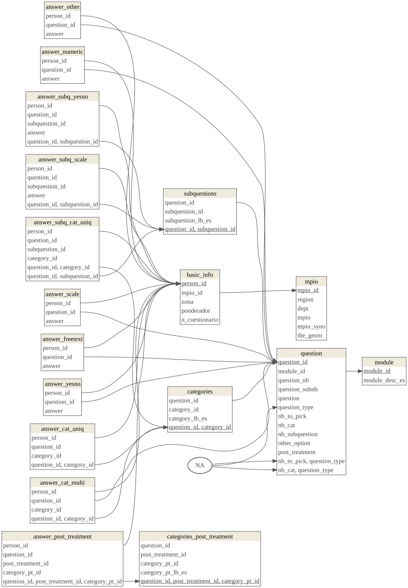

Creating the PostgreSQL database for the survey from the Colombian youth
observatory (Universidad del Rosario)
================
Marius Bottin and Juan Sebastian Cely

- <a href="#1-reading-and-first-formating-of-the-excel-data"
  id="toc-1-reading-and-first-formating-of-the-excel-data">1 Reading and
  first formating of the excel data</a>
  - <a
    href="#11-getting-to-understand-the-data-from-the-dictionary-and-the-table"
    id="toc-11-getting-to-understand-the-data-from-the-dictionary-and-the-table">1.1
    Getting to understand the data from the dictionary and the table</a>
- <a href="#2-description-of-the-variables"
  id="toc-2-description-of-the-variables">2 Description of the
  variables</a>
- <a href="#3-create-csv-main-table" id="toc-3-create-csv-main-table">3
  Create csv main table</a>
- <a href="#4-extracting-the-info-to-send-to-the-database"
  id="toc-4-extracting-the-info-to-send-to-the-database">4 Extracting the
  info to send to the database</a>
- <a href="#5-pushing-the-tables-in-the-database"
  id="toc-5-pushing-the-tables-in-the-database">5 Pushing the tables in
  the database</a>
- <a href="#6-preparing-the-table-structure-in-the-main-schema"
  id="toc-6-preparing-the-table-structure-in-the-main-schema">6 Preparing
  the table structure in the “main” schema</a>
- <a href="#7-description-of-the-structure-of-the-database"
  id="toc-7-description-of-the-structure-of-the-database">7 Description of
  the structure of the database</a>
- <a href="#8-inserting-the-data-in-the-tables"
  id="toc-8-inserting-the-data-in-the-tables">8 Inserting the data in the
  tables</a>
- <a href="#9-preparing-basic-views" id="toc-9-preparing-basic-views">9
  Preparing basic views</a>

``` r
stopifnot(require(openxlsx), require(kableExtra), require(RPostgreSQL), require(rpostgis), require(geodata), require(sp), require(knitr), require(dm), require(rsvg), require(DiagrammeRsvg))
```

    ## Loading required package: openxlsx

    ## Loading required package: kableExtra

    ## Loading required package: RPostgreSQL

    ## Loading required package: DBI

    ## Loading required package: rpostgis

    ## Loading required package: geodata

    ## Loading required package: terra

    ## terra 1.6.47

    ## Loading required package: sp

    ## Loading required package: knitr

    ## 
    ## Attaching package: 'knitr'

    ## The following object is masked from 'package:terra':
    ## 
    ##     spin

    ## Loading required package: dm

    ## 
    ## Attaching package: 'dm'

    ## The following object is masked from 'package:stats':
    ## 
    ##     filter

    ## Loading required package: rsvg

    ## Linking to librsvg 2.54.4

    ## Loading required package: DiagrammeRsvg

``` r
opts_chunk$set(cache=F,fig.path="./Fig/",tidy=T,tidy.opts=list(width.cutoff=70),cache.rebuild = F, formatSQL = TRUE)
options(knitr.kable.NA = '--', knitr.table.format = "simple")
```

# 1 Reading and first formating of the excel data

We first read the data and codebook (dictionary) from the file “020-22
Base de Datos Anonimizada V4 (1).xlsx”, which is located outside of the
git repository (I strongly advocates against sharing Excel files in
GitHub, but if we want to give open access of the data, there are other
solution), in a folder called “Data_Document”.

``` r
wb <- loadWorkbook("../../Data_Document/020-22 Base de Datos Anonimizada V4 (1).xlsx")
names(wb)
```

    ## [1] "020-22  Base de Datos Anonimiza" "Libro de codigos"

``` r
data1 <- readWorkbook(wb, sheet = 1)
codeBook1 <- readWorkbook(wb, sheet = 2, skipEmptyRows = F)
emptyRows <- which(apply(codeBook1, 1, function(x) all(is.na(x))))
```

Reading the codebook (dictionary of data):

``` r
beg <- c(0, emptyRows) + 1
end <- c(emptyRows - 1, nrow(codeBook1))
titles <- codeBook1[beg, 1]
position <- codeBook1[beg + 2, 3]
etiqueta <- codeBook1[beg + 3, 3]
tipo <- codeBook1[beg + 4, 3]
medicion <- codeBook1[beg + 5, 3]
noVal <- (beg + 5 == end)
# tipo[noVal] tipo[!noVal]
```

In the codebook, the potential values for all the columns of the data
sheet are encoded in various small tables, here goes the code to extract
this value encoding:

``` r
listVal <- vector(mode = "list", length = length(beg))
for (i in 1:length(beg)) {
    if (noVal[i]) {
        listVal[[i]] <- NULL
    } else {
        listVal[[i]] <- codeBook1[(beg[i] + 6):(end[i]), 2:3]
    }

}
descr <- data.frame(title = titles, position = position, question = etiqueta,
    type = tipo, measurement = medicion)
descr[1, "title"] = "@_id"
```

The description of the variables goes in a table structured as follows:

``` r
descr[1:15, ]
```

<div class="kable-table">

| title         | position | question                                                                 | type     | measurement |
|:--------------|:---------|:-------------------------------------------------------------------------|:---------|:------------|
| @\_id         | \_id     | Numérico                                                                 | Escala   | –           |
| PONDERADOR    | 2        | Ponderador                                                               | Numérico | Escala      |
| Region        | 3        | Región                                                                   | Cadena   | Nominal     |
| Departamento  | 4        | Departamento                                                             | Cadena   | Nominal     |
| Municipio     | 5        | Municipio                                                                | Cadena   | Nominal     |
| Zona          | 6        | Zona                                                                     | Cadena   | Nominal     |
| NCuestionario | 7        | N° Cuestionario                                                          | Numérico | Escala      |
| CODANE        | 8        | CODANE                                                                   | Numérico | Escala      |
| P1            | 9        | ¿Usted se encuentra en el rango de edad de 18 a 32 años de edad?         | Numérico | Nominal     |
| A1            | 10       | 1\. Sexo                                                                 | Numérico | Nominal     |
| A2            | 11       | 2\. ¿Cuántos años tiene?                                                 | Numérico | Escala      |
| RANGO_EDAD    | 12       | Rango de edad                                                            | Numérico | Nominal     |
| A3            | 13       | 3\. En el recibo de la luz de su domicilio, ¿qué estrato sale reportado? | Numérico | Nominal     |
| NSE           | 14       | NSE                                                                      | Numérico | Nominal     |
| A4            | 15       | 4\. ¿Qué hace usted principalmente?                                      | Numérico | Nominal     |

</div>

Unfortunately, the information from the dictionary in terms of types of
questions and variables is not very useful…

## 1.1 Getting to understand the data from the dictionary and the table

Here we check whether the variables from the codebook are in the data
table and inversely.

``` r
colNotInDic <- (!colnames(data1) %in% descr$title)
dicNotInCol <- (!descr$title %in% colnames(data1))
```

Dictionary fields which are not in the data:

``` r
descr[dicNotInCol, ]
```

<div class="kable-table">

|     | title         | position | question        | type     | measurement |
|-----|:--------------|:---------|:----------------|:---------|:------------|
| 7   | NCuestionario | 7        | N° Cuestionario | Numérico | Escala      |

</div>

\*The “número de cuestionario”, I imagine, represent the version number
of the survey (which I imagine can change by the order of the questions
or the options that are given?). This might be an important variable to
calculate some biases in the study (what is the effect of the survey
form on the results of the survey?), we may want to get that information
in the future.

Data fields which are not in the dictionary:

``` r
colnames(data1)[colNotInDic]
```

    ## character(0)

Now, concerning the fields, they seem to be organized through some
letter and number codes that we need to “hack” in order to go further.

# 2 Description of the variables

Here are the questions (I just went from question 1 to question 40, to
get a better idea on how organize the database):

- id
- ponderador
- Region, very general: “ORIENTE” “BOGOTA” “ANTIOQUIA” “COSTA” “CENTRAL”
  “OCCIDENTE”
- Departamento: Parece que está limpio, en español normal
- Municipios
- Zona: urbano o municipios rurales dispersos
- Numero de cuestionario
- Rango de edad entre 18 y 32? (P1) Si/No: Note: no tiene sentido si
  tenemos la edad en A2
- Sexo (A1), seems to be male or female
- Edad (A2), numerico, note that they are divided in categories in other
  variables
- Estrato (A3): 1 a 6
- NSE: seems to be the socio-economic level as well, but on a scale from
  1 to 3 and to have a clear relationship with estrato
  (1:2-\>1,3-\>2,\>3-\>3)
- Actividad principal (A4): categories, very few answers, with a text
  for “Others”, only one answer
- Anotacion etnica (A5): Defined categories, only one answer
- nivel educativo más alto (A6), defined categories, only one answer
- Hogar unipersonal o multipersonal (A7): one of these 2 categories
- Parentesco con el jefe del hogar (A8): defined categories
- Hijos (A9) : Yes/No
- Mascotas (A10): Yes/No
- Position ideologica (A11): from left (1) to right (6), rescaled in
  “PosIdeologica” on a 3 level scale.
- Media de información (B12): defined categories, more than one response
  possible, apparently no minimal number of response. A lot of columns
  used (for each category). There is an “other” option
- Problemas que lo afectan a usted (B13): 5 answers to choose,
  apparently some have chosen less, no order… and with an “other”
  option, which might explain the less than 4 possibility!
- Emociones dominantes Hoy (B14): 2 categories to choose, apparently no
  order, but there are a emocion1 and a emocion2
- B15_n All these emotions are then described one by one on a 6 level
  scale, but apparently only for the emotionchosen precedently (does
  that make sense?)
- Emociones cuanto a los candidatos presidenciales (B16): 2 categories
  to choose
- the following questions (C17), i guess, is about confidence to
  institutions, the possible anwers are Yes/No/I do not know it
  - Registraduría (C17_1)
  - Consejo Nacional Electoral (C17_2)
  - Jurados de votación (C17_3)
  - partidos politicos (C17_4)
  - presidencia de Colombia (C17_5)
  - gobernación departamental (C17_6)
  - Alcadía municipal (C17_7)
  - Congreso de la republica (C17_8)
  - Defensoría del pueblo (C17_9)
  - Iglesia catolica (C17_10)
  - Lideres religiosos cristianos no catolicos (C17_11)
  - fuerzas militares (C17_12)
  - policía nacional de Colombia (C17_13)
  - Universidades privadas (C17_14)
  - Universidades publicas (C17_15)
  - Fiscalía general de la nación (C17_16)
  - Sindicatos (C17_17)
  - Procuraduría general de la nación (C17_18)
  - Controlaría general de la republica (C17_19)
  - Medios de comunicación (C17_20)
  - Redes sociales (C17_21)
  - Influenciadores digitales (C17_22)
- The following questions (C18) seem to concern means (actions), the
  answer are Yes/No, but I have no idea what the question is…
  - Voluntariado (C18_1)
  - Pagar más impuesto (C18_2)
  - Seguir protestando (C18_3)
  - Aportar más a pensiones (C18_4)
  - Participar en politica (C18_5)
  - Asociarme en organisaciones políticas (C18_6)
  - Asociarme en organizaciones ambientales (C18_7)
  - Asociarme en organizaciones de defensa de los animales (C18_8)
  - Asociarme a organizaciones sindicales (C18_9)
  - Denunciar (C18_10)
  - Exigir rendición de cuentas a los gobernantes (C18_11)
  - Hacer donaciones a personas u organizaciones (C18_12)
- Votar ayuda a solucionar? (C19) Question Yes/No
- Ha votado? (C20) Yes/No
- Votó 13 de marzo interpartidista? (C21) Yes/No/No salió a votar (what
  is the difference?)
- Su candidato ganó (C22) Yes/No
- Va a votar por su candidato (primera vuelta pres) (C23) Yes/No
- comprar su voto (C24) Yes/No
- irregularidad constatada (C25) Yes/No
- irregularidad reportada (C26) Yes/No, Goes with a question on where
  they reported it, in free text
- Representado por candidatos de primera vuelta (C27) Yes/No
- Piensa votar primera vuelta (C28) Yes/No
- Decidido primera vuelta (C29) Yes/No
- Tiene clara propuestas (C30) Yes/No
- temas que llaman su attencion (C31): 3 free words, this is then
  analysed and categorized in categories, for each one of the question,
  which may be in the same order as the three words
- Que tiene en cuenta para escoger/votar (C32), various proposition,
  where the answers are Yes/No, it seems that the maximum is 3, there is
  an “other” option:
  - Lo que ve/lee en redes sociales (C32_1)
  - Voz a voz (C32_2)
  - Lo que ve lee escucha en medios de comunicación (C32_3)
  - Las conversaciones con sus amigos (C32_4)
  - Las conversaciones con su familia (C32_5)
  - Las propuestas del candidato (C32_6)
  - la popularidad del candidato (C32_7)
  - El perfil del candidato (C32_8)
  - El partido político/movimiento del candidato (C32_9)
  - Ideología del candidato (C32_10)
  - Las discusiones en los debates presidenciales (C32_11)
- Ve debates presidenciales? (C33) answer Yes/No
- Cuales ve (C33_1): free text
- The D34 questions has to do with emotions but we do not know the
  question, all the categories are to be defined with a 6level scale
  - Tranquilo (D34_1)
  - Angustiado (D34_2)
  - Abandonado (D34_3)
  - Temeroso (D34_4)
  - Esperanzado (D34_5)
  - Enojado (D34_6)
  - Valorado (D34_7)
  - Avergonzado (D34_8)
  - Menospreciado (D34_9)
  - Protegido (D34_10)
- The D35 question is a group of question concerning some social groups
  and the answers are a scale from 1 to 6 (negative to positive), with a
  possibility to answer NS/NR
  - cientificos (D35_1)
  - profesores (D35_2)
  - grupos religiosos (D35_3)
  - gobierno nacional (D35_4)
  - gobierno local (D35_5)
  - políticos (D35_6)
  - activistas (D35_7)
  - defensores de derechos humanos (D35_8)
  - Líderes ambientales (D35_9)
  - Líderes comunitarios (D35_10)
  - Feministas (D35_11)
  - Campesinos (D35_12)
  - Grupos a la margen de la ley (D35_13)
  - Fuerza pública (D35_14)
- 2 emociones cambio climatico (C36). choose 2 from categories, order
  does not seem important, some choose only one
  - Triste
  - Motivado
  - Temeroso
  - Furioso
  - Ansioso
  - Frustrado
  - Culpable
  - Avergonzado
  - Desesperado
  - Herido
  - Deprimido
  - Optimista
  - Indiferente
  - Confiado
  - Desesperanzado
  - Tranquilo
- Pensamientos CC (C37) Choose 3 options from a list of sentences, some
  take less, no “other” option, no order
  - La humanidad ha fracasado
  - El futuro es aterrador
  - Nada en especial, es algo que no me afecta
  - La humanidad está condenada
  - Las nuevas generaciones tienen menos oportunidades que sus padres
  - Las cosas que valoro se están destruyendo
  - Mi seguridad está amenazada
  - Quizas no debería tener hijos
  - La humanidad superará cualquier obstáculo que se pueda presentar
  - Es un proceso natural que ocurre en el planeta y no debe
    preocuparnos
  - … (15 sentences in total)
- C38 and C39 are two groups of questions which use the same
  subcategories, actions described by sentences, but we don’t know the
  questions, no “other” option, answers on a 6 levels scale
  - No tener carro
  - Prohibir el uso de bolsas plasticas
  - Comprar únicamente alimentos locales
  - … (10 sentences in total)
- Apreciación origen CC (C40), 10 level scale from natural to anthropic

# 3 Create csv main table

Here we create a csv file which we will fill up in order to describe the
main characteristics of the survey questions.

``` r
A<- descr[grep("^[0-9]",descr$question),c("title","question")]
write.csv(A,file="descr_question.csv")
```

After filling the table we read it back in R:

``` r
require(kableExtra)
infoTabPrint <- infoTab <- read.csv("descr_question.csv")
infoTabPrint$question <- paste0("\"", infoTabPrint$question, "\"")
kable(infoTab, caption = "Description of the survey questions")
```

|    Pos | title           | question                                                                                                                                                                                                             | type          | subquestion_nb_rep | scale | ordered | other_option | post_treatment |
|-------:|:----------------|:---------------------------------------------------------------------------------------------------------------------------------------------------------------------------------------------------------------------|:--------------|-------------------:|:------|:--------|:-------------|---------------:|
|      1 | @\_id           |                                                                                                                                                                                                                      | numeric       |                  – | –     | –       | –            |              – |
|      2 | PONDERADOR      |                                                                                                                                                                                                                      | numeric       |                  – | –     | –       | –            |              – |
|      3 | Region          |                                                                                                                                                                                                                      | Choice (1-n)  |                  – | –     | –       | –            |              – |
|      4 | Departamento    |                                                                                                                                                                                                                      | Choice (1-n)  |                  – | –     | –       | –            |              – |
|      5 | Municipio       |                                                                                                                                                                                                                      | Choice (1-n)  |                  – | –     | –       | –            |              – |
|      6 | Zona            |                                                                                                                                                                                                                      | Choice (1-n)  |                  – | –     | –       | –            |              – |
|      7 | Ncuestionario   |                                                                                                                                                                                                                      | Choice (1-n)  |                  – | –     | –       | –            |              – |
|      8 | CODANE          |                                                                                                                                                                                                                      | Choice (1-n)  |                  – | –     | –       | –            |              – |
|     10 | A1              | 1\. Sexo                                                                                                                                                                                                             | Choice (1-2)  |                  – | –     | –       | –            |              – |
|     11 | A2              | 2\. ¿Cuántos años tiene?                                                                                                                                                                                             | numeric       |                  – | –     | –       | –            |              – |
|     13 | A3              | 3\. En el recibo de la luz de su domicilio, ¿qué estrato sale reportado?                                                                                                                                             | Choice (1-6)  |                  – | –     | –       | –            |              – |
|     15 | A4              | 4\. ¿Qué hace usted principalmente?                                                                                                                                                                                  | Choice (1-6)  |                  – | –     | –       | TRUE         |              – |
|     17 | A5              | 5\. De acuerdo con su cultura, etnia o rasgos físicos, ¿usted se reconoce como:…?                                                                                                                                    | Choice (1-6)  |                  – | –     | –       | –            |              – |
|     18 | A6              | 6\. ¿Cuál es el nivel educativo más alto alcanzado por usted?                                                                                                                                                        | Choice (1-6)  |                  – | –     | –       | –            |              – |
|     19 | A7              | 7\. ¿Usted vive en un hogar:…?                                                                                                                                                                                       | Choice (1-2)  |                  – | –     | –       | –            |              – |
|     20 | A8              | 8\. ¿Cuál es su parentesco con el jefe o jefa de su hogar?                                                                                                                                                           | Choice (1-6)  |                  – | –     | –       | –            |              – |
|     21 | A9              | 9\. ¿Usted tiene hijos?                                                                                                                                                                                              | Yes/No        |                  – | –     | –       | –            |              – |
|     22 | A10             | 10\. ¿Usted tiene mascotas?                                                                                                                                                                                          | Yes/No        |                  – | –     | –       | –            |              – |
|     23 | A11             | 11\. Ubique su posición ideológica, en una escala de 1 a 6 donde 1 es una posición de izquierda y 6 es una posición de derecha                                                                                       | Scale (6)     |                  – | –     | –       | –            |              – |
|     25 | B12             | 12\. ¿Cómo se informa usted de los temas del país?                                                                                                                                                                   | Choice (5-5)  |                  – | –     | –       | TRUE         |              – |
|     34 | B13             | 13\. De la siguiente lista ¿cuáles son los cinco PRINCIPALES problemas que más lo afectan a USTED?                                                                                                                   | Choice (5-15) |                  – | –     | –       | TRUE         |              – |
|     52 | B14             | 14\. De las emociones que le voy a mencionar a continuación, ¿cuáles son las DOS MÁS DOMINANTES en su vida HOY?                                                                                                      | Choice (2-6)  |                  – | –     | –       | –            |              – |
|      – | B15             | 15\. De las emociones seleccionadas, en una escala de 1                                                                                                                                                              |               |                    |       |         |              |                |
| a 6 do | nde 1 es POCO y | 6 MUCHO, ¿qué tanto siente                                                                                                                                                                                           |               |                    |       |         |              |                |
| esta e | moción?         | Scale (6) 6 – – – –                                                                                                                                                                                                  |               |                    |       |         |              |                |
|     67 | B16             | 16\. De las emociones que le voy a mencionar a continuación, ¿cuáles son las DOS MÁS DOMINANTES que le generan los candidatos presidenciales actuales?                                                               | Choice (2-12) |                  – | –     | –       | TRUE         |              – |
|      – | C17             | 17\. De las siguientes instituciones y figuras, ¿en cuáles confía?                                                                                                                                                   | Choice (1-3)  |                 22 | –     | –       | –            |              – |
|      – | C18             | 18\. ¿Usted qué está dispuesto a hacer para aportar/solucionar los problemas del país?                                                                                                                               | Yes/No        |                 12 | –     | –       | –            |              – |
|    116 | C19             | 19\. ¿Usted cree que votar es una forma de ayudar a transformar y solucionar los problemas del país?                                                                                                                 | Yes/No        |                  – | –     | –       | –            |              – |
|    117 | C20             | 20\. ¿Usted ha votado alguna vez?                                                                                                                                                                                    | Yes/No        |                  – | –     | –       | –            |              – |
|    118 | C21             | 21\. ¿Usted votó en las elecciones para consulta interpartidista realizadas el pasado 13 de marzo?                                                                                                                   | Choice (1-3)  |                  – | –     | –       | –            |              – |
|    119 | C22             | 22\. ¿El candidato por el que usted votó en las consultas ganó?                                                                                                                                                      | Yes/No        |                  – | –     | –       | –            |              – |
|    120 | C23             | 23\. ¿Usted va a votar por el candidato que ganó en la consulta en la que usted participó, en primera vuelta presidencial?                                                                                           | Yes/No        |                  – | –     | –       | –            |              – |
|    121 | C24             | 24\. En las elecciones del pasado 13 de marzo de consultas y congreso, ¿alguien se le acercó para comprar su voto?                                                                                                   | Yes/No        |                  – | –     | –       | –            |              – |
|    122 | C25             | 25\. ¿Usted presenció alguna irregularidad en las elecciones del pasado 13 de marzo?                                                                                                                                 | Yes/No        |                  – | –     | –       | –            |              – |
|    123 | C26             | 26\. ¿Usted reportó la situación?                                                                                                                                                                                    | Yes/No        |                  – | –     | –       | –            |              – |
|    124 | C26_Otro        | ¿Donde?                                                                                                                                                                                                              | Free text     |                  – | –     | –       | –            |              – |
|    125 | C27             | 27\. ¿Usted se siente representado por los candidatos presidenciales de primera vuelta?                                                                                                                              | Yes/No        |                  – | –     | –       | –            |              – |
|    126 | C28             | 28\. ¿Usted piensa salir a votar en primera vuelta presidencial de 2022?                                                                                                                                             | Yes/No        |                  – | –     | –       | –            |              – |
|    127 | C29             | 29\. ¿Ya decidió por quién votar en primera vuelta presidencial este 29 de mayo?                                                                                                                                     | Yes/No        |                  – | –     | –       | –            |              – |
|    128 | C30             | 30\. ¿Usted tiene clara las propuestas de su candidato(a)?                                                                                                                                                           | Yes/No        |                  – | –     | –       | –            |              – |
|    129 | C31             | 31\. ¿Cuáles son los temas que más le llaman la atención de su candidato(a) que pueda resumir en 3 palabras?                                                                                                         | Free text     |                  – | –     | –       | –            |              3 |
|    133 | C32             | 32\. Usted, ¿qué tiene en cuenta a la hora de escoger por quién votar?                                                                                                                                               | Choice (3-11) |                  – | –     | –       | TRUE         |              – |
|    147 | C33             | 33\. ¿Usted ve los debates presidenciales?                                                                                                                                                                           | Yes/No        |                  – | –     | –       | –            |              – |
|    148 | C33_1           | 33.1 ¿Cuáles ve?                                                                                                                                                                                                     | Free text     |                  – | –     | –       | –            |              – |
|      – | D34             | 34\. En una escala de 1 a 6, donde 1 es MUY POCO y 6 es MUY FUERTE, Cuando usted piensa en cómo el gobierno está respondiendo al cambio climático se siente:                                                         | Scale (6)     |                 10 | –     | –       | –            |              – |
|      – | D35             | 35\. En una escala de 1 a 6, donde 1 es MUY NEGATIVO y 6 es MUY POSITIVO, ¿cómo cree usted que impactan los siguientes actores en el cambio climático?                                                               | Scale (6)     |                 14 | –     | –       | –            |              – |
|    173 | C36             | 36\. ¿Cuáles son las DOS emociones que reflejen su forma de sentir cuando piensa en el cambio climático?                                                                                                             | Choice (2-16) |                  – | –     | –       | –            |              – |
|    190 | C37             | 37\. De las siguientes opciones, el cambio climático me hace pensar que:                                                                                                                                             | Choice (3-15) |                  – | –     | –       | –            |              – |
|      – | C38             | 38\. En una escala de 1 a 6, donde 1 es MUY NEGATIVAMENTE y 6 es MUY POSITVAMENTE, ¿Cómo cree que las siguientes acciones afectarían A SU COMODIDA?                                                                  | Scale (6)     |                 10 | –     | –       | –            |              – |
|      – | C39             | 39\. En una escala de 1 a 6, donde 1 es MUY NEGATIVAMENTE y 6 es MUY POSITVAMENTE, ¿Cómo cree que las siguientes acciones afectarían AL CAMBIO CLIMÁTICO?                                                            | Scale (6)     |                 10 | –     | –       | –            |              – |
|    226 | C40             | 40\. Indíqueme su apreciación en cuanto al origen del cambio climático actual, en una escala de 1 a 10, donde 1 es 100% debido a causas naturales y 10 es 100% debido a actividades humanas                          | Scale (10)    |                  – | –     | –       | –            |              – |
|    227 | C41             | 41\. En su opinión, ¿cuál de los siguientes factores a nivel global tiene la mayor contribución al cambio climático actualmente?                                                                                     | Choice (1-4)  |                  – | –     | –       | –            |              – |
|    228 | D42             | 42\. ¿Estaba usted matriculado realizando algún tipo de estudio cuando se decretó el aislamiento a causa del COVID-19?                                                                                               | Yes/No        |                  – | –     | –       | –            |              – |
|    229 | D43             | 43\. ¿En qué nivel se encontraba usted matriculado?                                                                                                                                                                  | Choice (1-7)  |                  – | –     | –       | –            |              – |
|    230 | D44             | 44\. ¿Usted inició algún tipo de estudio después de que se decretó el aislamiento a causa del COVID-19?                                                                                                              | Yes/No        |                  – | –     | –       | –            |              – |
|    231 | D45             | 45\. ¿En qué nivel se matriculó usted?                                                                                                                                                                               | Choice (1-7)  |                  – | –     | –       | –            |              – |
|    232 | D46             | 46\. Durante el aislamiento decretado a causa del COVID-19, ¿pudo usted continuar con sus estudios?                                                                                                                  | Yes/No        |                  – | –     | –       | –            |              – |
|    233 | D47             | 47\. Durante el aislamiento decretado a causa del COVID-19, para sus actividades escolares virtuales o clases remotas utilizó.                                                                                       | Choice (7-7)  |                  – | –     | –       | –            |              – |
|    241 | D48             | 48\. Alguno de los motivos por lo que no continuó con sus estudios durante el aislamiento decretado a causa del COVID-19 fue porque…                                                                                 | Choice (8-8)  |                  – | –     | –       | TRUE         |              – |
|    252 | D49             | 49\. Durante el aislamiento decretado a causa del COVID-19, para sus actividades escolares virtuales o clases remotas usted contaba con las siguientes conexiones en su lugar de residencia                          | Choice (4-4)  |                  – | –     | –       | –            |              – |
|    257 | D50             | 50\. Cree usted que la calidad de la educación que usted recibió en modalidad remota respecto de la presencial es:                                                                                                   | Choice (1-3)  |                  – | –     | –       | –            |              – |
|    258 | D51             | 51\. En el marco de los estudios que estuvo realizando durante el aislamiento decretado a causa del COVID-19, ¿cómo califica su proceso de aprendizaje durante sus actividades escolares virtuales o clases remotas? | Choice (1-4)  |                  – | –     | –       | –            |              – |
|    259 | D52             | 52\. En su opinión, ¿cuáles han sido las ventajas de las clases a distancia o virtuales?                                                                                                                             | Choice (7-7)  |                  – | –     | –       | TRUE         |              – |
|    269 | D53             | 53\. En su opinión, ¿cuáles han sido las desventajas de las clases a distancia o virtuales?                                                                                                                          | Choice (8-8)  |                  – | –     | –       | TRUE         |              – |
|    280 | D54             | 54\. Al retornar a la educación presencial, usted se ha sentido:                                                                                                                                                     | Choice (6-6)  |                  – | –     | –       | TRUE         |              – |
|    289 | D55             | 55\. En su opinión, ¿cuáles considera usted que son las ventajas del regreso a la educación presencial?                                                                                                              | Choice (5-5)  |                  – | –     | –       | TRUE         |              – |
|    297 | D56             | 56\. En su opinión, ¿cuáles considera usted que son las desventajas del regreso a la educación presencial?                                                                                                           | Choice (5-5)  |                  – | –     | –       | TRUE         |              – |

Description of the survey questions

# 4 Extracting the info to send to the database

Here we use a regular expression to extract columns which describe
subquestions or categories for choices questions:

``` r
descr$title[grep("^[A-Z][0-9]{1,2}_[0-9]{1,2}", descr$title)]
```

    ##   [1] "B12_1"  "B12_2"  "B12_3"  "B12_4"  "B12_5"  "B12_89" "B13_1"  "B13_2" 
    ##   [9] "B13_3"  "B13_4"  "B13_5"  "B13_6"  "B13_7"  "B13_8"  "B13_9"  "B13_10"
    ##  [17] "B13_11" "B13_12" "B13_13" "B13_14" "B13_15" "B13_89" "B14_1"  "B14_2" 
    ##  [25] "B14_3"  "B14_4"  "B14_5"  "B14_6"  "B15_1"  "B15_2"  "B15_3"  "B15_4" 
    ##  [33] "B15_5"  "B15_6"  "B16_1"  "B16_2"  "B16_3"  "B16_4"  "B16_5"  "B16_6" 
    ##  [41] "B16_7"  "B16_8"  "B16_9"  "B16_10" "B16_11" "B16_12" "B16_89" "C17_1" 
    ##  [49] "C17_2"  "C17_3"  "C17_4"  "C17_5"  "C17_6"  "C17_7"  "C17_8"  "C17_9" 
    ##  [57] "C17_10" "C17_11" "C17_12" "C17_13" "C17_14" "C17_15" "C17_16" "C17_17"
    ##  [65] "C17_18" "C17_19" "C17_20" "C17_21" "C17_22" "C18_1"  "C18_2"  "C18_3" 
    ##  [73] "C18_4"  "C18_5"  "C18_6"  "C18_7"  "C18_8"  "C18_9"  "C18_10" "C18_11"
    ##  [81] "C18_12" "C32_1"  "C32_2"  "C32_3"  "C32_4"  "C32_5"  "C32_6"  "C32_7" 
    ##  [89] "C32_8"  "C32_9"  "C32_10" "C32_11" "C32_89" "C33_1"  "D34_1"  "D34_2" 
    ##  [97] "D34_3"  "D34_4"  "D34_5"  "D34_6"  "D34_7"  "D34_8"  "D34_9"  "D34_10"
    ## [105] "D35_1"  "D35_2"  "D35_3"  "D35_4"  "D35_5"  "D35_6"  "D35_7"  "D35_8" 
    ## [113] "D35_9"  "D35_10" "D35_11" "D35_12" "D35_13" "D35_14" "C36_1"  "C36_2" 
    ## [121] "C36_3"  "C36_4"  "C36_5"  "C36_6"  "C36_7"  "C36_8"  "C36_9"  "C36_10"
    ## [129] "C36_11" "C36_12" "C36_13" "C36_14" "C36_15" "C36_16" "C37_1"  "C37_2" 
    ## [137] "C37_3"  "C37_4"  "C37_5"  "C37_6"  "C37_7"  "C37_8"  "C37_9"  "C37_10"
    ## [145] "C37_11" "C37_12" "C37_13" "C37_14" "C37_15" "C38_1"  "C39_1"  "C38_2" 
    ## [153] "C39_2"  "C38_3"  "C39_3"  "C38_4"  "C39_4"  "C38_5"  "C39_5"  "C38_6" 
    ## [161] "C39_6"  "C38_7"  "C39_7"  "C38_8"  "C39_8"  "C38_9"  "C39_9"  "C38_10"
    ## [169] "C39_10" "D47_1"  "D47_2"  "D47_3"  "D47_4"  "D47_5"  "D47_6"  "D47_7" 
    ## [177] "D48_1"  "D48_2"  "D48_3"  "D48_4"  "D48_5"  "D48_6"  "D48_7"  "D48_8" 
    ## [185] "D48_89" "D49_1"  "D49_2"  "D49_3"  "D49_4"  "D52_1"  "D52_2"  "D52_3" 
    ## [193] "D52_4"  "D52_5"  "D52_6"  "D52_7"  "D52_89" "D53_1"  "D53_2"  "D53_3" 
    ## [201] "D53_4"  "D53_5"  "D53_6"  "D53_7"  "D53_8"  "D53_89" "D54_1"  "D54_2" 
    ## [209] "D54_3"  "D54_4"  "D54_5"  "D54_6"  "D54_89" "D55_1"  "D55_2"  "D55_3" 
    ## [217] "D55_4"  "D55_97" "D55_89" "D56_1"  "D56_2"  "D56_3"  "D56_4"  "D56_97"
    ## [225] "D56_89"

Here we look for the questions which correspond to categories or scales.

``` r
choice_scale <- grepl("Choice", infoTab$type) | grepl("Scale", infoTab$type)
```

Then we extract the labels for the subquestions:

``` r
# Searching subquestion
title_subQues <- infoTab$title[!is.na(infoTab$subquestion_nb_rep)]
regex_title_subQues <- paste0("^", title_subQues, "_[0-9]+$")
det_which_tsQ <- sapply(descr$title, function(t, rts, ts) {
    w <- which(sapply(rts, function(a, b) grepl(a, b), b = t))
    ts[w]
}, rts = regex_title_subQues, ts = title_subQues)
subquestions <- data.frame(questionTitle = unlist(det_which_tsQ), number = gsub("^[A-Z][0-9]{1,2}_([0-9]{1,2})$",
    "\\1", names(det_which_tsQ)[sapply(det_which_tsQ, function(x) length(x) ==
        1)]), category = descr[match(names(det_which_tsQ)[sapply(det_which_tsQ,
    function(x) length(x) == 1)], descr$title), "question"])
```

Then we extract the categories for the choice questions:

``` r
# Categories and scales
positionCategories <- infoTab[choice_scale, "Pos"]
positionCategories[is.na(positionCategories)] <- match(paste0(infoTab[choice_scale,
    "title"][is.na(positionCategories)], "_1"), descr$title)
valuesList <- listVal[positionCategories]
names(valuesList) <- infoTab[choice_scale, "title"]
missingCat <- names(valuesList)[sapply(valuesList, is.null)]
regex_title_categ <- paste0("^", missingCat, "_[0-9]{1,2}")
det_which_tCatMis <- sapply(descr$title, function(t, rts, ts) {
    w <- which(sapply(rts, function(a, b) grepl(a, b), b = t))
    ts[w]
}, rts = regex_title_categ, ts = missingCat)
missingCatTab <- data.frame(questionTitle = unlist(det_which_tCatMis),
    number = gsub("^[A-Z][0-9]{1,2}_([0-9]{1,2})$", "\\1", names(det_which_tCatMis)[sapply(det_which_tCatMis,
        function(x) length(x) == 1)]), category = descr[match(names(det_which_tCatMis)[sapply(det_which_tCatMis,
        function(x) length(x) == 1)], descr$title), "question"])
valuesList_notNull <- valuesList[!sapply(valuesList, is.null)]
catTab <- data.frame(questionTitle = rep(names(valuesList_notNull), sapply(valuesList_notNull,
    nrow)), number = unlist(lapply(valuesList_notNull, function(x) x[,
    1])), category = unlist(lapply(valuesList_notNull, function(x) x[,
    2])))

catTab <- rbind(catTab, missingCatTab)
catTab$number <- as.integer(catTab$number)
```

Then we extract the categories for the variables which correspond to the
post-treatments.

``` r
# Post-treatment
post_treatment <- rbind(data.frame(question_nb = 31, post_treatment_id = 1,
    category_pt_id = listVal[[which(descr$title == "C31_COD1")]][, 1],
    category_pt_lb_es = listVal[[which(descr$title == "C31_COD1")]][, 2]),
    data.frame(question_nb = 31, post_treatment_id = 2, category_pt_id = listVal[[which(descr$title ==
        "C31_COD2")]][, 1], category_pt_lb_es = listVal[[which(descr$title ==
        "C31_COD2")]][, 2]), data.frame(question_nb = 31, post_treatment_id = 3,
        category_pt_id = listVal[[which(descr$title == "C31_COD3")]][,
            1], category_pt_lb_es = listVal[[which(descr$title == "C31_COD3")]][,
            2]))
```

# 5 Pushing the tables in the database

First we create the database, in linux it may be done in the shell:

``` bash
createdb cc_young
```

Then we create the schema “rawdata”, where we will send the raw tables
from R:

``` r
cc_y <- dbConnect(PostgreSQL(), dbname = "cc_young")
listSchema <- dbGetQuery(cc_y, "SELECT * FROM information_schema.schemata")$schema_name
if (!"rawdata" %in% listSchema) {
    dbSendStatement(cc_y, "CREATE SCHEMA rawdata")
}

# Insert raw general information
dbWriteTable(cc_y, c("rawdata", "main_info"), infoTab, overwrite = T)
```

    ## [1] TRUE

``` r
# Insert raw categories
dbWriteTable(cc_y, c("rawdata", "categories"), catTab, overwrite = T)
```

    ## [1] TRUE

``` r
# Insert raw subquestions
dbWriteTable(cc_y, c("rawdata", "subquestions"), subquestions, overwrite = T)
```

    ## [1] TRUE

``` r
# Insert raw data
dbWriteTable(cc_y, c("rawdata", "data"), data1, overwrite = T)
```

    ## [1] TRUE

``` r
# Insert post treatment categories

dbWriteTable(cc_y, c("rawdata", "post_treatment"), post_treatment, overwrite = T)
```

    ## [1] TRUE

``` r
# Insert administrative limits of municipalities (we download it from
# gadm to get the )
pgPostGIS(cc_y)
```

    ## PostGIS extension version 3.1.8 installed.

    ## [1] TRUE

``` r
tmp <- tempdir()
municipios <- as(gadm("Colombia", level = 2, path = tmp), "Spatial")
unique(data1$Departamento[!tolower(data1$Departamento) %in% tolower(municipios$NAME_1)])
```

    ## [1] "Bogotá, D.C."

``` r
unique(data1$Municipio[!tolower(data1$Municipio) %in% tolower(municipios$NAME_2)])
```

    ## [1] "Cúcuta"        "Bogotá, D.C."  "Sauza"         "Cali"         
    ## [5] "Pasto"         "Silos"         "Bolívar valle"

``` r
pgInsert(cc_y, c("rawdata", "municipios"), municipios, geom = "the_geom",
    overwrite = T)
```

    ## Using writeWKT from rgeos package...

    ## Query executed:

    ## DROP TABLE IF EXISTS "rawdata"."municipios";

    ## Data inserted into table "rawdata"."municipios"

    ## [1] TRUE

Now the data is available in the database! We just have to organize it
with the right structure.

# 6 Preparing the table structure in the “main” schema

Deleting the schema main in case it already exists:

``` r
if ("main" %in% dbGetQuery(cc_y, "SELECT schema_name FROM information_schema.schemata")$schema_name) {
    dbSendStatement(cc_y, "DROP SCHEMA main CASCADE")
}
```

    ## <PostgreSQLResult>

``` sql
CREATE SCHEMA main;

CREATE TABLE main.module
(
    module_id CHAR(1) PRIMARY KEY,
    module_desc_es TEXT
);


CREATE TABLE main.question
(
    question_id smallserial PRIMARY KEY,
    module_id CHAR(1) REFERENCES main.module(module_id),
    question_nb smallint NOT NULL,
    question_subnb varchar(10),
    question text NOT NULL UNIQUE,
    question_type varchar(10),
    nb_to_pick smallint,
    nb_cat smallint,
    nb_subquestion smallint NOT NULL,
    other_option boolean,
    post_treatment smallint,
    CHECK (question_type IN ('choice','free text','scale','numeric','yes/no')),
    CHECK ((question_type != 'choice') OR (nb_to_pick IS NOT NULL)),
    CHECK ((question_type NOT IN ( 'choice','scale')) OR (nb_cat IS NOT NULL)),
    UNIQUE(question_nb,question_subnb)
);

CREATE TABLE main.mpio
(
    mpio_id smallserial PRIMARY KEY,
    region varchar(20),
    dept text NOT NULL,
    mpio text NOT NULL,
    mpio_syno TEXT[]
);
SELECT AddGeometryColumn ('main','mpio','the_geom',4326,'MULTIPOLYGON',2);

CREATE TABLE main.basic_info
(
    person_id int PRIMARY KEY,
    mpio_id smallint REFERENCES main.mpio (mpio_id),
    zona text,
    ponderador double precision,
    n_cuestionario int
);

CREATE TABLE main.categories
(
    question_id smallint REFERENCES main.question(question_id),
    category_id smallint,
    category_lb_es text,
    PRIMARY KEY(question_id,category_id),
    UNIQUE(question_id,category_lb_es)
);

CREATE TABLE main.subquestions
(
    question_id smallint REFERENCES main.question(question_id),
    subquestion_id smallint,
    subquestion_lb_es text,
    PRIMARY KEY (question_id, subquestion_id),
    UNIQUE(question_id,subquestion_lb_es)
);

CREATE TABLE main.answer_subq_yesno
(
    person_id int REFERENCES main.basic_info(person_id),
    question_id smallint NOT NULL,
    subquestion_id smallint NOT NULL,
    answer boolean NOT NULL,
    FOREIGN KEY (question_id, subquestion_id) REFERENCES main.subquestions(question_id, subquestion_id),
    UNIQUE (person_id, question_id, subquestion_id)
);

CREATE TABLE main.answer_subq_scale
(
    person_id int REFERENCES main.basic_info(person_id),
    question_id smallint NOT NULL,
    subquestion_id smallint NOT NULL,
    answer smallint NOT NULL,
    FOREIGN KEY (question_id, subquestion_id) REFERENCES main.subquestions(question_id,subquestion_id),
    UNIQUE(person_id, question_id, subquestion_id)
);

CREATE TABLE main.answer_subq_cat_uniq
(
    person_id int REFERENCES main.basic_info(person_id),
    question_id smallint NOT NULL,
    subquestion_id smallint NOT NULL,
    category_id smallint NOT NULL,
    FOREIGN KEY (question_id, subquestion_id) REFERENCES main.subquestions (question_id, subquestion_id),
    FOREIGN KEY (question_id, category_id) REFERENCES main.categories (question_id,category_id),
    UNIQUE (person_id, question_id, subquestion_id)
);

CREATE TABLE main.answer_yesno
(
    person_id int REFERENCES main.basic_info(person_id),
    question_id smallint NOT NULL REFERENCES main.question(question_id),
    answer boolean NOT NULL,
    UNIQUE(person_id, question_id)
);

CREATE TABLE main.answer_scale
(
    person_id int REFERENCES main.basic_info(person_id),
    question_id smallint NOT NULL REFERENCES main.question(question_id),
    answer smallint NOT NULL,
    UNIQUE(person_id, question_id)
);

CREATE TABLE main.answer_numeric
(
    person_id int REFERENCES main.basic_info(person_id),
    question_id smallint NOT NULL REFERENCES main.question(question_id),
    answer smallint NOT NULL,
    UNIQUE(person_id, question_id)
);


CREATE TABLE main.answer_freetext
(
    person_id int NOT NULL REFERENCES main.basic_info(person_id),
    question_id smallint NOT NULL REFERENCES main.question(question_id),
    answer text NOT NULL,
    UNIQUE(person_id,question_id)
);

CREATE TABLE main.answer_other
(
    person_id int NOT NULL REFERENCES main.basic_info(person_id),
    question_id smallint NOT NULL REFERENCES  main.question(question_id),
    answer text,
    UNIQUE(person_id,question_id, answer)
);

CREATE TABLE main.answer_cat_uniq
(
    person_id int NOT NULL REFERENCES main.basic_info(person_id),
    question_id smallint NOT NULL,
    category_id smallint NOT NULL,
    FOREIGN KEY (question_id, category_id) REFERENCES main.categories(question_id, category_id),
    UNIQUE (person_id, question_id)
);

CREATE TABLE main.answer_cat_multi
(
    person_id int NOT NULL REFERENCES main.basic_info(person_id),
    question_id smallint REFERENCES main.question(question_id),
    category_id smallint NOT NULL,
    FOREIGN KEY  (question_id,category_id) REFERENCES main.categories (question_id, category_id),
    UNIQUE(person_id,question_id,category_id)
);

CREATE TABLE main.categories_post_treatment
(
    question_id smallint,
    post_treatment_id smallint,
    category_pt_id smallint,
    category_pt_lb_es text NOT NULL,
    PRIMARY KEY(question_id,post_treatment_id,category_pt_id),
    UNIQUE(question_id, post_treatment_id,category_pt_id)
);

CREATE TABLE main.answer_post_treatment
(
    person_id int NOT NULL REFERENCES main.basic_info(person_id),
    question_id smallint NOT NULL,
    post_treatment_id smallint NOT NULL,
    category_pt_id smallint NOT NULL,
    FOREIGN KEY (question_id,post_treatment_id,category_pt_id) REFERENCES main.categories_post_treatment (question_id, post_treatment_id, category_pt_id)
);
```

# 7 Description of the structure of the database

``` r
if (params$recreate_png_dataModel) {
    dm_object <- dm_from_con(cc_y, schema = "main", learn_keys = T)
    A <- dm_draw(dm_object, view_type = "all")
    DiagrammeRsvg::export_svg(A) %>%
        charToRaw %>%
        rsvg_png("./dataModel.png")
}

```


# 8 Inserting the data in the tables

``` sql
INSERT INTO main.module
    VALUES
        ('A','Sociodemográficos'),
        ('B','Lo que piensan y sienten los jovenes'),
        ('C','Cultura política de los jóvenes'),
        ('D','Frente al medio ambiente'),
        ('E','Educación');

INSERT INTO main.mpio(dept,mpio,mpio_syno,the_geom)
SELECT "NAME_1", "NAME_2",STRING_TO_ARRAY("VARNAME_2",'|'),the_geom
FROM rawdata.municipios
ORDER BY "NAME_1","NAME_2";


/* put the region to the municipios which are in the survey*/
WITH mn AS(
SELECT mpio_id,dept,mpio
FROM main.mpio
UNION ALL
SELECT mpio_id,dept,UNNEST(mpio_syno)
FROM main.mpio
), joined_ok AS(
SELECT DISTINCT mpio_id,dept,mpio, INITCAP("Region") AS reg,"Departamento","Municipio"
FROM rawdata.data d
LEFT JOIN mn ON CASE WHEN d."Municipio"='Sauza' THEN 'Suazá' WHEN d."Municipio"= 'Bolívar valle' THEN 'Bolívar' ELSE REGEXP_REPLACE(d."Municipio",',','') END =mn.mpio AND REGEXP_REPLACE(d."Departamento",',','')=mn.dept
)
UPDATE main.mpio m
SET region=jo.reg
FROM joined_ok jo
WHERE m.mpio_id=jo.mpio_id;

INSERT INTO main.question(module_id,question_nb,question_subnb, question, question_type, nb_to_pick, nb_cat, nb_subquestion, other_option, post_treatment)
SELECT
    CASE
        WHEN REGEXP_REPLACE(title,'^[A-D]([0-9]{1,2})(_([A-Za-z0-9]+))?','\1')::INT BETWEEN 1 AND 11 THEN 'A'
        WHEN REGEXP_REPLACE(title,'^[A-D]([0-9]{1,2})(_([A-Za-z0-9]+))?','\1')::INT BETWEEN 12 AND 16 THEN 'B'
        WHEN REGEXP_REPLACE(title,'^[A-D]([0-9]{1,2})(_([A-Za-z0-9]+))?','\1')::INT BETWEEN 17 AND 33 THEN 'C'
        WHEN REGEXP_REPLACE(title,'^[A-D]([0-9]{1,2})(_([A-Za-z0-9]+))?','\1')::INT BETWEEN 34 AND 41 THEN 'D'
        WHEN REGEXP_REPLACE(title,'^[A-D]([0-9]{1,2})(_([A-Za-z0-9]+))?','\1')::INT > 41 THEN 'E'

        ELSE NULL
    END module_id,
    --title,
    REGEXP_REPLACE(title,'^[A-D]([0-9]{1,2})(_([A-Za-z0-9]+))?','\1')::INT question_nb,
    CASE
        WHEN REGEXP_REPLACE(title,'^[A-D]([0-9]{1,2})(_([A-Za-z0-9]+))?','\3')='' THEN NULL
        ELSE REGEXP_REPLACE(title,'^[A-D]([0-9]{1,2})(_([A-Za-z0-9]+))?','\3')
    END question_subnb,
    --"type",
    REGEXP_REPLACE(REGEXP_REPLACE(question, '^[0-9]+\. ',''),'\n',' ','g') question,
    CASE
        WHEN "type" ~ '^Choice' THEN 'choice'
        WHEN "type" ~ '^numeric' THEN 'numeric'
        WHEN "type" ~ '^Yes' THEN 'yes/no'
        WHEN "type" ~ '^Free' THEN 'free text'
        WHEN "type" ~ '^Scale' THEN 'scale'
        ELSE NULL
    END question_type,
    CASE
        WHEN "type" ~ '^Choice' THEN REGEXP_REPLACE("type", '^Choice \(([0-9]{1,2})-[0-9]{1,2}\)$','\1')::int
        ELSE NULL
    END nb_to_pick,
    CASE
        WHEN "type" ~ '^Choice' THEN REGEXP_REPLACE("type", '^Choice \([0-9]{1,2}-([0-9]{1,2})\)$','\1')::int
        WHEN "type" ~ '^Scale' THEN REGEXP_REPLACE("type", '^Scale \(([0-9]{1,2})\)$','\1')::int
        ELSE NULL
    END nb_cat,
    CASE
        WHEN subquestion_nb_rep IS NULL THEN 1
        ELSE subquestion_nb_rep
    END nb_subquestion,
    CASE
        WHEN "type" ~ '^Choice' AND other_option THEN true
        WHEN "type" ~ '^Choice' AND other_option IS NULL THEN false
        ELSE NULL
    END other_option,
    post_treatment

FROM rawdata.main_info
WHERE title ~ '^[A-D][0-9]{1,2}(_[A-Za-z0-9]+)?$'
ORDER BY question_nb, question_subnb
;

INSERT INTO main.basic_info(person_id,mpio_id,zona,ponderador)
WITH mn AS(
SELECT mpio_id,dept,mpio
FROM main.mpio
UNION ALL
SELECT mpio_id,dept,UNNEST(mpio_syno)
FROM main.mpio
)
SELECT "@_id",mpio_id,"Zona","PONDERADOR"
FROM rawdata.data d
LEFT JOIN mn ON CASE WHEN d."Municipio"='Sauza' THEN 'Suazá' WHEN d."Municipio"= 'Bolívar valle' THEN 'Bolívar' ELSE REGEXP_REPLACE(d."Municipio",',','') END =mn.mpio AND REGEXP_REPLACE(d."Departamento",',','')=mn.dept
;


INSERT INTO main.categories (question_id, category_id, category_lb_es)
SELECT q.question_id, number AS category_id, category AS category_lb_es
FROM rawdata.categories c
LEFT JOIN main.question q ON (REGEXP_REPLACE("questionTitle",'^[A-Z]([0-9]+)$','\1')::int = q.question_nb AND q.question_subnb IS NULL)
WHERE
    "questionTitle" ~ '^[A-Z][0-9]+$'
    AND
    q.question_type='choice'
;

INSERT INTO main.subquestions(question_id, subquestion_id, subquestion_lb_es)
SELECT q.question_id, number::int AS subquestion_id, category AS subquestion_lb_es
FROM rawdata.subquestions
LEFT JOIN main.question q ON (REGEXP_REPLACE("questionTitle",'^[A-Z]([0-9]+)$','\1')::int = q.question_nb AND q.question_subnb IS NULL)
WHERE
    "questionTitle" ~ '^[A-Z][0-9]+$'
    AND
    q.nb_subquestion>1
ORDER BY question_id, number::int
;

/* dirty meta-programmation trick:
WITH a AS(
SELECT question_id, question_nb, column_name, REGEXP_REPLACE(column_name,'^[A-E][0-9]{1,2}_([0-9]{1,2})$','\1') subquestion_id
FROM main.question q
LEFT JOIN information_schema.columns c ON c.table_schema='rawdata' AND c.table_name='data' AND c.column_name ~ ('^[A-E]'||q.question_nb::text||'_.+$')
WHERE question_type='yes/no' AND nb_subquestion>1
)
SELECT STRING_AGG('SELECT "@_id" person_id, '|| question_id||' question_id, '|| subquestion_id|| ' subquestion_id,  "' || column_name || '"=1 answer FROM rawdata.data', E' UNION ALL\n')
FROM a;

*/

INSERT INTO main.answer_subq_yesno
WITH a AS(
 SELECT "@_id" person_id, 18 question_id, 1 subquestion_id,  "C18_1"=1 answer FROM rawdata.data UNION ALL
 SELECT "@_id" person_id, 18 question_id, 2 subquestion_id,  "C18_2"=1 answer FROM rawdata.data UNION ALL
 SELECT "@_id" person_id, 18 question_id, 3 subquestion_id,  "C18_3"=1 answer FROM rawdata.data UNION ALL
 SELECT "@_id" person_id, 18 question_id, 4 subquestion_id,  "C18_4"=1 answer FROM rawdata.data UNION ALL
 SELECT "@_id" person_id, 18 question_id, 5 subquestion_id,  "C18_5"=1 answer FROM rawdata.data UNION ALL
 SELECT "@_id" person_id, 18 question_id, 6 subquestion_id,  "C18_6"=1 answer FROM rawdata.data UNION ALL
 SELECT "@_id" person_id, 18 question_id, 7 subquestion_id,  "C18_7"=1 answer FROM rawdata.data UNION ALL
 SELECT "@_id" person_id, 18 question_id, 8 subquestion_id,  "C18_8"=1 answer FROM rawdata.data UNION ALL
 SELECT "@_id" person_id, 18 question_id, 9 subquestion_id,  "C18_9"=1 answer FROM rawdata.data UNION ALL
 SELECT "@_id" person_id, 18 question_id, 10 subquestion_id,  "C18_10"=1 answer FROM rawdata.data UNION ALL
 SELECT "@_id" person_id, 18 question_id, 11 subquestion_id,  "C18_11"=1 answer FROM rawdata.data UNION ALL
 SELECT "@_id" person_id, 18 question_id, 12 subquestion_id,  "C18_12"=1 answer FROM rawdata.data

)
SELECT *
FROM a
WHERE answer IS NOT NULL;

/* dirty meta-programmation trick:
WITH a AS(
SELECT question_id, question_nb, column_name, REGEXP_REPLACE(column_name,'^[A-E][0-9]{1,2}_([0-9]{1,2})$','\1') subquestion_id
FROM main.question q
LEFT JOIN information_schema.columns c ON c.table_schema='rawdata' AND c.table_name='data' AND c.column_name ~ ('^[A-E]'||q.question_nb::text||'_.+$')
WHERE question_type='scale' AND nb_subquestion>1
)
SELECT STRING_AGG('SELECT "@_id" person_id, '|| question_id||' question_id, '|| subquestion_id|| ' subquestion_id,  "' || column_name || '" answer FROM rawdata.data', E' UNION ALL\n')
FROM a;

*/


INSERT INTO main.answer_subq_scale
WITH a AS(
 SELECT "@_id" person_id, 15 question_id, 1 subquestion_id,  "B15_1" answer FROM rawdata.data UNION ALL
 SELECT "@_id" person_id, 15 question_id, 2 subquestion_id,  "B15_2" answer FROM rawdata.data UNION ALL
 SELECT "@_id" person_id, 15 question_id, 3 subquestion_id,  "B15_3" answer FROM rawdata.data UNION ALL
 SELECT "@_id" person_id, 15 question_id, 4 subquestion_id,  "B15_4" answer FROM rawdata.data UNION ALL
 SELECT "@_id" person_id, 15 question_id, 5 subquestion_id,  "B15_5" answer FROM rawdata.data UNION ALL
 SELECT "@_id" person_id, 15 question_id, 6 subquestion_id,  "B15_6" answer FROM rawdata.data UNION ALL
 SELECT "@_id" person_id, 36 question_id, 1 subquestion_id,  "D34_1" answer FROM rawdata.data UNION ALL
 SELECT "@_id" person_id, 36 question_id, 2 subquestion_id,  "D34_2" answer FROM rawdata.data UNION ALL
 SELECT "@_id" person_id, 36 question_id, 3 subquestion_id,  "D34_3" answer FROM rawdata.data UNION ALL
 SELECT "@_id" person_id, 36 question_id, 4 subquestion_id,  "D34_4" answer FROM rawdata.data UNION ALL
 SELECT "@_id" person_id, 36 question_id, 5 subquestion_id,  "D34_5" answer FROM rawdata.data UNION ALL
 SELECT "@_id" person_id, 36 question_id, 6 subquestion_id,  "D34_6" answer FROM rawdata.data UNION ALL
 SELECT "@_id" person_id, 36 question_id, 7 subquestion_id,  "D34_7" answer FROM rawdata.data UNION ALL
 SELECT "@_id" person_id, 36 question_id, 8 subquestion_id,  "D34_8" answer FROM rawdata.data UNION ALL
 SELECT "@_id" person_id, 36 question_id, 9 subquestion_id,  "D34_9" answer FROM rawdata.data UNION ALL
 SELECT "@_id" person_id, 36 question_id, 10 subquestion_id,  "D34_10" answer FROM rawdata.data UNION ALL
 SELECT "@_id" person_id, 37 question_id, 1 subquestion_id,  "D35_1" answer FROM rawdata.data UNION ALL
 SELECT "@_id" person_id, 37 question_id, 2 subquestion_id,  "D35_2" answer FROM rawdata.data UNION ALL
 SELECT "@_id" person_id, 37 question_id, 3 subquestion_id,  "D35_3" answer FROM rawdata.data UNION ALL
 SELECT "@_id" person_id, 37 question_id, 4 subquestion_id,  "D35_4" answer FROM rawdata.data UNION ALL
 SELECT "@_id" person_id, 37 question_id, 5 subquestion_id,  "D35_5" answer FROM rawdata.data UNION ALL
 SELECT "@_id" person_id, 37 question_id, 6 subquestion_id,  "D35_6" answer FROM rawdata.data UNION ALL
 SELECT "@_id" person_id, 37 question_id, 7 subquestion_id,  "D35_7" answer FROM rawdata.data UNION ALL
 SELECT "@_id" person_id, 37 question_id, 8 subquestion_id,  "D35_8" answer FROM rawdata.data UNION ALL
 SELECT "@_id" person_id, 37 question_id, 9 subquestion_id,  "D35_9" answer FROM rawdata.data UNION ALL
 SELECT "@_id" person_id, 37 question_id, 10 subquestion_id,  "D35_10" answer FROM rawdata.data UNION ALL
 SELECT "@_id" person_id, 37 question_id, 11 subquestion_id,  "D35_11" answer FROM rawdata.data UNION ALL
 SELECT "@_id" person_id, 37 question_id, 12 subquestion_id,  "D35_12" answer FROM rawdata.data UNION ALL
 SELECT "@_id" person_id, 37 question_id, 13 subquestion_id,  "D35_13" answer FROM rawdata.data UNION ALL
 SELECT "@_id" person_id, 37 question_id, 14 subquestion_id,  "D35_14" answer FROM rawdata.data UNION ALL
 SELECT "@_id" person_id, 40 question_id, 1 subquestion_id,  "C38_1" answer FROM rawdata.data UNION ALL
 SELECT "@_id" person_id, 40 question_id, 2 subquestion_id,  "C38_2" answer FROM rawdata.data UNION ALL
 SELECT "@_id" person_id, 40 question_id, 3 subquestion_id,  "C38_3" answer FROM rawdata.data UNION ALL
 SELECT "@_id" person_id, 40 question_id, 4 subquestion_id,  "C38_4" answer FROM rawdata.data UNION ALL
 SELECT "@_id" person_id, 40 question_id, 5 subquestion_id,  "C38_5" answer FROM rawdata.data UNION ALL
 SELECT "@_id" person_id, 40 question_id, 6 subquestion_id,  "C38_6" answer FROM rawdata.data UNION ALL
 SELECT "@_id" person_id, 40 question_id, 7 subquestion_id,  "C38_7" answer FROM rawdata.data UNION ALL
 SELECT "@_id" person_id, 40 question_id, 8 subquestion_id,  "C38_8" answer FROM rawdata.data UNION ALL
 SELECT "@_id" person_id, 40 question_id, 9 subquestion_id,  "C38_9" answer FROM rawdata.data UNION ALL
 SELECT "@_id" person_id, 40 question_id, 10 subquestion_id,  "C38_10" answer FROM rawdata.data UNION ALL
 SELECT "@_id" person_id, 41 question_id, 1 subquestion_id,  "C39_1" answer FROM rawdata.data UNION ALL
 SELECT "@_id" person_id, 41 question_id, 2 subquestion_id,  "C39_2" answer FROM rawdata.data UNION ALL
 SELECT "@_id" person_id, 41 question_id, 3 subquestion_id,  "C39_3" answer FROM rawdata.data UNION ALL
 SELECT "@_id" person_id, 41 question_id, 4 subquestion_id,  "C39_4" answer FROM rawdata.data UNION ALL
 SELECT "@_id" person_id, 41 question_id, 5 subquestion_id,  "C39_5" answer FROM rawdata.data UNION ALL
 SELECT "@_id" person_id, 41 question_id, 6 subquestion_id,  "C39_6" answer FROM rawdata.data UNION ALL
 SELECT "@_id" person_id, 41 question_id, 7 subquestion_id,  "C39_7" answer FROM rawdata.data UNION ALL
 SELECT "@_id" person_id, 41 question_id, 8 subquestion_id,  "C39_8" answer FROM rawdata.data UNION ALL
 SELECT "@_id" person_id, 41 question_id, 9 subquestion_id,  "C39_9" answer FROM rawdata.data UNION ALL
 SELECT "@_id" person_id, 41 question_id, 10 subquestion_id,  "C39_10" answer FROM rawdata.data

)

SELECT *
FROM a
WHERE answer IS NOT NULL;


/* the following query was obtained, in part, by:
WITH a AS(
SELECT question_id, question_nb, column_name, REGEXP_REPLACE(column_name,'^[A-E][0-9]{1,2}_([0-9]{1,2})$','\1') subquestion_id
FROM main.question q
LEFT JOIN information_schema.columns c ON c.table_schema='rawdata' AND c.table_name='data' AND c.column_name ~ ('^[A-E]'||q.question_nb::text||'_.+$')
WHERE question_type='choice' AND nb_subquestion>1 AND nb_to_pick=1
)
SELECT STRING_AGG('SELECT "@_id" person_id, '|| question_id||' question_id, '|| subquestion_id|| ' subquestion_id,  "' || column_name || '" answer FROM rawdata.data', E' UNION ALL\n')
FROM a;
*/
INSERT INTO main.answer_subq_cat_uniq
WITH a AS(
 SELECT "@_id" person_id, 17 question_id, 1 subquestion_id,"C17_1" answer FROM rawdata.data UNION ALL
 SELECT "@_id" person_id, 17 question_id, 2 subquestion_id,"C17_2" answer FROM rawdata.data UNION ALL
 SELECT "@_id" person_id, 17 question_id, 3 subquestion_id,"C17_3" answer FROM rawdata.data UNION ALL
 SELECT "@_id" person_id, 17 question_id, 4 subquestion_id,"C17_4" answer FROM rawdata.data UNION ALL
 SELECT "@_id" person_id, 17 question_id, 5 subquestion_id,"C17_5" answer FROM rawdata.data UNION ALL
 SELECT "@_id" person_id, 17 question_id, 6 subquestion_id,"C17_6" answer FROM rawdata.data UNION ALL
 SELECT "@_id" person_id, 17 question_id, 7 subquestion_id,"C17_7" answer FROM rawdata.data UNION ALL
 SELECT "@_id" person_id, 17 question_id, 8 subquestion_id,"C17_8" answer FROM rawdata.data UNION ALL
 SELECT "@_id" person_id, 17 question_id, 9 subquestion_id,"C17_9" answer FROM rawdata.data UNION ALL
 SELECT "@_id" person_id, 17 question_id, 10 subquestion_id,"C17_10" answer FROM rawdata.data UNION ALL
 SELECT "@_id" person_id, 17 question_id, 11 subquestion_id,"C17_11" answer FROM rawdata.data UNION ALL
 SELECT "@_id" person_id, 17 question_id, 12 subquestion_id,"C17_12" answer FROM rawdata.data UNION ALL
 SELECT "@_id" person_id, 17 question_id, 13 subquestion_id,"C17_13" answer FROM rawdata.data UNION ALL
 SELECT "@_id" person_id, 17 question_id, 14 subquestion_id,"C17_14" answer FROM rawdata.data UNION ALL
 SELECT "@_id" person_id, 17 question_id, 15 subquestion_id,"C17_15" answer FROM rawdata.data UNION ALL
 SELECT "@_id" person_id, 17 question_id, 16 subquestion_id,"C17_16" answer FROM rawdata.data UNION ALL
 SELECT "@_id" person_id, 17 question_id, 17 subquestion_id,"C17_17" answer FROM rawdata.data UNION ALL
 SELECT "@_id" person_id, 17 question_id, 18 subquestion_id,"C17_18" answer FROM rawdata.data UNION ALL
 SELECT "@_id" person_id, 17 question_id, 19 subquestion_id,"C17_19" answer FROM rawdata.data UNION ALL
 SELECT "@_id" person_id, 17 question_id, 20 subquestion_id,"C17_20" answer FROM rawdata.data UNION ALL
 SELECT "@_id" person_id, 17 question_id, 21 subquestion_id,"C17_21" answer FROM rawdata.data UNION ALL
 SELECT "@_id" person_id, 17 question_id, 22 subquestion_id,"C17_22" answer FROM rawdata.data
)
SELECT *
FROM a
WHERE answer IS NOT NULL;

/* Yet another dirty meta-programmation trick:
WITH a AS(
SELECT question_id, question_nb, column_name
FROM main.question q
LEFT JOIN information_schema.columns c ON c.table_schema='rawdata' AND c.table_name='data' AND c.column_name ~ ('^[A-E]'||q.question_nb::text||'$')
WHERE question_type='yes/no' AND nb_subquestion=1
)
SELECT STRING_AGG('SELECT "@_id" person_id, '|| question_id||' question_id, "' || column_name || '" answer FROM rawdata.data', E' UNION ALL\n')
FROM a;

Then I used the result of the query, after checking for each variable which value corresponded to 'Sí'

*/

INSERT INTO main.answer_yesno
WITH a AS(
 SELECT "@_id" person_id, 9 question_id, "A9"=1 answer FROM rawdata.data UNION ALL
 SELECT "@_id" person_id, 10 question_id, "A10"=1 answer FROM rawdata.data UNION ALL
 SELECT "@_id" person_id, 19 question_id, "C19" =1 answer FROM rawdata.data UNION ALL
 SELECT "@_id" person_id, 20 question_id, "C20" =1 answer FROM rawdata.data UNION ALL
 SELECT "@_id" person_id, 22 question_id, "C22" =1 answer FROM rawdata.data UNION ALL
 SELECT "@_id" person_id, 23 question_id, "C23" = 1 answer FROM rawdata.data UNION ALL
 SELECT "@_id" person_id, 24 question_id, "C24" = 1 answer FROM rawdata.data UNION ALL
 SELECT "@_id" person_id, 25 question_id, "C25" = 1 answer FROM rawdata.data UNION ALL
 SELECT "@_id" person_id, 27 question_id, "C26"=1 answer FROM rawdata.data UNION ALL
 SELECT "@_id" person_id, 28 question_id, "C27"=1 answer FROM rawdata.data UNION ALL
 SELECT "@_id" person_id, 29 question_id, "C28"=1 answer FROM rawdata.data UNION ALL
 SELECT "@_id" person_id, 30 question_id, "C29"=1 answer FROM rawdata.data UNION ALL
 SELECT "@_id" person_id, 31 question_id, "C30"=1 answer FROM rawdata.data UNION ALL
 SELECT "@_id" person_id, 35 question_id, "C33"=1 answer FROM rawdata.data UNION ALL
 SELECT "@_id" person_id, 44 question_id, "D42"=1 answer FROM rawdata.data UNION ALL
 SELECT "@_id" person_id, 46 question_id, "D44"=1 answer FROM rawdata.data UNION ALL
 SELECT "@_id" person_id, 48 question_id, "D46"=1 answer FROM rawdata.data
)
SELECT *
FROM a
WHERE answer IS NOT NULL;

/* Yet another dirty meta-programmation trick:
WITH a AS(
SELECT question_id, question_nb, column_name
FROM main.question q
LEFT JOIN information_schema.columns c ON
    c.table_schema='rawdata' AND
    c.table_name='data' AND
    c.column_name ~ ('^[A-E]'||q.question_nb::text||'$')
WHERE question_type='scale' AND nb_subquestion=1
)
SELECT STRING_AGG('SELECT "@_id" person_id, '|| question_id||' question_id, "' || column_name || '" answer FROM rawdata.data', E' UNION ALL\n')
FROM a;
*/

INSERT INTO main.answer_scale
WITH a AS(
SELECT "@_id" person_id, 11 question_id, "A11" answer FROM rawdata.data UNION ALL
SELECT "@_id" person_id, 42 question_id, "C40" answer FROM rawdata.data
)
SELECT *
FROM a
WHERE answer IS NOT NULL;


/* Yet another dirty meta-programmation trick:
WITH a AS(
SELECT question_id, question_nb, column_name
FROM main.question q
LEFT JOIN information_schema.columns c ON
    c.table_schema='rawdata' AND
    c.table_name='data' AND
    c.column_name ~ ('^[A-E]'||q.question_nb::text||'$')
WHERE question_type='choice' AND nb_subquestion=1 AND nb_to_pick=1
)
SELECT STRING_AGG('SELECT "@_id" person_id, '|| question_id||' question_id, "' || column_name || '" answer FROM rawdata.data', E' UNION ALL\n')
FROM a;
*/

INSERT INTO main.answer_cat_uniq
WITH a AS(
 SELECT "@_id" person_id, 1 question_id, "A1" answer FROM rawdata.data UNION ALL
 SELECT "@_id" person_id, 3 question_id, "A3" answer FROM rawdata.data UNION ALL
 SELECT "@_id" person_id, 4 question_id, "A4" answer FROM rawdata.data UNION ALL
 SELECT "@_id" person_id, 5 question_id, "A5" answer FROM rawdata.data UNION ALL
 SELECT "@_id" person_id, 6 question_id, "A6" answer FROM rawdata.data UNION ALL
 SELECT "@_id" person_id, 7 question_id, "A7" answer FROM rawdata.data UNION ALL
 SELECT "@_id" person_id, 8 question_id, "A8" answer FROM rawdata.data UNION ALL
 SELECT "@_id" person_id, 21 question_id, "C21" answer FROM rawdata.data UNION ALL
 SELECT "@_id" person_id, 43 question_id, "C41" answer FROM rawdata.data UNION ALL
 SELECT "@_id" person_id, 45 question_id, "D43" answer FROM rawdata.data UNION ALL
 SELECT "@_id" person_id, 47 question_id, "D45" answer FROM rawdata.data UNION ALL
 SELECT "@_id" person_id, 52 question_id, "D50" answer FROM rawdata.data UNION ALL
 SELECT "@_id" person_id, 53 question_id, "D51" answer FROM rawdata.data
)
SELECT *
FROM a
WHERE answer IS NOT NULL;

/* Yet another dirty meta-programmation trick:
WITH a AS(
SELECT question_id, question_nb, column_name
FROM main.question q
LEFT JOIN information_schema.columns c ON
    c.table_schema='rawdata' AND
    c.table_name='data' AND
    c.column_name ~ ('^[A-E]'||q.question_nb::text||'$')
WHERE question_type='numeric' AND nb_subquestion=1
)
SELECT STRING_AGG('SELECT "@_id" person_id, '|| question_id||' question_id,"' || column_name || '" answer FROM rawdata.data', E' UNION ALL\n')
FROM a;
*/

INSERT INTO main.answer_numeric
SELECT "@_id" person_id, 2 question_id,"A2" answer FROM rawdata.data WHERE "A2" IS NOT NULL;


/* Yet another dirty meta-programmation trick:
WITH a AS(
SELECT question_id, question_nb, column_name
FROM main.question q
LEFT JOIN information_schema.columns c ON
    c.table_schema='rawdata' AND
    c.table_name='data' AND
    c.column_name ~ ('^[A-E]'||q.question_nb::text||'$')
WHERE question_type='choice' AND nb_subquestion=1 AND nb_to_pick>1
)
SELECT STRING_AGG('SELECT "@_id" person_id, '|| question_id||' question_id, UNNEST(STRING_TO_ARRAY("' || column_name || '",'' ''))::int answer FROM rawdata.data', E' UNION ALL\n')
FROM a;
*/

INSERT INTO main.answer_cat_multi
WITH a AS(
 SELECT "@_id" person_id, 12 question_id, UNNEST(STRING_TO_ARRAY("B12",' '))::int answer FROM rawdata.data UNION ALL
 SELECT "@_id" person_id, 13 question_id, UNNEST(STRING_TO_ARRAY("B13",' '))::int answer FROM rawdata.data UNION ALL
 SELECT "@_id" person_id, 14 question_id, UNNEST(STRING_TO_ARRAY("B14",' '))::int answer FROM rawdata.data UNION ALL
 SELECT "@_id" person_id, 16 question_id, UNNEST(STRING_TO_ARRAY("B16",' '))::int answer FROM rawdata.data UNION ALL
 SELECT "@_id" person_id, 33 question_id, UNNEST(STRING_TO_ARRAY("C32",' '))::int answer FROM rawdata.data UNION ALL
 SELECT "@_id" person_id, 38 question_id, UNNEST(STRING_TO_ARRAY("C36",' '))::int answer FROM rawdata.data UNION ALL
 SELECT "@_id" person_id, 39 question_id, UNNEST(STRING_TO_ARRAY("C37",' '))::int answer FROM rawdata.data UNION ALL
 SELECT "@_id" person_id, 49 question_id, UNNEST(STRING_TO_ARRAY("D47",' '))::int answer FROM rawdata.data UNION ALL
 SELECT "@_id" person_id, 50 question_id, UNNEST(STRING_TO_ARRAY("D48",' '))::int answer FROM rawdata.data UNION ALL
 SELECT "@_id" person_id, 51 question_id, UNNEST(STRING_TO_ARRAY("D49",' '))::int answer FROM rawdata.data UNION ALL
 SELECT "@_id" person_id, 54 question_id, UNNEST(STRING_TO_ARRAY("D52",' '))::int answer FROM rawdata.data UNION ALL
 SELECT "@_id" person_id, 55 question_id, UNNEST(STRING_TO_ARRAY("D53",' '))::int answer FROM rawdata.data UNION ALL
 SELECT "@_id" person_id, 56 question_id, UNNEST(STRING_TO_ARRAY("D54",' '))::int answer FROM rawdata.data UNION ALL
 SELECT "@_id" person_id, 57 question_id, UNNEST(STRING_TO_ARRAY("D55",' '))::int answer FROM rawdata.data UNION ALL
 SELECT "@_id" person_id, 58 question_id, UNNEST(STRING_TO_ARRAY("D56",' '))::int answer FROM rawdata.data
)
SELECT *
FROM a
WHERE answer IS NOT NULL;

/* Yet another dirty meta-programmation trick:
WITH a AS(
(SELECT question_id, question_nb, column_name
FROM main.question q
LEFT JOIN information_schema.columns c ON
    c.table_schema='rawdata' AND
    c.table_name='data' AND
    c.column_name ~ ('^[A-E]'||q.question_nb::text||'$')
WHERE question_type='free text' AND nb_subquestion=1 AND question_subnb IS NULL
)
UNION ALL
(
SELECT question_id, question_nb, column_name
FROM main.question q
LEFT JOIN information_schema.columns c ON
    c.table_schema='rawdata' AND
    c.table_name='data' AND
    c.column_name ~ ('^[A-E]'||q.question_nb::text||'_.+$')
WHERE question_type='free text' AND nb_subquestion=1 AND question_subnb IS NOT NULL
)
)
SELECT STRING_AGG('SELECT "@_id" person_id, '|| question_id||' question_id, "' || column_name || '" answer FROM rawdata.data', E' UNION ALL\n')
FROM a;

*/

INSERT INTO main.answer_freetext
WITH a AS(
 SELECT "@_id" person_id, 32 question_id, "C31" answer FROM rawdata.data UNION ALL
 SELECT "@_id" person_id, 26 question_id, "C26_Otro" answer FROM rawdata.data UNION ALL
 SELECT "@_id" person_id, 34 question_id, "C33_1" answer FROM rawdata.data
)
SELECT *
FROM a
WHERE answer IS NOT NULL AND answer !=''
;

/* Yet another dirty meta-programmation trick:
WITH a AS(
SELECT question_id, question_nb, column_name
FROM main.question q
LEFT JOIN information_schema.columns c ON
    c.table_schema='rawdata' AND
    c.table_name='data' AND
    c.column_name ~ ('^[A-E]'||q.question_nb::text||'_Otro$')
WHERE other_option
)
SELECT STRING_AGG('SELECT "@_id" person_id, '|| question_id||' question_id, "' || column_name || '" answer FROM rawdata.data', E' UNION ALL\n')
FROM a;
*/

INSERT INTO main.answer_other
WITH a AS(
 SELECT "@_id" person_id, 4 question_id, "A4_Otro" answer FROM rawdata.data UNION ALL
 SELECT "@_id" person_id, 12 question_id, "B12_Otro" answer FROM rawdata.data UNION ALL
 SELECT "@_id" person_id, 13 question_id, "B13_Otro" answer FROM rawdata.data UNION ALL
 SELECT "@_id" person_id, 16 question_id, "B16_Otro" answer FROM rawdata.data UNION ALL
 SELECT "@_id" person_id, 33 question_id, "C32_Otro" answer FROM rawdata.data UNION ALL
 SELECT "@_id" person_id, 50 question_id, "D48_Otro" answer FROM rawdata.data UNION ALL
 SELECT "@_id" person_id, 54 question_id, "D52_Otro" answer FROM rawdata.data UNION ALL
 SELECT "@_id" person_id, 55 question_id, "D53_Otro" answer FROM rawdata.data UNION ALL
 SELECT "@_id" person_id, 56 question_id, "D54_Otro" answer FROM rawdata.data UNION ALL
 SELECT "@_id" person_id, 57 question_id, "D55_Otro" answer FROM rawdata.data UNION ALL
 SELECT "@_id" person_id, 58 question_id, "D56_Otro" answer FROM rawdata.data
)
SELECT *
FROM a
WHERE answer IS NOT NULL;

INSERT INTO main.categories_post_treatment
SELECT question_id, post_treatment_id,category_pt_id::smallint,category_pt_lb_es
FROM rawdata.post_treatment pt
LEFT JOIN main.question q ON q.question_nb=pt.question_nb;

INSERT INTO main.answer_post_treatment
WITH a AS(
SELECT "@_id" person_id,32 question_id, 1 post_treatment_id, "C31_COD1"::smallint category_pt_id
FROM rawdata.data
UNION ALL
SELECT "@_id" person_id,32 question_id, 2 post_treatment_id, "C31_COD2"::smallint category_pt_id
FROM rawdata.data
UNION ALL
SELECT "@_id" person_id,32 question_id, 3 post_treatment_id, "C31_COD3"::smallint category_pt_id
FROM rawdata.data
)
SELECT *
FROM a
WHERE category_pt_id IS NOT NULL
;
```

# 9 Preparing basic views

``` r
unlink(tmp, recursive = T)
dbDisconnect(cc_y)
```

    ## [1] TRUE
